# Reti di Calcolatori I — Guida Completa allo Studio

> **Corso di Laurea in Informatica — A.A. 2025-2026**
> Questa guida copre **tutti gli argomenti** delle lezioni 1–26 del corso **Computer Networks I**.
> Il documento è completamente sostitutivo allo studio delle slide ed è scritto interamente in **italiano**.
> Include **tutte le 63 lavagne manoscritte originali** (board), i **laboratori pratici completi con Wireshark** e le **sessioni di domande d'esame (QA01)**.

---

<a id="indice"></a>
## Indice

1. [Introduzione alle Reti di Calcolatori](#1-introduzione-alle-reti-di-calcolatori) — [Sottosezioni](#indice-delle-sottosezioni-capitolo-1)
2. [Il Livello Applicazione — Architetture e Protocolli Base](#2-il-livello-applicazione--architetture-e-protocolli-base) — [Sottosezioni](#indice-delle-sottosezioni-capitolo-2)
3. [Il Protocollo HTTP](#3-il-protocollo-http) — [Sottosezioni](#indice-delle-sottosezioni-capitolo-3)
4. [Posta Elettronica, P2P e DNS](#4-posta-elettronica-p2p-e-dns) — [Sottosezioni](#indice-delle-sottosezioni-capitolo-4)
5. [Programmazione di Rete con i Socket](#5-programmazione-di-rete-con-i-socket) — [Sottosezioni](#indice-delle-sottosezioni-capitolo-5)
6. [Il Livello di Trasporto — UDP e Trasferimento Affidabile](#6-il-livello-di-trasporto--udp-e-trasferimento-affidabile) — [Sottosezioni](#indice-delle-sottosezioni-capitolo-6)
7. [Il Protocollo TCP](#7-il-protocollo-tcp) — [Sottosezioni](#indice-delle-sottosezioni-capitolo-7)
8. [Controllo di Flusso e Controllo della Congestione](#8-controllo-di-flusso-e-controllo-della-congestione) — [Sottosezioni](#indice-delle-sottosezioni-capitolo-8)
9. [Il Livello di Rete — IP e Router](#9-il-livello-di-rete--ip-e-router) — [Sottosezioni](#indice-delle-sottosezioni-capitolo-9)
10. [Indirizzamento IP, DHCP, NAT e IPv6](#10-indirizzamento-ip-dhcp-nat-e-ipv6) — [Sottosezioni](#indice-delle-sottosezioni-capitolo-10)
11. [Il Piano di Controllo — Algoritmi di Routing](#11-il-piano-di-controllo--algoritmi-di-routing) — [Sottosezioni](#indice-delle-sottosezioni-capitolo-11)
12. [Il Livello di Collegamento (Link Layer) e il Livello Fisico](#12-il-livello-di-collegamento-link-layer-e-il-livello-fisico) — [Sottosezioni](#indice-delle-sottosezioni-capitolo-12)
13. [Sicurezza delle Reti](#13-sicurezza-delle-reti) — [Sottosezioni](#indice-delle-sottosezioni-capitolo-13)
14. [Programmazione REST e Formati di Scambio Dati](#14-programmazione-rest-e-formati-di-scambio-dati) — [Sottosezioni](#indice-delle-sottosezioni-capitolo-14)
15. [Esercizi Risolti e Sessioni di Domande e Risposte](#15-esercizi-risolti-e-sessioni-di-domande-e-risposte) — [Sottosezioni](#indice-delle-sottosezioni-capitolo-15)
16. [Guide Pratiche di Laboratorio con Wireshark](#16-guide-pratiche-di-laboratorio-con-wireshark) — [Sottosezioni](#indice-delle-sottosezioni-capitolo-16)
17. [Sessione di Ripasso e Domande d'Esame Svolte (QA01)](#17-sessione-di-ripasso-e-domande-desame-svolte-qa01) — [Sottosezioni](#indice-delle-sottosezioni-capitolo-17)

---

## 1. Introduzione alle Reti di Calcolatori
<div align="right"><em><a href="#indice">Torna all'indice</a></em></div>

### 1.1 Cos'è una Rete di Calcolatori

Una **rete di calcolatori** (*computer network*) è un insieme di dispositivi separati ma interconnessi che collaborano per svolgere un compito comune:
- È una **raccolta di dispositivi di calcolo autonomi interconnessi** che possono scambiare informazioni tra loro.
- Il termine "autonomi" distingue le reti dai sistemi multiprocessore: ogni nodo ha il proprio sistema operativo e funziona indipendentemente.
- La rete più importante ed estesa è **Internet**.

> [Cambridge Dictionary] *"Computer networking: the process of connecting computers together so that they can share information."*

**Utilizzi delle reti di calcolatori:**

| Utilizzo | Descrizione | Modello |
|----------|-------------|--------|
| **Accesso alle informazioni** | Navigazione web, ricerca, consultazione di risorse remote | Client-Server |
| **Comunicazione persona-persona** | E-mail, messaggistica istantanea, videoconferenza | Entrambi |
| **Commercio elettronico** | Acquisti online, servizi bancari, transazioni digitali | Client-Server |
| **Intrattenimento** | Streaming, giochi online, musica, video | Entrambi |
| **Internet delle Cose (IoT)** | Dispositivi intelligenti connessi (casa, industria, trasporti) | Client-Server |

**Accesso alle informazioni — modelli:**
- **Client-server**: un processo client invia una richiesta al processo server che risponde con l'informazione
- **Peer-to-peer**: non ci sono client e server fissi; ogni nodo può essere entrambi

### 1.2 Internet — La Rete delle Reti

**Internet** è la più grande rete di calcolatori al mondo. È tecnicamente un'enorme **Wide Area Network (WAN)** che permette a sotto-reti e dispositivi di connettersi tra nazioni e continenti.

**Breve storia di Internet:**

| Anno | Evento |
|------|--------|
| ~1950 | J.C.R. Licklider teorizza l'idea di una rete "universale" |
| 1969 | ARPA finanzia ARPANET con 4 nodi (SRI, UCLA, UCSB, UTAH) |
| 1974 | R. Kahn e V. Cerf progettano **TCP/IP** |
| 1986 | NSF finanzia **NSFNET** |
| 1990 | ARPANET dismessa |
| 1995 | Internet moderna: rimosse le ultime restrizioni commerciali |

### 1.3 Componenti di una Rete

Una rete è descritta con la terminologia della **teoria dei grafi**:

- **Nodi** (*nodes*): dispositivi connessi alla rete (router, switch, host)
- **Link di comunicazione** (*communication links*): connessioni fisiche o wireless tra i nodi
- **Cammino** (*path*): sequenza di nodi e link da sorgente a destinazione
- **Host** (end-system): nodi terminali (foglie) che forniscono o utilizzano servizi — laptop, smartphone, server, IoT devices
- **Dispositivi di routing**: nodi intermedi che instradano i pacchetti — router, switch

> Gli **host** sono idealmente le foglie del grafo di rete; i dispositivi intermedi (router, switch) non eseguono applicazioni utente ma si occupano solo dell'instradamento.

**Principali dispositivi di rete:**

| Dispositivo | Livello OSI | Funzione | Note |
|-------------|-------------|----------|----- |
| **Router** | Livello 3 (Rete) | Instrada i pacchetti tra reti diverse (basato su IP) | Cuore di Internet |
| **Switch** | Livello 2 (Link) | Commuta i frame all'interno di una LAN (basato su MAC) | Self-learning |
| **Hub** | Livello 1 (Fisico) | Ripete il segnale su tutti i port (obsoleto) | Causa collisioni |
| **Access Point** | Livello 2 | Permette connessioni wireless a una rete cablata | IEEE 802.11 |
| **Modem** | Livello 1 | Modulazione/demodulazione per linee telefoniche analogiche | ADSL |
| **ONT** | Livello 1 | Terminale di rete ottica per fibra | No (de)modulazione |

### 1.4 Comunicazione dei Dati

La **comunicazione dei dati** coinvolge 5 elementi fondamentali:

1. **Messaggio**: i dati da trasmettere (testo, numeri, immagini, audio, video)
2. **Mittente** (*sender*): l'entità che invia il messaggio
3. **Destinatario** (*receiver*): l'entità che deve ricevere il messaggio
4. **Mezzo** (*medium*): il canale attraverso cui il messaggio viaggia
5. **Protocollo** (*protocol*): l'insieme di regole di comunicazione

**Tipi di flusso dati:**

| Tipo | Descrizione |
|------|-------------|
| **Simplex** | Monodirezionale (un solo senso) |
| **Half-duplex** | Bidirezionale a turni |
| **Full-duplex** | Bidirezionale simultaneo |

**Concetti chiave di velocità:**

- **Transmission rate**: quantità massima di informazione trasmissibile da un dispositivo (bit/s)
- **Bandwidth**: quantità massima su un cammino completo (link + nodi), in bit/s
- **Throughput**: quantità istantanea effettiva trasmessa, in bit/s

### 1.5 Tipi di Connessione e Topologie di Rete

**Tipi di connessione:**
- **Point-to-point**: link dedicato tra due dispositivi (wireless o cablato)
- **Multipoint (broadcast)**: più di due dispositivi condividono un singolo link (wireless o cablato)

**Topologie di rete principali:**

| Topologia | Link fisici | Pro | Contro |
|-----------|-------------|-----|--------|
| **Bus** | 1 backbone + n link (o solo 1 condiviso) | Semplice, economico; buona per reti piccole | Singolo punto di guasto; collisioni possibili |
| **Ring** | n link duplex | Semplice, più performante del bus | Aggiungere nodi è difficile; un nodo guasto può bloccare la rete |
| **Star** | 1 controller + n link duplex | Meno costosa, semplice, robusta, più scalabile | Controller raggiungibile da tutti; singolo punto di guasto |
| **Tree** | Combinazione di star+bus | Versatile, scalabile, ben supportata da HW/SW | Difficile da configurare; debolezza del bus |
| **Mesh** | Full: n(n-1)/2 link duplex; Partial: meno | Basso traffico, robusta, sicura, dedicata | Difficilmente scalabile; costosa (dispositivi con molte porte) |
| **Hybrid** | Variabile | Flessibile, combinazione ottimale | Complessità aumentata |

> **Full Mesh:** n(n-1)/2 link fisici duplex. Con 10 nodi = 45 link!

**Esempio Hybrid:** Star-backbone con 3 reti bus collegate tramite un controller centrale.

### 1.6 Categorie di Reti

| Tipo | Acronimo | Portata | Esempio |
|------|----------|---------|---------|
| Personal Area Network | **PAN** | ~1-10 m | Bluetooth |
| Local Area Network | **LAN/WLAN** | Edificio, campus | Ethernet, Wi-Fi |
| Metropolitan Area Network | **MAN** | Città | Rete via cavo cittadina |
| Wide Area Network | **WAN** | Nazione, mondo | Internet |

### 1.7 Internet Service Providers (ISP)

Un **ISP** (Internet Service Provider) è un'organizzazione che fornisce servizi per l'accesso, l'utilizzo e la partecipazione a Internet. Può essere commerciale, comunitaria, non-profit o privata (es. università).

**Gerarchia degli ISP:**
- **PoP (Point of Presence)**: gruppo di uno o più router usati dall'ISP per raggiungere i clienti
- **ISP di accesso** (*Access ISP*): coprono aree locali (es. Fastweb, TIM in Italia)
- **ISP regionali**: coprono aree più ampie (regione, nazione)
- **ISP nazionali/globali**: backbone Internet
- **IXP (Internet Exchange Point)**: punto neutrale dove ISP diversi si scambiano traffico (spesso non gestito dagli ISP stessi)

```
[ISP Globale] ←──IXP──→ [ISP Globale]
      │                        │
[ISP Regionale]          [ISP Regionale]
      │                        │
[ISP di Accesso]         [ISP di Accesso]
      │                        │
  [Utenti]                [Utenti]
```

**Tecnologie di accesso privato (via Modem/ONT → rete telefonica → ISP → Internet):**

| Tecnologia | Velocità | Note |
|-----------|----------|------|
| Analogica | 56 kbps | Storica |
| ISDN | 128 kbps | Digitale base |
| ADSL | 1–20 Mbps | Doppino, asimmetrica |
| Doppino in rame | 10–100 Mbps | Twisted-pair |
| **Fibra ottica** | 50 Mbps – 40 Gbps | Via ONT, no (de)modulazione |

> Le aziende (soprattutto medio/grandi) possono avere una connessione diretta/dedicata all'ISP, bypassando la rete telefonica.

### 1.8 Il Modello a Strati (Stack Protocollare)

Le reti adottano un'**architettura a strati** per gestire la complessità. Ogni strato:
- Offre **servizi** allo strato superiore
- Usa i **servizi** dello strato inferiore
- Comunica con lo strato pari (*peer*) sull'altro host tramite un **protocollo**

**Modello TCP/IP (de facto — 5 strati):**

| Strato | Nome | Protocolli | Unità dati |
|--------|------|------------|------------|
| 5 | **Applicazione** | HTTP, FTP, DNS, SMTP, SSH | Messaggio |
| 4 | **Trasporto** | TCP, UDP | Segmento / Datagramma |
| 3 | **Rete (Network)** | IP, DHCP, NAT, ICMP | Datagramma IP |
| 2 | **Collegamento (Link)** | Ethernet, Wi-Fi, ARP | Frame |
| 1 | **Fisico (Physical)** | Cavi, fibra, onde radio | Bit |

**Modello ISO/OSI (de iure — 7 strati):**

| Strato | Nome | Funzione |
|--------|------|----------|
| 7 | **Applicazione** | Interfaccia con l'utente, protocolli applicativi |
| 6 | **Presentazione** | Formattazione dati, cifratura, compressione |
| 5 | **Sessione** | Gestione delle sessioni di comunicazione (sincronizzazione) |
| 4 | **Trasporto** | Consegna end-to-end, controllo flusso/congestione |
| 3 | **Rete** | Indirizzamento e routing dei pacchetti |
| 2 | **Collegamento** | Trasmissione frame tra nodi adiacenti, rilevamento errori |
| 1 | **Fisico** | Trasmissione bit sul mezzo fisico |

> **Confronto:** In TCP/IP i livelli Presentazione e Sessione (5,6 OSI) sono **assorbiti nel livello Applicazione**. ISO/OSI è il modello *de iure* (standard formale), TCP/IP è il modello *de facto* (usato in pratica su Internet).

**Principio di incapsulamento (Encapsulation):**

Ogni strato aggiunge il proprio header (e a volte trailer) ai dati provenienti dallo strato superiore:

```
Applicazione:  [           MESSAGGIO           ]
Trasporto:     [ TCP Hdr | MESSAGGIO           ]  → segmento
Rete:          [ IP Hdr | TCP Hdr | MESSAGGIO  ]  → datagramma
Collegamento:  [ ETH Hdr | ... | MESSAGGIO | CRC ] → frame
Fisico:        01001101010110...                   → bit stream
```

Il destinatario esegue il processo inverso (**decapsulamento**): ogni strato rimuove il proprio header e passa il payload allo strato superiore.

**Comunicazione tra strati in un percorso completo:**
```
Host A                    Router                   Host B
[App]                                              [App]
[Transport]                                        [Transport]
[Network]  ←──────────→  [Network]  ←──────────→  [Network]
[Link]     ←──────────→  [Link]     ←──────────→  [Link]
[Physical] ←──────────→  [Physical] ←──────────→  [Physical]
```
> I router operano solo fino al livello di rete (3); gli host operano su tutti e 5 i livelli.

### 1.9 Schemi e Appunti dalle Lavagne (Lezione 2)

I seguenti schemi riproducono fedelmente le lavagne manoscritte della lezione sull'architettura a livelli e il modello di rete:

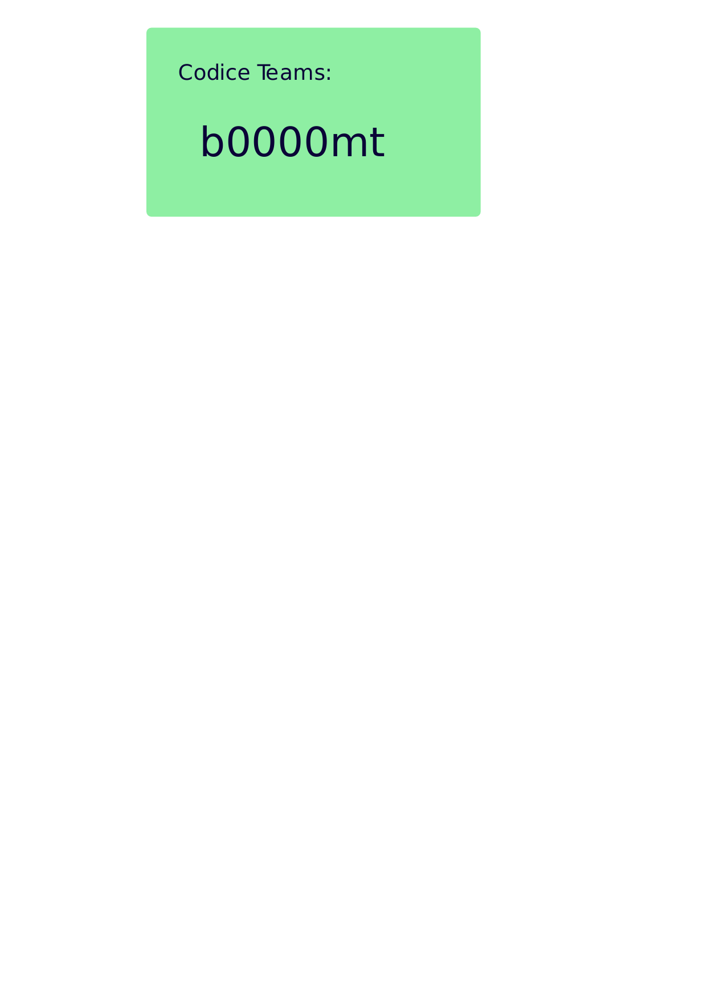
*Figura 1.1 — Comunicazione tra due macchine a ogni strato e protocolli corrispondenti.*

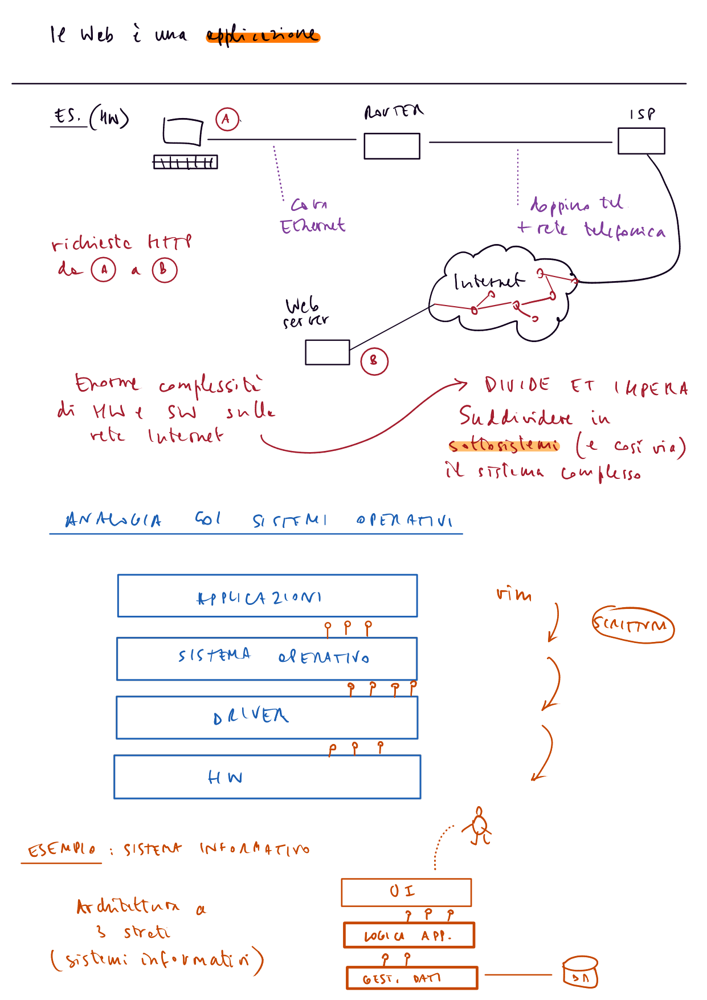
*Figura 1.2 — Host terminali vs nodi intermedi di commutazione e instradamento.*

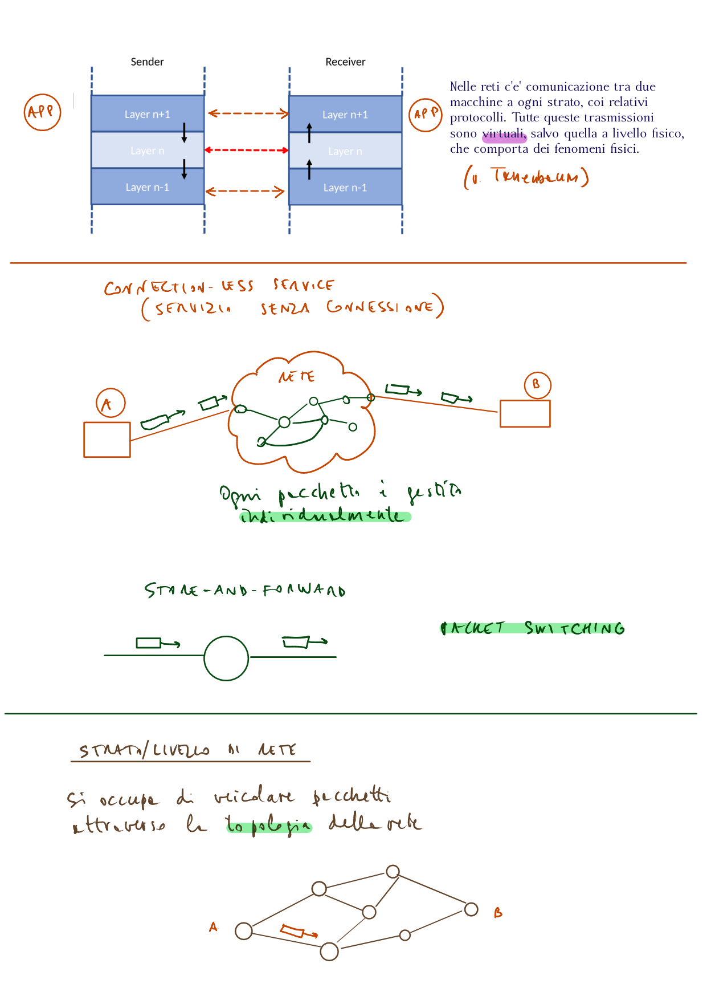
*Figura 1.3 — Stack protocollare e incapsulamento sequenziale dei dati.*

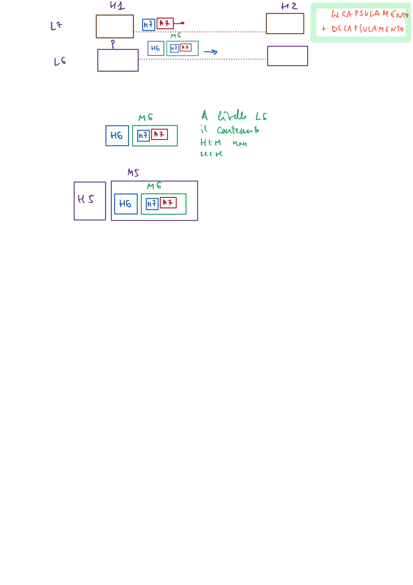
*Figura 1.4 — Percorso end-to-end dei dati attraverso la rete fisica.*

---

## 2. Il Livello Applicazione — Architetture e Protocolli Base
<div align="right"><em><a href="#indice">Torna all'indice</a></em></div>

### 2.1 Applicazioni di Rete

Un'**applicazione di rete** è composta da più programmi che girano su diversi host (end-system) e comunicano attraverso la rete. I programmi non devono necessariamente essere scritti nello stesso linguaggio o girare sullo stesso OS.

**Applicazioni comuni:** social network, Web, messaggistica, e-mail, giochi online, streaming (YouTube, Netflix), P2P (BitTorrent), VoIP (Skype), videoconferenza, motori di ricerca, accesso remoto (SSH, Telnet).

> Le applicazioni di rete girano sugli **host** (end-system) e **non** sui dispositivi di rete intermedi (router, switch): questi non eseguono applicazioni utente. Questo approccio semplifica enormemente lo sviluppo.

### 2.2 Architetture delle Applicazioni di Rete

L'**architettura applicativa** è progettata dallo sviluppatore e determina come l'applicazione è strutturata sui vari end-system:

#### 2.2.1 Architettura Client-Server

- C'è un host **sempre attivo** (il **server**) con indirizzo fisso e ben noto
- I **client** richiedono servizi; non comunicano direttamente tra loro
- Il client conosce sempre l'indirizzo del server; il server non conosce a priori i client

**Organizzazione dei server per la scalabilità:**
1. **Data center locale**: un singolo luogo con molti server
2. **Server distribuiti nel mondo**: più data center in paesi diversi
3. **Data center distribuiti**: organizzazione gerarchica globale

> Il client è tipicamente **ignaro** dell'esistenza di più server e li percepisce come un unico server.

**Esempio**: applicazione web — il browser (client) invia richieste al processo web server; il server è sempre attivo e raggiungibile da tutti i client.

#### 2.2.2 Architettura Peer-to-Peer (P2P)

- Non esistono server fissi sempre attivi; le comunicazioni avvengono **direttamente tra coppie di host** (*peer*)
- I peer non sono di proprietà di un service provider ma sono desktop, laptop e smartphone degli utenti
- Ogni peer ha il proprio indirizzo (non fisso come il server)
- È usata tipicamente per applicazioni ad alta intensità di traffico

**Vantaggi:**
- **Scalabilità**: ogni nuovo peer aggiunge workload MA anche capacità di servizio
- **Costo basso**: non richiedono infrastrutture costose o grande banda centralizzata

**Svantaggi:**
- Problemi di **sicurezza** (comunicazione diretta tra client)
- **Performance e affidabilità** dipendono dalla disponibilità dei peer

#### 2.2.3 Architettura Ibrida (P2P + Client-Server)

La maggior parte delle applicazioni P2P **pure** sono rare. Nella pratica si usano architetture **ibride** che combinano elementi di entrambe:

**Esempi:**
- **Messaggistica istantanea**: i server tracciano gli indirizzi IP degli utenti (C-S), ma i messaggi utente-utente viaggiano direttamente tra i peer (P2P)
- **File-sharing**: il server può tenere traccia di tutti i file disponibili per velocizzare la ricerca (C-S), mentre il trasferimento avviene tra peer (P2P)
- **VoIP/Videoconferenza**: server per la segnalazione, P2P per i media

### 2.3 Comunicazione tra Processi

In un'applicazione di rete, i **processi** che girano su macchine diverse (con OS potenzialmente diversi) comunicano attraverso la rete. Si definisce:
- **Processo client**: avvia la comunicazione (invia messaggi per primo)
- **Processo server**: attende di essere contattato

> In P2P un processo può cambiare ruolo: è client quando scarica, server quando carica.

#### 2.3.1 Socket — L'interfaccia tra Applicazione e Rete

Un **socket** è l'interfaccia software tra livello applicazione e livello di trasporto. Analogia: come una **cassetta delle lettere** — il processo mette il messaggio nella cassetta (socket) e la rete lo recapita.

- È usato come **API** (Application Programming Interface) tra applicazione e rete
- Lo sviluppatore ha controllo completo del lato applicazione della socket
- Ha **poco controllo** sul lato trasporto: solo scelta del protocollo (TCP/UDP) e forse alcuni parametri (buffer, MSS)
- Una volta scelto il protocollo, l'applicazione usa i servizi che quel protocollo fornisce

```
  Processo Applicativo
  ─────────────────────────────────
          Socket (API)
  ─────────────────────────────────
  Livello Trasporto (TCP/UDP)
  ─────────────────────────────────
  Livello Rete (IP)
  ─────────────────────────────────
  Livello Link + Fisico
```

#### 2.3.2 Indirizzamento dei Processi

Poiché più applicazioni possono girare su un singolo host, per identificare il processo destinatario servono **due elementi**:
1. **Indirizzo IP** (32 bit) — identifica l'host sulla rete (livello di rete)
2. **Numero di porta** (16 bit, 0-65535) — identifica il processo sull'host (livello di trasporto)

**Porte well-known (0-1023)** — riservate a protocolli noti, gestite da IANA ([www.iana.org](http://www.iana.org)):

| Porta | Protocollo | Uso |
|-------|-----------|-----|
| 20 | FTP | Trasferimento dati |
| 21 | FTP | Controllo comandi |
| 22 | SSH | Accesso remoto sicuro |
| 23 | Telnet | Accesso remoto (non cifrato) |
| 25 | SMTP | Invio email |
| 53 | DNS | Risoluzione nomi |
| 80 | HTTP | Web |
| 110 | POP3 | Ricezione email |
| 119 | NNTP | News groups |
| 123 | NTP | Sincronizzazione orario |
| 143 | IMAP | Gestione email avanzata |
| 161 | SNMP | Gestione rete |
| 443 | HTTPS | Web sicuro |

### 2.4 QoS — Servizi dello Strato di Trasporto

Il livello di trasporto offre servizi di **Quality of Service (QoS)**:

| Servizio | Descrizione | Note |
|----------|-------------|------|
| **Affidabilità** | Dati arrivano corretti e completi all'altra estremità | Essenziale per email, FTP |
| **Throughput** | Velocità garantita (bit/s) | Utile per streaming |
| **Timing** | Ogni bit arriva entro un intervallo di tempo | Critico per VoIP, gaming |
| **Sicurezza** | Cifratura e decifratura dei messaggi | TLS su TCP (livello app) |

**Protocolli di trasporto e le loro scelte applicative:**

| Protocollo | Caratteristiche | Uso tipico |
|------------|-----------------|-----------|
| **TCP** | Connection-oriented, affidabile, controllo flusso/congestione; handshake iniziale | Web, e-mail, FTP, SSH |
| **UDP** | Connectionless, nessuna garanzia, veloce, overhead minimo (8B header) | DNS, streaming, VoIP, gaming |

> **TLS/SSL**: tecnicamente la sicurezza è un problema del livello trasporto, ma protocolli sicuri come TLS sono spesso implementati sopra TCP a livello applicazione.

### 2.5 Protocolli del Livello Applicazione

Un **protocollo applicativo** definisce:
1. **Tipi di messaggi** scambiati (richieste e risposte)
2. **Sintassi** dei messaggi (campi, delimitatori, encoding)
3. **Semantica** dei campi (significato delle informazioni)
4. **Regole** su quando e come i processi inviano/rispondono ai messaggi

**Tipi di protocolli:**
- **Open protocols** (protocolli aperti): regole pubbliche, definite in RFC (es. HTTP, SMTP, DNS) — consentono interoperabilità
- **Proprietary protocols** (protocolli proprietari): non pubblicati apertamente (es. protocolli interni di Skype, WhatsApp)

**Tabella principali protocolli applicativi:**

| Applicazione | Protocollo | Trasporto | Nota |
|--------------|------------|-----------|------|
| Web | HTTP/HTTPS | TCP (o UDP/QUIC per H3) | Base del WWW |
| E-mail invio | SMTP/SMTPS | TCP (porta 25) | Tra mail server |
| E-mail ricezione | POP3, IMAP | TCP (110, 143) | Client-server |
| DNS | DNS | UDP (porta 53) | Risoluzione nomi |
| Configurazione IP | DHCP | UDP | Plug-and-play |
| Trasferimento file | FTP/FTPS | TCP (20/21) | Storico |
| Accesso remoto sicuro | SSH | TCP (22) | Cifrato |
| Accesso remoto | Telnet | TCP (23) | Non cifrato (deprecato) |
| Gestione rete | SNMP | UDP (161) | Dispositivi rete |

### 2.6 FTP — File Transfer Protocol

**FTP** (prima versione 1971) trasferisce file tra host attraverso la rete. È uno dei protocolli più antichi di Internet.

**Due versioni:**
- **FTP base**: trasferimento **in chiaro** (username, password, file)
- **FTPS** (FTP Secure): protegge credenziali e cifra il contenuto

**Entrambe hanno due componenti:**
1. Il protocollo che specifica i comandi
2. Un'applicazione software client-side e server-side che implementa il protocollo

**Setup su Linux:**
```bash
# Installazione server FTP (vsftpd - very secure FTP daemon)
sudo apt-get install vsftpd
service vsftpd status         # controlla che il daemon sia in esecuzione

# Installazione client FTP
sudo apt-get install ftp
ftp INDIRIZZO_SERVER          # username e password richiesti
exit                          # chiude la connessione
```

> Il server FTP è implementato come **daemon**: un programma che gira in background e aspetta che i client si connettano. È un approccio comune per i server di rete.

**Comandi FTP principali:**

| Comando | Descrizione |
|---------|-------------|
| `help` | Elenca tutti i comandi disponibili |
| `ls` | Elenca file nella directory remota |
| `cd DIR` | Cambia directory remota |
| `lcd DIR` | Cambia directory locale |
| `pwd` | Stampa directory corrente sul server |
| `get FILE` | Scarica file dal server |
| `put FILE` | Carica file sul server |
| `mkdir DIR` | Crea directory remota |
| `rmdir DIR` | Rimuove directory remota |
| `delete FILE` | Cancella file remoto |

### 2.7 Schemi e Appunti dalle Lavagne (Lezione 3)

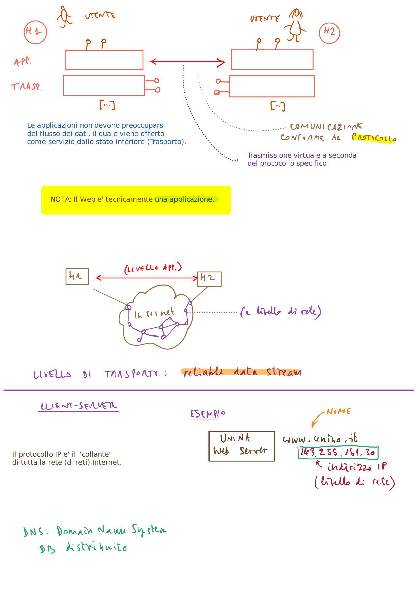
*Figura 2.1 — Principio di disaccoppiamento: le applicazioni delegano la gestione del flusso al livello di trasporto.*

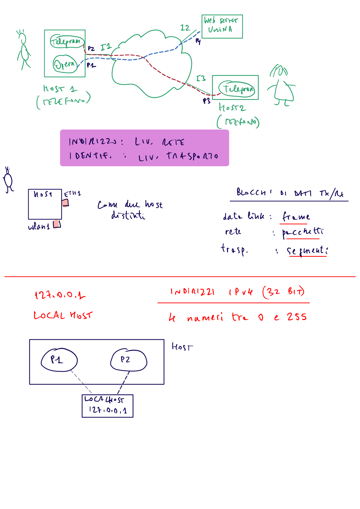
*Figura 2.2 — Servizi del trasporto visti dal livello applicazione (astrazione logica).*

---

## 3. Il Protocollo HTTP
<div align="right"><em><a href="#indice">Torna all'indice</a></em></div>

### 3.1 World Wide Web e HTTP

Fino ai primi anni '90, Internet era usata principalmente da ricercatori, accademici e studenti universitari (Telnet, FTP, email). Il **World Wide Web** è stata la prima applicazione Internet a raggiungere il grande pubblico.

**HTTP (HyperText Transfer Protocol)** è il protocollo alla base del WWW. Definisce:
- La **struttura dei messaggi** scambiati tra client e server
- Come client e server **scambiano questi messaggi**
- (Non definisce come le applicazioni client/server vanno implementate)

**Caratteristiche fondamentali:**
- **Client-server**: il browser (client) traduce le richieste dell'utente in messaggi HTTP; il server esegue la richiesta e risponde
- **Stateless**: il server **non mantiene** informazioni sulle interazioni precedenti con un client specifico → semplifica enormemente il design del server
  - Un tipico server gestisce **~1000 richieste HTTP/secondo**; grandi motori di ricerca gestiscono **centinaia di migliaia** di query/secondo
- Piattaforma per YouTube, Gmail, social network, app mobili

**Evoluzione di HTTP:**

| Versione | Anno | Cambiamento principale |
|----------|------|------------------------|
| HTTP/1.0 | 1996 | Prima versione diffusa; connessioni **non persistenti** di default |
| HTTP/1.1 | 1997 | Connessioni **persistenti** di default, pipelining |
| HTTP/2 | 2015 | Multiplexing richieste/risposte sulla stessa connessione, priorità, compressione header (HPACK) |
| HTTP/3 | 2022 | Basato su **UDP/QUIC** (Quick UDP Internet Connection); ~30% più veloce; ~30% del traffico HTTP nel 2024 |

### 3.2 URL — Uniform Resource Locator

Le informazioni sul web sono chiamate **risorse** (o oggetti) e sono identificate da un **URL**:

```
[protocollo]://[usrinfo@][host][:porta][/path][?query][#fragment]
```

| Componente | Obbligatorio | Descrizione | Esempio |
|------------|-------------|-------------|--------|
| `[protocollo]` | Sì | Protocollo di accesso | `http`, `https`, `ftp` |
| `[usrinfo@]` | No | Username:password (deprecato per sicurezza) | `user:pass@` |
| `[host]` | Sì | Nome o IP del server | `www.unina.it` |
| `[:porta]` | No | Porta (inferita dal protocollo se assente) | `:8080` |
| `[/path]` | Sì | Percorso della risorsa nel server | `/someDept/page.html` |
| `[?query]` | No | Parametri di richiesta (preceduto da `?`) | `?title=SSC_Napoli` |
| `[#fragment]` | No | Elemento/sezione nella risorsa (preceduto da `#`) | `#sezione2` |

**Esempio:**
```
https://en.wikipedia.org/w/index.php?title=SSC_Napoli
# equivalente a:
https://en.wikipedia.org/wiki/SSC_Napoli
```

La maggior parte delle pagine web = **1 file HTML base** + oggetti aggiuntivi referenziati (immagini JPEG, video, applet, ecc.)

### 3.3 HTTP e il Protocollo di Trasporto

**HTTP usa principalmente TCP** per la sua affidabilità:
- Il client inizia una connessione TCP col server (porta 80 di default)
- Una volta stabilita, browser e server comunicano tramite le rispettive socket
- Il client invia messaggi HTTP nella propria socket, il server li riceve dalla propria
- TCP garantisce che le richieste/risposte HTTP arrivino integre a destinazione (**reliable data transfer**)

**HTTP/3 usa UDP/QUIC** (Quick UDP Internet Connection):
- Implementa affidabilità sopra UDP
- Stima ~30% più veloce della comunicazione TCP-only
- Circa il 30% del traffico HTTP è oggi su UDP [Wikipedia, 2024]

**Vantaggio dell'architettura a strati:** le applicazioni HTTP **non devono preoccuparsi** di raggiungibilità, perdita dati, correzione errori — delegano tutto al livello di trasporto.

### 3.4 Connessioni HTTP: Persistenti vs. Non Persistenti

#### 3.4.1 Connessioni Non Persistenti

Una connessione TCP per ogni oggetto. Esempio: 1 HTML + 10 JPEG → **11 connessioni TCP separate** (e 11 coppie di socket).

> HTTP definisce il **protocollo di comunicazione**, NON come i contenuti vengono visualizzati (quello è compito del browser).

**Tempo di risposta per ogni oggetto (con TCP):**
```
Totale ≈ 2 RTT + tempo di trasmissione del file
```
- **1° RTT**: TCP three-way handshake (SYN → SYN-ACK → ACK)
- **2° RTT**: richiesta HTTP + risposta HTTP

```
Client                    Server
  │── ACK + req HTTP ────►│
  │◄─ risposta HTTP ──────│
```

#### 3.4.2 Connessioni Persistenti

La connessione TCP rimane aperta dopo ogni risposta:
- Tutti gli oggetti di una pagina su **una singola connessione TCP**
- Risparmio di ~1-2 RTT per oggetto

**Pipelining (HTTP/1.1+):** richieste inviate senza aspettare le risposte precedenti.

| Tipo | Velocità | Risorse |
|------|----------|---------|
| Non persistente | Lenta | Molte |
| Persistente | Veloce | Poche |
| Persistente + Pipelining | Molto veloce | Poche |

### 3.5 Formato dei Messaggi HTTP

#### 3.5.1 Messaggio di Richiesta

I messaggi HTTP sono scritti in **ASCII text**, leggibili dagli umani. I campi sono separati da:
- `sp`: spazio ` `
- `cr`: carriage return `\r`
- `lf`: line feed `\n`

```
GET /somedir/page.html HTTP/1.1\r\n
Host: www.someschool.edu\r\n
Connection: close\r\n
User-agent: Mozilla/5.0\r\n
Accept-language: fr\r\n
\r\n
[corpo vuoto per GET]
```

**Struttura del messaggio:**
- **Linea di richiesta**: `METODO URL HTTP/Versione`
- **Header lines**: parametri della richiesta (numero e tipo variabili; possono essere anche personalizzati)
- **Corpo (body)**: specifico del metodo, contiene i dati

**Analisi degli header dell'esempio:**
- `Host: www.someschool.edu` — host dove risiede la risorsa (necessario perché un proxy potrebbe essere un intermediario)
- `Connection: close` — connessione non persistente (chiudi dopo la risposta)
- `User-Agent: Mozilla/5.0` — tipo di browser (il server può inviare versioni diverse dello stesso oggetto in base al tipo)
- `Accept-Language: fr` — il client preferisce la versione francese (se esiste)

**Metodi HTTP:**

| Metodo | Descrizione | Body richiesta | Uso |
|--------|-------------|----------------|-----|
| **GET** | Recupera una risorsa dal server | Vuoto | Navigazione web |
| **POST** | Invia dati al server (il body li contiene) | Contiene i dati | Form, upload |
| **HEAD** | Come GET ma il server risponde senza corpo | Vuoto | Debug, verifica esistenza risorse |
| **PUT** | Carica/sostituisce un oggetto su un percorso specifico | Contiene l'oggetto | Web publishing, REST API |
| **DELETE** | Cancella un oggetto sul server | Vuoto | REST API |

> **GET vs POST per i form**: un form HTML non usa necessariamente POST; spesso usa GET includendo i dati dell'utente nell'URL come query string (es. `?nome=Mario&email=mario@ex.it`).

#### 3.5.2 Messaggio di Risposta

```
HTTP/1.1 200 OK\r\n
Connection: close\r\n
Date: Tue, 18 Aug 2015 15:44:04 GMT\r\n
Server: Apache/2.2.3 (CentOS)\r\n
Last-Modified: Tue, 18 Aug 2015 15:11:03 GMT\r\n
Content-Length: 6821\r\n
Content-Type: text/html\r\n
\r\n
(dati oggetto...)
```

**Struttura del messaggio di risposta:**
- **Status line**: `HTTP/Versione CodiceStato Frase`
- **Header lines**: metadati della risposta
- **Corpo**: l'oggetto richiesto

**Analisi degli header dell'esempio:**
- `Connection: close` — il server chiuderà la connessione dopo questo messaggio
- `Date:` — data/ora di creazione/invio della risposta HTTP (non dell'oggetto)
- `Server:` — tipo di server web (analogo a User-Agent lato client)
- `Last-Modified:` — data/ora dell'ultima modifica dell'oggetto (importante per il **caching**)
- `Content-Length:` — numero di byte nel payload
- `Content-Type:` — tipo MIME dell'oggetto (es. `text/html`) — questo è il tipo "ufficiale", NON l'estensione del file

**Classi di codici di stato HTTP:**

| Classe | Range | Significato |
|--------|-------|-------------|
| **1xx** | 100-199 | Informazionale: info sulla richiesta |
| **2xx** | 200-299 | Successo: richiesta eseguita con successo |
| **3xx** | 300-399 | Reindirizzamento: azioni aggiuntive richieste al client |
| **4xx** | 400-499 | Errore client: richiesta non eseguibile per un problema del client |
| **5xx** | 500-599 | Errore server: richiesta non eseguibile per un problema del server |

**Codici più comuni:**

| Codice | Messaggio | Descrizione |
|--------|-----------|-------------|
| **200** | OK | Richiesta riuscita, informazione nella risposta |
| **301** | Moved Permanently | Risorsa spostata definitivamente; nuovo URL nell'header `Location` |
| **400** | Bad Request | Richiesta non comprensibile dal server (errore generico client) |
| **404** | Not Found | La risorsa richiesta non esiste su questo server |
| **505** | HTTP Version Not Supported | Versione HTTP non supportata dal server |

### 3.6 Cookie

**Cookie**: token digitale (ID alfanumerico) usato dai server per identificare un cliente specifico, aggirando la statelessness di HTTP.

**Motivazione:** la statelessness pura è una limitazione forte: il carrello Amazon dipende dal cliente, Netflix suggerisce contenuti in base alle preferenze, ecc.

**4 componenti della tecnologia cookie:**
1. Header `Set-cookie: ID` nella **risposta HTTP** del server (il server crea il cookie e lo invia)
2. Header `Cookie: ID` nelle **richieste successive** del client (il client lo allega automaticamente)
3. **File cookie** sul sistema del client (gestito dal browser)
4. **Database di back-end** sul server (associa ID cookie alle info del cliente)

**Flusso completo (esempio Amazon):**
```
Client                          Server Amazon
  │── HTTP request (senza cookie) ►│  Server crea ID=1678, entry nel DB
  │◄─ HTTP response + Set-cookie: 1678 │
  │  [browser salva cookie 1678]       │
  │── HTTP request + Cookie: 1678 ►│  Server riconosce utente 1678
  │◄─ HTTP response personalizzata │  traccia attività nel database
```

**Utilizzi:** carrello acquisti, login automatico, raccomandazioni prodotti, sessioni utente, preferenze.

**Attenzione — invasione della privacy:**
- Combinando cookie e informazioni dell'account (nome, email, indirizzo, carta di credito), i siti sanno molto sull'utente
- Alcune piattaforme vendono queste informazioni a terzi
- La GDPR europea impone consenso esplicito prima di impostare cookie non essenziali

### 3.7 Web Caching (Proxy)

Un **web cache** (o **proxy server**) soddisfa le richieste HTTP per conto del server originale, mantenendo copie degli oggetti recentemente richiesti nel proprio storage.

**Funzionamento:**
1. Browser invia tutte le richieste al proxy
2. **Hit** (oggetto trovato nella cache): proxy risponde direttamente → risposta rapida, nessuna trasmissione verso Internet
3. **Miss** (oggetto non trovato): proxy contatta il server originale, memorizza una copia locale, invia al browser

La cache è contemporaneamente **server** (quando fornisce oggetti ai client) e **client** (quando richiede oggetti ai server originali).

**Due motivi per cui il web caching è utile:**
1. **Riduzione del tempo di risposta**: connessione ad alta velocità tra client e cache — molto più veloce del server lontano su Internet
2. **Riduzione del traffico**: meno richieste verso Internet, riduzione dei costi di banda

**Hit rate tipico:** da 0.2 a 0.7 (20%-70% delle richieste servite localmente). Aumenta con più client che usano la cache.

**Cache del browser:** il browser stesso mantiene copie locali degli oggetti visitati — stesso principio, ma solo per quell'utente. La copia locale potrebbe non essere aggiornata (errore frequente).

**GET Condizionale** — meccanismo per evitare cache obsoleta:
```
Cache → Server:   GET /oggetto.html HTTP/1.1
                   If-Modified-Since: Tue, 18 Aug 2015 15:11:03 GMT

Se NON modificato: Server risponde  304 Not Modified  (nessun body, usa copia locale)
Se modificato:     Server risponde  200 OK  + nuovo oggetto
```

**Proxy istituzionali:** oltre alle prestazioni, i proxy possono essere usati per accedere a servizi istituzionali. Es: il proxy dell'UniNA (`proxy.unina.it`) fa sì che dal punto di vista del server originale tutte le richieste sembrino provenire dall'istituzione (utile per accesso a riviste scientifiche, risorse riservate, ecc.). Ci sono anche molti proxy commerciali/gratuiti su Internet.

### 3.8 Schemi e Appunti dalle Lavagne (Lezione 4)

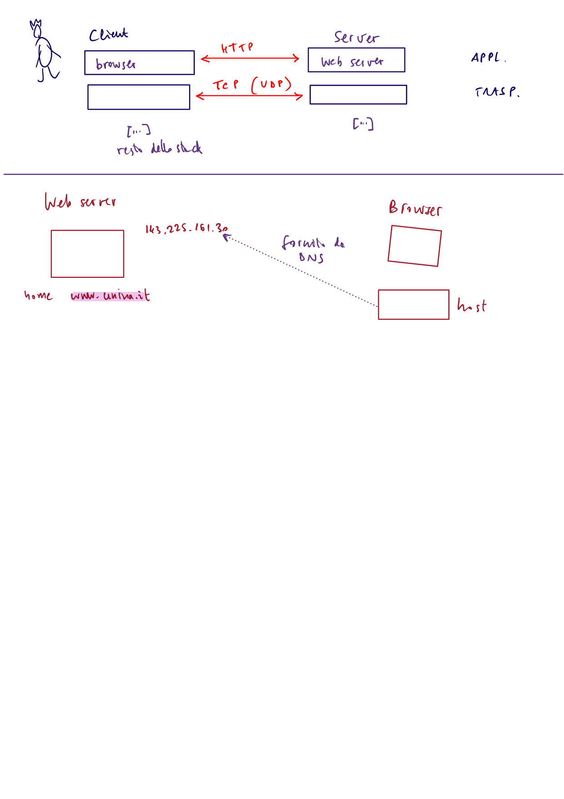
*Figura 3.1 — Diagramma temporale dello scambio messaggi HTTP, handshaking TCP e stima dell'RTT.*

---

## 4. Posta Elettronica, P2P e DNS
<div align="right"><em><a href="#indice">Torna all'indice</a></em></div>

### 4.1 Architettura della Posta Elettronica

La **posta elettronica** (e-mail) è una delle applicazioni Internet più antiche e importanti.

**Differenza da HTTP:** nella posta elettronica la comunicazione avviene **anche tra server** (non solo client-server). Servono quindi due protocolli distinti:
1. Tra **user agent e mail server** — POP3, IMAP, HTTP
2. Tra **mail server e mail server** — SMTP

**Componenti:**
- **User agent** (*client email*): applicazione per la gestione delle email (Outlook, Thunderbird, K-9 Mail, Pine)
- **Mail Server**: server sempre attivo che archivia email e mantiene **caselle di posta** (*mailbox*) specifiche per ogni utente

```
 Alice's User Agent                          Bob's User Agent
         │                                         │
         │ SMTP                                    │ POP3/IMAP/HTTP
         │                                         │
   Alice's Mail Server ──── SMTP ──── Bob's Mail Server
         (sender)                                 (receiver)
```

> Gli utenti non si scambiano le email direttamente (come avviene nella messaggistica istantanea). Si preferisce usare i mail server, più affidabili e specializzati.

**Protocolli:**
- **SMTP** (porta 25): tra mail server (invio) — client-side (sender) e server-side (receiver) su mail server
- **POP3** (porta 110): ricezione da mail server a user agent
- **IMAP**: ricezione avanzata da mail server a user agent
- **HTTP**: accesso web (Gmail, Yahoo!, webmail istituzionale)

### 4.2 SMTP — Simple Mail Transfer Protocol

SMTP usa **TCP porta 25**. È il protocollo principale tra mail server. Processo di invio (Alice → Bob):

1. Alice invoca il suo user agent, fornisce l'indirizzo email di Bob (`bob@someschool.edu`), compone il messaggio e istruisce l'user agent di inviarlo
2. L'user agent di Alice invia il messaggio al **mail server di Alice**, che lo mette in una **coda di messaggi** (*message queue*)
3. Il **client SMTP** di Alice (lato mail server) vede il messaggio nella coda, apre una **connessione TCP** al server SMTP di Bob (porta 25)
4. Se il server di Bob è down, il client riproverà più tardi
5. Dopo l'**handshake SMTP** (dove client e server si presentano), il client invia il messaggio nella connessione TCP
6. Il server SMTP di Bob riceve il messaggio e lo deposita nella **mailbox di Bob**
7. Bob invoca il suo user agent per leggere il messaggio quando preferisce

> **Vantaggio dei mail server:** i server sono sempre attivi, certificati, e possono ritentare la consegna in caso di fallimento (un processo computazionalmente costoso che non conviene delegare all'user agent).

**Handshake SMTP — esempio di sessione testuale:**
```
S: 220 hamburger.edu
C: EHLO crepes.fr
S: 250 Hello crepes.fr, pleased to meet you
C: MAIL FROM: <alice@crepes.fr>
S: 250 alice@crepes.fr ... Sender ok
C: RCPT TO: <bob@hamburger.edu>
S: 250 bob@hamburger.edu ... Recipient ok
C: DATA
S: 354 Enter mail, end with "." on a line by itself
C: Do you like ketchup?
C: How about pickles?
C: .
S: 250 Message accepted for delivery
C: QUIT
S: 221 hamburger.edu closing connection
```

### 4.3 Accesso alle Email — POP3, IMAP, HTTP

> Ricorda: SMTP è tra **mail server**. POP3/IMAP/HTTP sono tra **user agent e mail server**.

#### 4.3.1 POP3 — Post Office Protocol v3

Protocollo di accesso email estremamente semplice. TCP **porta 110**.

**3 fasi della sessione POP3:**

| Fase | Descrizione |
|------|-------------|
| **Authorization** | L'user agent invia username e password per autenticarsi |
| **Transaction** | L'user agent recupera messaggi, marca per cancellazione, ottiene statistiche |
| **Update** | Dopo il comando `quit`, il server cancella i messaggi marcati |

**Esempio di comandi POP3:**
```
C: USER alice
S: +OK
C: PASS secret
S: +OK user successfully logged on
C: LIST
S: 1 498   (messaggio 1, 498 byte)
S: 2 912   (messaggio 2, 912 byte)
S: .
C: RETR 1   (recupera messaggio 1)
S: [dati del messaggio]
S: .
C: DELE 1   (marca per cancellazione)
C: RETR 2
S: [dati del messaggio]
S: .
C: DELE 2
C: QUIT
S: +OK POP3 server signing off
```

**Limitazioni POP3:** solo download o cancellazione. Non supporta nativamente: ricerca in cartelle remote, organizzazione in cartelle sul server, accesso da più dispositivi.

#### 4.3.2 IMAP — Internet Mail Access Protocol

Funzionalità avanzate rispetto a POP3:
- **Gestione e creazione di cartelle** sul server
- **Ricerca** in cartelle remote per messaggi con criteri specifici
- Recupero **parziale dei messaggi** (es. solo header, solo allegati)
- Supporto per **più client** connessi contemporaneamente allo stesso server

Al contrario di POP3, con IMAP le email rimangono sul server (meglio per accesso da più dispositivi).

#### 4.3.3 HTTP per la Posta

Approccio mainstream introdotto da Hotmail negli anni '90, oggi dominante (Gmail, Yahoo!, UniNA Webmail):
- L'**user agent è il browser web** (non un'applicazione dedicata)
- La comunicazione tra utente e server avviene via **HTTP** (non POP3/IMAP)
- I **mail server continuano a usare SMTP** per scambiarsi email tra loro

**Confronto protocolli di accesso email:**

| Protocollo | Porta | Pro | Contro |
|------------|-------|-----|--------|
| **POP3** | 110 | Semplice, scarica email localmente | No cartelle remote, no multi-device |
| **IMAP** | 143 | Cartelle remote, multi-device, ricerca | Più complesso |
| **HTTP** | 80/443 | Nessuna installazione, ovunque | Dipende dalla connessione |

### 4.4 Applicazioni P2P e BitTorrent

A differenza di client-server, l'architettura P2P fa uso minimo (o nullo) di server centralizzati. Coppie di host (*peer*) intermittentemente connessi comunicano direttamente tra loro.

**P2P per il file sharing:** applicazione naturale del P2P
- In client-server: il server deve inviare il file a tutti i client (bottleneck sul server)
- In P2P: ogni peer che riceve il file può condividerlo con altri peer → più scalabile

**BitTorrent** — il protocollo P2P più popolare:
- ~150-170 milioni di utenti nel 2023

**Terminologia:**
- **Torrent**: insieme dei peer che partecipano alla distribuzione di un file specifico
- **Chunk**: parte del file (tipicamente **256 KB**)
- **Tracker**: nodo infrastrutturale che tiene traccia dei peer nel torrent (essenzialmente un server)

**Ciclo di vita di un peer:**
1. Si unisce al torrent → non ha ancora nessun chunk
2. Si registra con il **tracker** → riceve un sottoinsieme casuale di indirizzi IP dei peer attuali
3. Tenta connessioni TCP simultane con tutti i peer della lista (**vicini**)
4. Scarica chunk dai vicini e contemporaneamente carica chunk ai vicini
5. Periodicamente aggiorna la lista dei chunk disponibili dai vicini
6. Alla fine: può **uscire** (selfishly) o **restare** a fare seeding (altruistic)

**Strategia di download — Rarest-First:**
- I chunk con **meno copie disponibili** tra i vicini vengono prioritizzati
- Questo equalizza il numero di copie nel torrent e accelera la distribuzione

**Strategia di upload — Tit-for-Tat (Trading):**
- **Top-4 unchoked**: priorità ai 4 vicini con il **rate di upload più alto** verso di noi
  - La lista dei 4 best viene aggiornata ogni **10 secondi**
- **Optimistic unchoking**: ogni **30 secondi**, viene scelto casualmente un vicino aggiuntivo e gli vengono inviati chunk
  - Se lo scambio va bene, potrebbero entrare entrambi nelle rispettive liste top-4
  - Permette a peer con rate compatibili di trovarsi

> Il meccanismo tit-for-tat incentiva i peer a **contribuire**: chi carica di più ottiene download più veloci. I **free rider** (chi scarica senza caricare) vengono penalizzati.

### 4.5 DNS — Domain Name System

#### 4.5.1 Cos'è il DNS e perché è distribuito

Il **Domain Name System (DNS)** risolve la necessità di identificare gli host in due modi complementari:
- Gli **esseri umani** preferiscono nomi mnemonici (hostname): es. `www.unina.it`
- I **dispositivi di rete** preferiscono indirizzi IP a lunghezza fissa e struttura gerarchica: es. `143.225.15.50`

Il DNS è un **protocollo di livello applicazione** che gestisce la traduzione hostname → indirizzo IP in modalità client-server: un *DNS client* chiede a un *DNS server* la traduzione per un hostname specifico.

> I server DNS sono tipicamente macchine UNIX che eseguono il software **BIND** (Berkeley Internet Name Domain), in ascolto su **porta UDP 53**.

**Perché un DNS centralizzato sarebbe impossibile?**

Un singolo repository centralizzato non è praticabile per tre motivi fondamentali:
1. **Volume enorme di host**: miliardi di dispositivi connessi
2. **Distanza geografica**: latenze insopportabili tra utenti lontani
3. **Single point of failure**: un guasto blocca tutta Internet

Per questo il DNS è **distribuito e decentralizzato**.

---

#### 4.5.2 Gerarchia dello Spazio dei Nomi DNS

Lo spazio dei nomi DNS è organizzato da **ICANN** (Internet Corporation for Assigning Names and Numbers) in una struttura ad albero invertito con circa **250 TLD (Top-Level Domain)**.

```
                        . (root)
          ┌──────────────┼──────────────┐
         com            edu             it       ...
     ┌────┴────┐     ┌───┴───┐      ┌───┴───┐
  google    amazon  mit    unina  google  amazon
               |          |
             maps        dei
```

**Tipi di TLD:**
- **Generici (gTLD)**: `.com`, `.org`, `.edu`, `.net`, `.aero`, ...
- **Nazionali (ccTLD)**: `.it`, `.uk`, `.us`, `.tv`, ...
- Tutti gestiti da **registrar** nominati da ICANN

**Nomi di dominio — sintassi:**
- I nomi si leggono **dal basso verso l'alto** verso la root: es. `eng.mit.edu`
- **Percorso assoluto**: termina con un punto finale (es. `eng.mit.edu.`) → path dalla foglia alla radice
- **Percorso relativo**: interpretato rispetto a un dominio di riferimento
- Ogni dominio controlla l'allocazione dei sottodomini sotto di sé
- La creazione di un nuovo sottodominio richiede il **permesso del dominio padre**
- I nomi **non seguono confini geografici o fisici**
- È possibile registrarsi sotto più TLD (es. `ibm.com` e `ibm.us`)

> **Cyber-squatting**: pratica di acquistare domini solo per rivenderli successivamente a prezzi elevati alle aziende interessate.

---

#### 4.5.3 Zone DNS e Name Server

Lo spazio dei nomi DNS è suddiviso in **zone** (partizioni non sovrapposte). La suddivisione è a discrezione dell'amministratore della zona.

**Ogni zona contiene uno o più name server:**
- **Name server primario** (*primary*): ha il database autoritativo per la zona
- **Name server secondario** (*secondary*): copia di backup del primario, per ridondanza

```
          Zona A
    ┌─────────────────┐
    │   . (root)      │
    │    com          │
    └────────┬────────┘
             │
          Zona B
    ┌─────────────────┐
    │   example.com   │
    │  ┌───┐  ┌────┐  │
    │  │www│  │mail│  │
    └──┴───┴──┴────┴──┘
```

**Root server:** Ci sono **13 root server** (da `a.root-servers.net` a `m.root-servers.net`), altamente replicati in tutto il mondo. Essendo molto occupati, di norma restituiscono informazioni sulle **zone inferiori** (cioè i riferimenti ai TLD server), non record individuali.

---

#### 4.5.4 Resource Record DNS

Ogni entry nel database DNS è un **Resource Record (RR)** con 5 campi:

| Campo | Nome | Descrizione |
|-------|------|-------------|
| `NAME` | Domain Name | Il dominio a cui il record si applica; è la **chiave di ricerca** principale per le query DNS. Normalmente esistono più record per ciascun dominio, distribuiti su server diversi. |
| `TTL` | Time To Live | Durata del record in secondi. Lunga per host stabili (es. `86400` = 1 giorno), breve per host volatili (es. `60` = 1 minuto). Valore massimo: 2³¹−1 ≈ 68 anni. |
| `CLASS` | Classe | Sempre `IN` (Internet) per i record Internet; altri codici raramente usati. |
| `TYPE` | Tipo | Indica il tipo di record (vedi tabella sotto). |
| `RDATA` | Value | Il valore effettivo; dipende dal tipo di record: può essere un dominio, un valore numerico o una stringa ASCII. |

**Tipi di record DNS:**

| Tipo | Descrizione | Uso |
|------|-------------|-----|
| **A** | Indirizzo IPv4 a 32 bit per un'interfaccia dell'host | Mappatura hostname → IP |
| **AAAA** | Indirizzo IPv6 (equivalente di A per IPv6) | Mappatura hostname → IPv6 |
| **NS** | Name Server: fornisce il nome del name server autorevole per il dominio | Delegazione della zona |
| **MX** | Mail eXchange: indica l'host che accetta email per il dominio | Instradamento email |
| **CNAME** | Canonical Name: permette alias; la risoluzione DNS procede col nuovo nome | Alias hostname |
| **PTR** | Pointer: alias usato per **reverse lookup** (IP → nome); la risoluzione NON procede, viene restituito il nome | Reverse DNS |
| **SOA** | Start of Authority: informazioni sul server della zona, email dell'amministratore, numeri di serie | Metadati zona |

**Esempio di insieme di record per il dominio `cs.vu.nl`:**
```
cs.vu.nl.    86400  IN  SOA   ns1.cs.vu.nl. admin.vu.nl. 2024010101 3600 900 604800 86400
cs.vu.nl.    86400  IN  NS    ns1.cs.vu.nl.
cs.vu.nl.    86400  IN  NS    ns2.cs.vu.nl.
cs.vu.nl.    86400  IN  MX    10 mail.cs.vu.nl.
www.cs.vu.nl 86400  IN  A     130.37.20.20
ftp.cs.vu.nl 86400  IN  CNAME www.cs.vu.nl.
ns1.cs.vu.nl 86400  IN  A     130.37.20.1
```

---

#### 4.5.5 DNS Resolver (Local DNS Server)

Il **local DNS server** (o **DNS resolver**) è un tipo speciale di server DNS che:
- **Non appartiene strettamente** alla gerarchia dei name server
- È tipicamente gestito dagli **ISP** o dalle organizzazioni locali
- Quando un host si connette a un ISP, l'ISP gli fornisce l'indirizzo IP del local DNS server

**Funzionamento del resolver:**
- Quando un host esegue una query DNS, la invia al **local DNS server**
- Il local DNS server agisce da **proxy**, inoltrandola alla gerarchia DNS
- Restituisce la risposta finale all'host (risposta completa o errore)

**Resolver pubblici noti:**
| Provider | Indirizzo primario | Indirizzo secondario |
|----------|--------------------|----------------------|
| Google Public DNS | `8.8.8.8` | `8.8.4.4` |
| Cloudflare | `1.1.1.1` | `1.0.0.1` |
| OpenDNS | `208.67.222.222` | `208.67.220.220` |

---

#### 4.5.6 Risoluzione dei Nomi DNS: Query Ricorsive e Iterative

Il processo di risoluzione avviene in due modalità che spesso coesistono nella stessa richiesta.

**Query ricorsiva:** il client chiede al server di fornire la risposta completa, e il server si occupa di tutta la risoluzione iterativa (il client riceve o la risposta finale o un errore).

**Query iterativa:** il server risponde con il "meglio che sa" — se non ha la risposta, restituisce l'indirizzo di un altro server DNS da contattare; il client poi contatta direttamente il prossimo server.

**Schema tipico di una risoluzione (esempio: `www.amazon.com`):**

```
  Host (client)             Local DNS server            Root Server
      │                           │                          │
      │── query ricorsiva ────────►│                          │
      │   "www.amazon.com?"        │── query iterativa ──────►│
      │                           │   "www.amazon.com?"      │
      │                           │◄──────────────────────── │
      │                           │   "Non so, vai su        │
      │                           │    TLD server .com"      │
      │                           │                      TLD Server (.com)
      │                           │── query iterativa ──────►│
      │                           │   "www.amazon.com?"      │
      │                           │◄─────────────────────────│
      │                           │   "Non so, vai su        │
      │                           │    ns1.amazon.com"       │
      │                           │                      Authoritative DNS
      │                           │── query iterativa ──────►│ (amazon.com)
      │                           │   "www.amazon.com?"      │
      │                           │◄─────────────────────────│
      │                           │   "205.251.242.103"      │
      │◄── risposta completa ─────│                          │
      │    "205.251.242.103"       │                          │
```

**Regola pratica:**
- I **local DNS server** gestiscono le query ricorsive (servizio per i loro host)
- I **server occupati** (root, TLD) gestiscono quasi sempre solo query **iterative** (non ricorsive), per non sovraccaricarsi

**Processo di risoluzione — algoritmo:**
1. L'host invia la query al **local name server**
2. Se il dominio rientra nella giurisdizione (zona) del server locale → viene restituito un **record autoritativo**
3. Altrimenti, il local server gestisce la query ricorsivamente:
   - Se ha l'indirizzo → lo restituisce
   - Se ha l'indirizzo del name server per una zona inferiore → lo usa per una query diretta
   - Il processo continua iterativamente fino a trovare l'indirizzo

> **I root server** sono consultati solo **in assenza di qualsiasi informazione** su un certo dominio.

---

#### 4.5.7 Record Autoritativi vs. Cached

I record DNS si distinguono in due categorie fondamentali:

| Tipo | Descrizione |
|------|-------------|
| **Autoritativo** | Proviene direttamente dal name server che gestisce la zona; è sempre aggiornato e affidabile |
| **Cached (in cache)** | Proveniente da una risposta precedente, memorizzato temporaneamente; **scade alla scadenza del TTL** |

**Caching DNS — ottimizzazione delle prestazioni:**
- **Tutte le risposte DNS vengono messe in cache** dal local DNS server
- Se arriva una richiesta per `cs.mit.edu` e il server ha già in cache l'indirizzo del name server per `mit.edu`, può interrogare direttamente quel server senza passare dai root
- I root server vengono interrogati **solo** in assenza di qualsiasi informazione su un certo dominio
- I record cached hanno un TTL che, alla scadenza, li rende invalidi

> **Prestazioni:** La caching riduce drasticamente il numero di query ai root server e accelera le risoluzioni per i domini frequentemente visitati.

---

#### 4.5.8 Aliasing DNS (CNAME) e Host Aliasing

Il DNS fornisce un **servizio di aliasing** che permette di associare nomi complicati/lunghi (nomi *canonici*) a nomi più semplici/corti (*alias*).

**Host aliasing:** host con hostname complicati possono essere associati ad alias più mnemonici.

Esempio:
```
# Il nome canonico (reale):
relay1.west-coast.enterprise.com.   IN  A      192.0.2.1

# L'alias (più semplice):
www.enterprise.com.   IN  CNAME  relay1.west-coast.enterprise.com.
```

Quando si risolve `www.enterprise.com`:
1. Il DNS trova il record CNAME → ottiene il nome canonico `relay1.west-coast.enterprise.com`
2. Risolve il nome canonico → ottiene l'IP `192.0.2.1`
3. **Differenza con PTR**: con CNAME la risoluzione prosegue con il nuovo nome; con PTR la risoluzione si ferma e viene restituito il nome.

> Un'applicazione può invocare il DNS per ottenere sia il nome canonico per un alias sia il corrispondente IP.

---

#### 4.5.9 DNS e Distribuzione del Carico (Round-Robin DNS)

Il DNS può essere usato per la **distribuzione del carico** tra server replicati.

- Siti molto trafficati (Google, Amazon, CNN, ecc.) sono replicati su **più server**, ognuno su un end-system diverso con un IP diverso
- Il database DNS contiene l'**insieme di indirizzi IP** per lo stesso hostname canonico
- Quando i client eseguono una query DNS per quel nome, il server **ruota l'ordine** in cui gli indirizzi vengono restituiti → i client tendono a usare IP diversi → il carico si distribuisce

```
# Esempio: amazon.com con 3 server replicati
amazon.com.   IN  A  205.251.242.103
amazon.com.   IN  A  205.251.242.104
amazon.com.   IN  A  205.251.242.105
# Il DNS ruota l'ordine ad ogni risposta
```

---

#### 4.5.10 Strumento pratico: `nslookup`

`nslookup` è un tool da riga di comando che permette di eseguire manualmente le query DNS che normalmente gestisce il local DNS server.

**Utilizzo base:**
```bash
# Query A record (hostname → IP)
nslookup www.unina.it

# Query con server DNS specifico
nslookup www.unina.it 8.8.8.8

# Reverse lookup (IP → hostname)
nslookup 143.225.15.50

# Query di tipo specifico
nslookup -type=MX unina.it
nslookup -type=NS unina.it
nslookup -type=SOA unina.it
```

**Interpretazione dell'output:**
```
Server:   127.0.0.53          ← Il default server è il router locale (porta 53)
Address:  127.0.0.53#53

Non-authoritative answer:      ← I record sono cached (non vengono dal server autoritativo)
Name:     www.unina.it
Address:  143.225.15.50
```

> I record **non-authoritativi** (cached) **non provengono** dal DNS server che gestisce la zona; il local server ha gestito tutta la risoluzione tramite query iterative e ha messo in cache il risultato.

---

#### 4.5.11 Riepilogo: Caratteristiche Principali del DNS

| Caratteristica | Dettaglio |
|----------------|-----------|
| **Trasporto** | UDP, porta 53 (TCP per trasferimenti di zona) |
| **Architettura** | Distribuita, gerarchica, decentralizzata |
| **Root server** | 13 (a–m.root-servers.net), altamente replicati |
| **Gestione** | ICANN per TLD; registrar per sottodomini |
| **Caching** | Tutti i record vengono cachati con scadenza TTL |
| **Query ricorsive** | Gestite dai local DNS server per i loro client |
| **Query iterative** | Usate dai server occupati (root, TLD) |
| **Software tipico** | BIND (Berkeley Internet Name Domain) su UNIX |

### 4.6 Schemi e Appunti dalle Lavagne (Lezione 7)

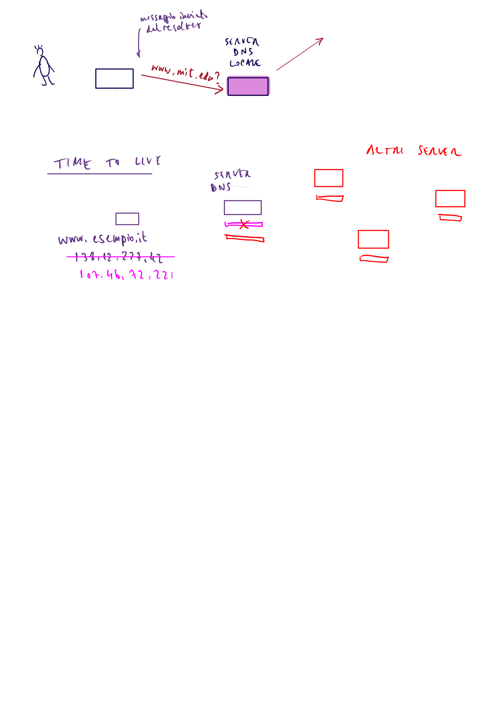
*Figura 4.1 — Tabella dei record DNS e formati di risorsa.*

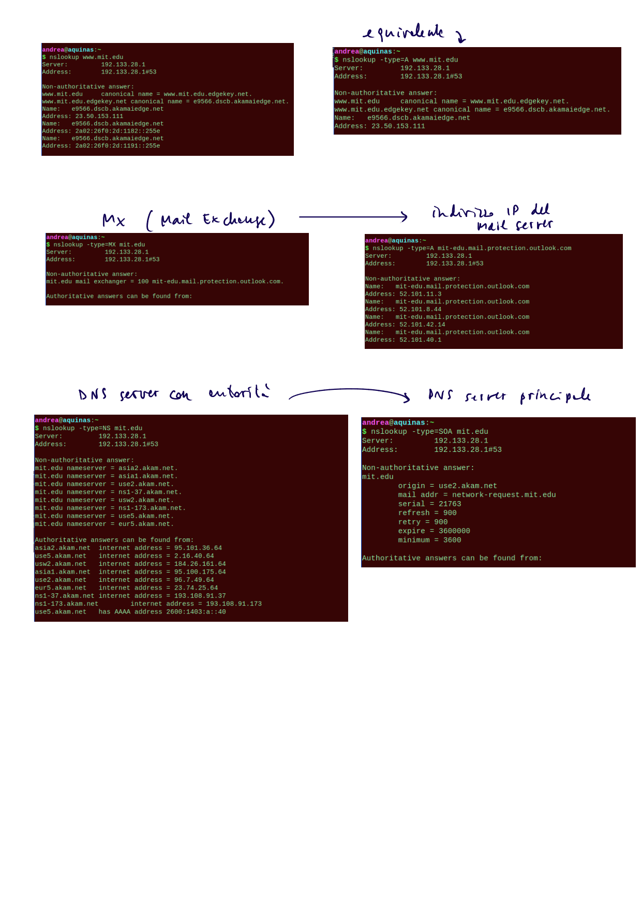
*Figura 4.2 — Flusso delle interrogazioni DNS nella gerarchia dei server.*

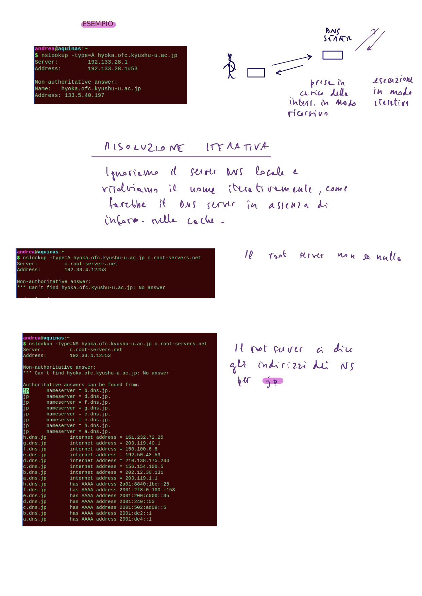
*Figura 4.3 — Esempio pratico di risoluzione dei nomi tra server autoritativi.*

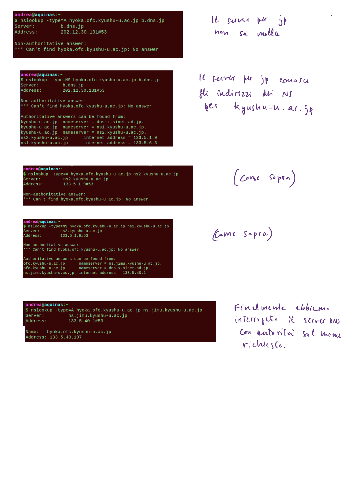
*Figura 4.4 — Caching locale e gestione del campo Time To Live (TTL).*

---

## 5. Programmazione di Rete con i Socket
<div align="right"><em><a href="#indice">Torna all'indice</a></em></div>

### 5.1 Socket nell'Architettura a Strati

Le socket implementano (come black-box) le funzionalità TCP/UDP e IP.

```
  La Tua Applicazione
  ──────────────────────
  Transport   Socket API
  ──────────────────────
  Network (IP)
  ──────────────────────
  Access Layer  (OS + HW)
```

In Unix: **Berkeley sockets** (BSD/POSIX) — API native in C.

### 5.2 Strutture Dati per le Socket

```c
#include <netinet/in.h>
#include <arpa/inet.h>

struct sockaddr_in {
    short          sin_family;   // AF_INET (IPv4)
    unsigned short sin_port;     // es. htons(3490)
    struct in_addr sin_addr;     // indirizzo IP
    char           sin_zero[8];  // padding (zero)
};

struct in_addr {
    unsigned long s_addr;  // IP (usa inet_addr() o INADDR_ANY)
};
```

### 5.3 Creazione della Socket

```c
#include <sys/socket.h>
int sockfd = socket(int domain, int type, int protocol);
// domain: AF_INET
// type: SOCK_STREAM (TCP) o SOCK_DGRAM (UDP)
// protocol: tipicamente 0
```

> Le socket seguono la filosofia Unix "tutto è un file": associate a un file descriptor.

### 5.4 Binding della Socket

```c
int val = bind(int socket, const struct sockaddr *address, socklen_t address_len);
// socket: file descriptor della socket
// address: puntatore a sockaddr con IP e porta
//   address.sin_addr spesso impostato a INADDR_ANY: accetta connessioni da tutti gli indirizzi
// address_len: sizeof(struct sockaddr)
// Ritorna 0 su successo, -1 su errore
```

> `bind()` è **obbligatorio per i server** (devono essere raggiungibili su una porta nota). Per i client è **opzionale** (l'OS assegna automaticamente una porta libera).

### 5.4.1 Chiusura della Socket

```c
#include <unistd.h>
int val = close(int socket);
// socket: file descriptor della socket da chiudere
// val: 0 su successo, -1 su errore
```

> Le socket seguono la filosofia Unix "tutto è un file": `close()` rilascia il file descriptor proprio come per i file normali.

### 5.5 Programmazione Socket UDP

**Flusso client-server:**

```
Client UDP              Server UDP
──────────────          ──────────────
Crea Socket             Crea Socket
                        Bind (porta)
                        Attendi msg
Invia Msg ────────────►
◄───────────── Risposta
Chiudi Socket
```

**Funzioni di invio/ricezione:**

```c
// Invio UDP
int ob = sendto(int osock, const void *obuf, size_t olen, int flags,
                const struct sockaddr *oaddr, socklen_t oaddr_len);

// Ricezione UDP
int ib = recvfrom(int isock, void *ibuf, size_t ilen, int flags,
                  struct sockaddr *iaddr, socklen_t *iaddr_len);
```

**Esempio Client UDP:**

```c
int main() {
    int sockfd = socket(AF_INET, SOCK_DGRAM, 0);
    struct sockaddr_in servaddr;
    memset(&servaddr, 0, sizeof(servaddr));
    servaddr.sin_family    = AF_INET;
    servaddr.sin_port      = htons(8080);
    servaddr.sin_addr.s_addr = INADDR_ANY; // o inet_addr("192.168.1.10")

    sendto(sockfd, "Hello", 5, 0, (struct sockaddr*)&servaddr, sizeof(servaddr));

    char buf[1024]; socklen_t len = sizeof(servaddr);
    int n = recvfrom(sockfd, buf, 1024, MSG_WAITALL, (struct sockaddr*)&servaddr, &len);
    buf[n] = '\0'; printf("Ricevuto: %s\n", buf);
    close(sockfd); return 0;
}
```

**Esempio Server UDP:**

```c
int main() {
    int sockfd = socket(AF_INET, SOCK_DGRAM, 0);
    struct sockaddr_in servaddr, cliaddr;
    memset(&servaddr, 0, sizeof(servaddr));
    servaddr.sin_family = AF_INET;
    servaddr.sin_addr.s_addr = INADDR_ANY;
    servaddr.sin_port = htons(8080);
    bind(sockfd, (struct sockaddr*)&servaddr, sizeof(servaddr));

    char buf[1024]; socklen_t len = sizeof(cliaddr);
    int n = recvfrom(sockfd, buf, 1024, MSG_WAITALL, (struct sockaddr*)&cliaddr, &len);
    buf[n] = '\0'; printf("Ricevuto: %s\n", buf);
    sendto(sockfd, "Hello from server", 17, 0, (struct sockaddr*)&cliaddr, len);
    close(sockfd); return 0;
}
```

> **Socket UDP identificata da:** indirizzo IP di destinazione + porta di destinazione.

### 5.6 Programmazione Socket TCP

In TCP si effettua un **handshake** prima di trasmettere. Server-side: **due socket**.
- **Welcoming socket**: sempre attiva, accetta handshake
- **Socket client-specifica**: creata dopo l'handshake

```
Client TCP              Server TCP
──────────────          ──────────────────────────
Crea Socket             Crea Socket + Bind
                        listen() — coda connessioni
Connetti (SYN) ───────►
                        accept() — nuova socket
Invia Msg ────────────►
◄───────────── Risposta
Chiudi Socket           Chiudi socket client
```

**Funzioni specifiche TCP:**

```c
int val = connect(int socket, const struct sockaddr *address, socklen_t len);
int val = listen(int socket, int backlog);  // backlog = max connessioni in coda
int new_sockfd = accept(int socket, struct sockaddr *address, socklen_t *len);
int ob = send(int osock, const void *obuf, size_t olen, int flags);
int ib = read(int isock, void *ibuf, size_t ilen);
```

**Esempio Server TCP:**

```c
int main() {
    int sockfd = socket(AF_INET, SOCK_STREAM, 0);
    struct sockaddr_in servaddr, cliaddr;
    memset(&servaddr, 0, sizeof(servaddr));
    servaddr.sin_family = AF_INET;
    servaddr.sin_addr.s_addr = INADDR_ANY;
    servaddr.sin_port = htons(8080);

    bind(sockfd, (struct sockaddr*)&servaddr, sizeof(servaddr));
    listen(sockfd, 3);

    int addrlen = sizeof(cliaddr);
    int new_socket = accept(sockfd, (struct sockaddr*)&cliaddr, (socklen_t*)&addrlen);

    char buf[1024];
    int n = read(new_socket, buf, 1024);
    printf("Ricevuto: %s\n", buf);
    send(new_socket, "Hello from server", 17, 0);

    close(new_socket); close(sockfd); return 0;
}
```

> **Socket TCP identificata da 4 elementi:** IP sorgente, porta sorgente, IP destinazione, porta destinazione.

> **Socket UDP identificata da 2 elementi:** IP destinazione + porta destinazione. Questo permette a un server UDP di ricevere messaggi da più client sulla stessa socket; con TCP serve una socket diversa per ogni client.

**Riepilogo funzioni socket:**

| Funzione | UDP/TCP | Descrizione |
|----------|---------|-------------|
| `socket()` | Entrambi | Crea una socket |
| `bind()` | Entrambi | Associa socket a IP:porta (obbligatorio per server) |
| `sendto()` | UDP | Invia datagramma (include indirizzo destinazione) |
| `recvfrom()` | UDP | Riceve datagramma (ottiene indirizzo sorgente) |
| `connect()` | TCP | Avvia connessione (client-side) |
| `listen()` | TCP | Apre coda connessioni (server-side, max = backlog) |
| `accept()` | TCP | Crea socket client-specific (server-side) |
| `send()` | TCP | Invia dati su connessione esistente |
| `read()` | TCP | Riceve dati da connessione esistente |
| `close()` | Entrambi | Chiude la socket |

### 5.7 Schemi e Appunti dalle Lavagne (Lezioni 8 e 9)

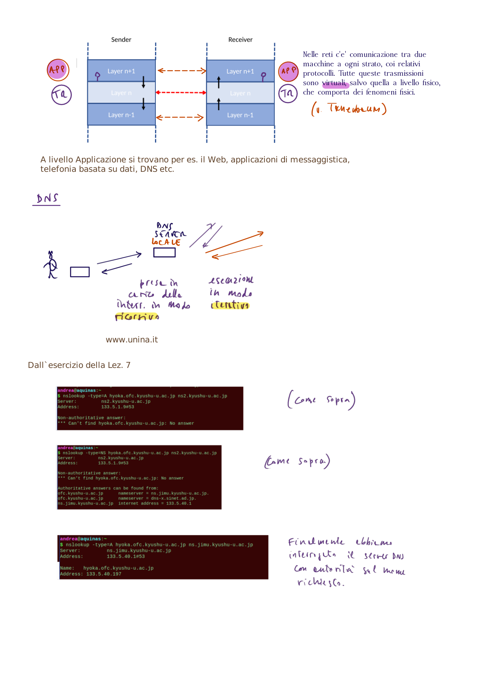
*Figura 5.1 — Comunicazione tra processi remoti tramite socket come porta di interfaccia tra applicazione e SO.*

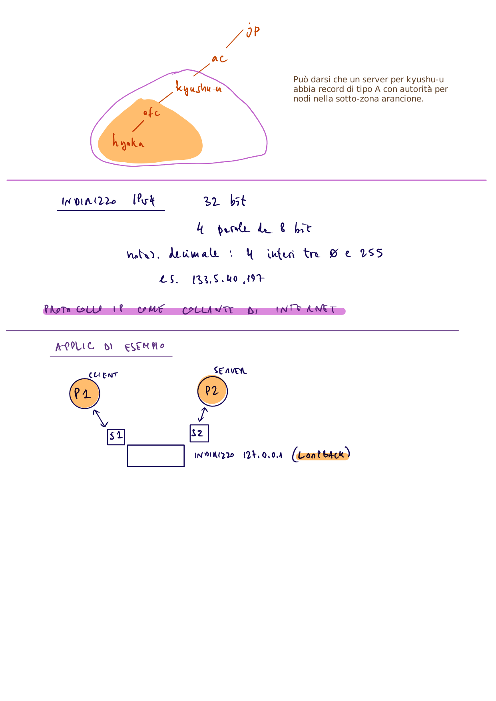
*Figura 5.2 — Incapsulamento del payload applicativo all'interno del segmento di trasporto.*

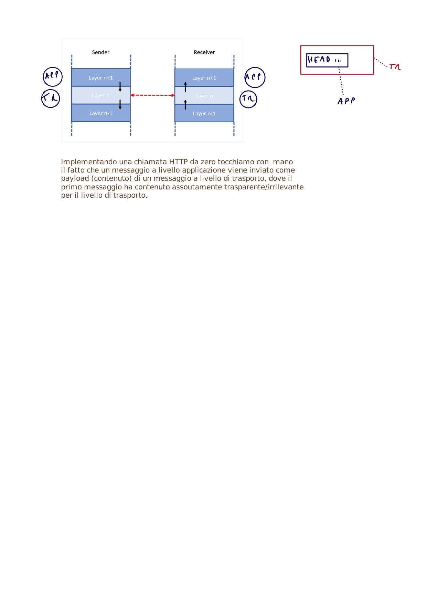
*Figura 5.3 — Costruzione di una richiesta HTTP raw da zero inviata direttamente su socket TCP.*

---

## 6. Il Livello di Trasporto — UDP e Trasferimento Affidabile
<div align="right"><em><a href="#indice">Torna all'indice</a></em></div>

### 6.1 Dal Livello Applicazione al Livello di Trasporto

Un **protocollo di trasporto** fornisce una **comunicazione logica** (process-to-process) tra processi applicativi in esecuzione su host diversi. Dal punto di vista dell'applicazione, i due host sembrano direttamente connessi, anche se si trovano ai lati opposti del pianeta.

Mentre il livello di rete sottostante (es. IP) garantisce l'instradamento logico dei pacchetti da un host all'altro (host-to-host delivery), il livello di trasporto converte i messaggi applicativi in **segmenti** (in TCP) o **datagrammi** (in UDP) aggiungendo un apposito header prima di passarli al livello di rete.

> [!NOTE]
> A livello di trasporto la comunicazione avviene tra **processi**. A livello di rete avviene tra **host**. Il software del livello di trasporto viene eseguito solo sugli host terminali (edge della rete), non nei router interni che agiscono solo fino a livello di rete.

### 6.2 Responsabilità del Livello di Trasporto

I protocolli del livello di trasporto, come UDP e TCP, si fanno carico di quattro responsabilità principali (di cui solo le prime due sono garantite da UDP):

| # | Responsabilità | UDP | TCP | Descrizione |
|---|---------------|-----|-----|-------------|
| 1 | **Process-to-process delivery** | ✅ | ✅ | Consegna del messaggio al processo corretto tramite porte (Mux/Demux). |
| 2 | **Integrity checking** | ✅ | ✅ | Controllo di integrità del dato tramite Checksum (identifica le alterazioni fisiche). |
| 3 | **Reliable data transfer (RDT)** | ❌ | ✅ | Trasferimento Dati Affidabile: arrivo in ordine e senza perdite o duplicati. |
| 4 | **Congestion & Flow control** | ❌ | ✅ | Previene la congestione sia nella rete sia nel buffer del ricevente. |

### 6.3 Multiplexing e Demultiplexing

Più processi (es. browser, Spotify, mail client) possono accedere simultaneamente alla rete. Invece di inviare dati direttamente ai processi, ci si affida alle **socket**, che fungono da interfaccia.

I messaggi vengono diretti tramite **numeri di porta** (da 0 a 65535, 16 bit). Le porte da 0 a 1023 sono dette *Well-known ports* (es. HTTP: 80, DNS: 53, SSH: 22, SMTP: 25).

* **Multiplexing (Mittente)**: Prende i dati dalle diverse socket, assegna le porte sorgente e destinazione, incapsulando il tutto in segmenti per il livello inferiore.
* **Demultiplexing (Destinatario)**: Esamina l'header in arrivo e smista il segmento verso la socket corretta.

> [!TIP]
> **Differenza fondamentale nelle Socket:**
> - Una **socket UDP** è identificata unicamente da 2 elementi: `IP destinazione` + `Porta destinazione`. Vari datagrammi da client diversi verso lo stesso IP/Porta finiranno in una singola coda.
> - Una **socket TCP** è identificata rigidamente da 4 elementi: `IP sorgente`, `Porta sorgente`, `IP destinazione`, `Porta destinazione`. Un server TCP alloca un nuovo thread e una nuova socket per ogni connessione in ingresso!

### 6.4 UDP — User Datagram Protocol

**UDP** è un protocollo minimalista, "best-effort". Prende il payload, aggiunge le funzionalità di mux/demux e un controllo d'errore basilare, per poi inviarlo in rete senza alcuna pretesa.

**Perché scegliere UDP invece del ben più potente TCP?**
1. **Controllo a livello applicativo**: UDP non intralcia l'applicazione. Non impone ritardi per ritrasmissioni forzate o pause per congestione. È eccellente per il *real-time* in cui scartare un pacchetto vecchio è meglio che ritardare l'intero stream.
2. **Nessun ritardo per l'apertura**: UDP è *connectionless*. Nessun handshake iniziale, ergo nessun delay per stabilire la connessione (motivo cruciale per il protocollo DNS).
3. **Nessuno stato di connessione**: Non avendo buffer di invio/ricezione, timer complessi e finestre di congestione, i server UDP possono sopportare un carico di client concorrenti enormemente superiore (maggiore scalabilità).
4. **Overhead ridotto**: L'header di UDP è di soli 8 byte, contro l'header di TCP (20 byte standard).

> [!WARNING]
> Usare massicciamente UDP senza implementare controlli applicativi sul rate d'invio (ad esempio in uno streaming smodato) porta a *UDP-induced packet loss*, in cui un singolo host aggressivo può intasare i router saturandone i buffer, soffocando le connessioni TCP vicine.

### 6.5 Formato e Checksum in UDP

Il datagramma UDP ha una struttura estremamente snella:
```
 ├──────────────────────────────────────┤
 │  Source Port (16) | Dest Port (16)   │  Header (8 byte)
 │  Length (16)      | Checksum (16)    │
 ├──────────────────────────────────────┤
 │          Data (N byte)               │
 └──────────────────────────────────────┘
```

Il **Checksum UDP** fornisce un check d'integrità rudimentale contro alterazioni di bit durante il tragitto. 
**Lato mittente**: I dati vengono trattati come sequenza di numeri interi a 16 bit. Si sommano tutti (gestendo il riporto, detto overflow, sommandolo a sua volta al risultato) e infine se ne fa il **complemento a 1** (inversione dei bit). Questo è il Checksum.
**Lato destinatario**: Si sommano di nuovo tutti i blocchi a 16 bit del pacchetto arrivato, includendo nel conto lo stesso campo Checksum. Se non vi è stata alcuna anomalia fisica, la somma dei bit restituirà obbligatoriamente `1111111111111111`. Se un solo bit vale `0`, il pacchetto viene scartato per errore.

### 6.6 Il Problema del Trasferimento Dati Affidabile (RDT)

Come si può realizzare un Trasferimento Affidabile (*Reliable Data Transfer*, RDT) lavorando sopra un livello di rete notoriamente inaffidabile (come l'IP, che si limita al best-effort)?

**L'analogia della stazione ferroviaria:**
Immaginiamo di essere in una stazione in attesa del Treno 6 sul binario 5. L'altoparlante della stazione (comunicazione inaffidabile) annuncia un cambio e gracchia: *"Il Treno 6 arriverà sul binario 9"*.
Se la trasmissione fallisce, potremmo udire:
- *"Il Treno %&! arriverà sul binario 9"* (Corruzione)
- *"Il Treno 7 arriverà sul binario 9"* (Alterazione non evidente)
- Niente del tutto (Smarrimento).
La ricezione errata porta conseguenze disastrose, e capire che c'è stato un errore è solo il primo passo; rimediare è il vero RDT.

Un **canale affidabile** perfetto deve garantire tre condizioni d'oro:
1. Nessun bit corrotto (gestito parzialmente dal checksum).
2. Nessun bit perso o duplicato.
3. Tutti i bit arrivano esattamente nell'ordine in cui sono partiti.

I router intermedi bufferizzano i pacchetti; se vi è congestione, i pacchetti in eccedenza debordano dai buffer venendo semplicemente cancellati (packet loss). L'RDT deve mascherare del tutto questo dramma all'applicazione sovrastante.

### 6.7 Stop-and-Wait e la Lotta alla Perdita

Il primo primitivo protocollo per l'RDT è lo **Stop-and-Wait**: per ogni singolo pacchetto mandato, il mittente si pianta e attende passivamente un feedback.
* **ACK** (*Positive Acknowledgment*): Tutto bene.
* **NCK** (*Negative Acknowledgment*): C'è un errore o corruzione, rimanda il pacchetto.

Nascono però delle criticità enormi e concatenate:
1. **Problema degli ACK Corrotti (Duplicati)**: Se l'ACK viene distrutto e torna come bit incomprensibili, il mittente non ha idea se il destinatario abbia ottenuto il dato. L'unica opzione è **ritrasmettere**. Ma il destinatario, ricevendo il pacchetto di nuovo, non sa se è un pacchetto *nuovo* o il precedente *ritrasmesso*!
   *Soluzione*: si allega un **Numero di Sequenza** (Sequence Number) ai pacchetti. Nel caso basilare dello Stop-and-Wait, basta che il numero alterni tra `0` e `1`.
2. **Lo smarrimento (Il Deadlock)**: Se il pacchetto si perde nel nulla (loss router), il destinatario non risponde nulla, e il mittente rimane bloccato in attesa per l'eternità.

#### Introduzione del Timeout
La salvezza contro i deadlock da pacchetto perso è il **Timeout**. Se l'ACK non giunge entro lo scoccare del timer, il mittente ritrasmette a prescindere.
Stimare il timeout perfetto è essenziale per la vitalità della rete. Dipende ovviamente dall'RTT (*Round-Trip Time*).
- Se è *troppo lungo*, la comunicazione arranca.
- Se è *troppo corto*, si sprecano risorse per ritrasmettere inutilmente pacchetti lenti ma corretti, intasando ulteriormente la rete.

#### Le Prestazioni Disastrose dello Stop-and-Wait

Possiamo paragonare il RDT a un tubo dell'acqua: con Stop-and-Wait iniettiamo un bicchiere, aspettiamo che arrivi a destinazione e ci ritorni un messaggio a conferma, per poi versare il secondo. 

Calcoliamo quanto tempo spreca il protocollo in uno scenario USA Coast-to-Coast:
* Capacità Link $R$ = `1 Gbps` (`10^9 bit/s`)
* RTT di latenza transatlantica = `30 ms` (`0.03 s`)
* Grandezza Pacchetto $L$ = `1000 Bytes` (`8000 bits`)

Il **Tempo di pura Trasmissione** per spingere 8000 bit sul cavo a 1 Gbps è:
$t_{trasm} = \frac{L}{R} = 0.000008 \text{ sec (8 microsecondi)}$

Se usiamo Stop-and-Wait, il tempo totale (andata del pacchetto e ritorno dell'ACK) è $t_{tot} = RTT + t_{trasm} = 30.008 \text{ ms}$.
La **Utilization** del canale (frazione del tempo utile) è:
$U = \frac{t_{trasm}}{t_{tot}} = \frac{0.008}{30.008} \approx 0.00027 \text{ (0.027\%)}$

Nonostante possediamo una dorsale a `1 Gbps`, il protocollo ci fa sprecare il **99.97%** del tempo in mera attesa. Il throughput effettivo collassa a un misero `27 kbps`.

### 6.8 Il Pipelining: Pompaggio continuo e Finestre

Per sfruttare la larghezza di banda serve il **Pipelining**: si sparano in sequenza molti pacchetti contemporaneamente (riempiendo la "tubazione") prima di esigere qualsiasi ACK.
Questa potenza richiede due cose: buffer per accumulare la miriade di pacchetti in volo, e Numeri di Sequenza enormemente più ampi. 
Per gestire l'inevitabile perdita in un treno di pacchetti, esistono due celebri architetture:

#### 1. Go-Back-N (GBN - Finestra Scorrevole)
Il mittente spara fino a una finestra massima ($N$) di pacchetti non ancora confermati.
* **Lato Destinatario**: Agisce in modo assai pigro ed egoista. Riceve il pacchetto 1, ACK; riceve il 2, ACK; *non* riceve il 3 ma riceve il 4. **Cosa fa? Scarta direttamente e distrugge il pacchetto 4**. Non lo bufferizza affatto. Il destinatario manderà in continuazione l'ACK cumulativo del 2. In Go-Back-N, il destinatario rigetta sistematicamente i pacchetti out-of-order.
* **Lato Mittente**: Avendo spedito 3, 4, 5 e 6, scatterà prima o poi il Timeout sul pacchetto 3. La reazione del mittente è feroce: "Torna indietro a N!" (**Go Back N**). Invalida tutta la coda e ritrasmette l'intero treno 3, 4, 5 e 6 pur sapendo che alcuni erano già arrivati, sprecando molta banda e congestionando la rete.

#### 2. Selective Repeat (SR - Ripetizione Selettiva)
Evoluzione efficiente di GBN, progettato per evitare ritrasmissioni cieche e rovinose.
* **Lato Destinatario**: È dotato di memoria. Se si smarrisce il pacchetto 3, l'arrivo del 4, 5 e 6 non viene cestinato ma intelligentemente **bufferizzato** (salvato da parte). Viene inviato un ACK *individuale* (non cumulativo) per i pacchetti correttamente giunti fuori ordine.
* **Lato Mittente**: Deve mantenere i singoli timer per ogni pacchetto in volo. Ritrasmetterà in modo chirurgico *soltanto* il pacchetto 3 smarrito, chiudendo il buco.

> [!CAUTION]
> **Il tallone d'Achille del Selective Repeat:** 
> Vi è un vincolo critico in Selective Repeat per evitare allucinazioni del destinatario di fronte a grossi ritardi. Immaginiamo che il destinatario confermi 3 vecchi pacchetti e si sposti su una nuova finestra, ma che i tre ACK vadano tutti perduti. Il mittente rinvierebbe la vecchia tornata di pacchetti usando gli stessi numeri di sequenza, e il ricevente confonderebbe la ritrasmissione stantia coi nuovi pacchetti attesi per il prosieguo, corrompendo per sempre il file!
> Per evitare questa fatale omonimia (aliasing temporale), il numero di sequenza disponibile deve essere per forza vasto.
> Esiste una regola aurea: **L'intero campo dei Numeri di Sequenza in uso deve essere pari ad almeno il doppio dell'ampiezza della Window Size ($Seq \ge 2N$)**.

---

## 7. Il Protocollo TCP
<div align="right"><em><a href="#indice">Torna all'indice</a></em></div>

### 7.1 Caratteristiche Distintive di TCP

Rispetto all'immaturo UDP, **TCP (Transmission Control Protocol)** si distingue per le seguenti proprietà granitiche:
- **Connection-oriented**: Impone una stretta di mano iniziale (handshake) prima di iniettare dati in rete, garantendo che i sistemi siano coordinati e pronti (buffer allocati).
- **Affidabile (Reliable)**: Implementa internamente checksum, ack, ritrasmissioni chirurgiche e timer su modello *Selective Repeat/Pipelining* per annientare ogni traccia di pacchetto perduto.
- **Full-duplex**: Il flusso è bi-direzionale contemporaneo. Quando A parla a B, i dati che A manda a B e i dati che B manda ad A viaggiano in parallelo sui medesimi segmenti.
- **Point-to-point**: Una conversazione TCP è sempre e solo tra due endpoint monolitici. Esclude categoricamente i broadcast e multicast.
- **Stream-oriented**: Apparentemente i pacchetti non esistono. TCP mostra l'informazione alle app sovrastanti come un flusso (stream) liquido e continuo di *byte*, celando la sua frantumazione retrostante.

### 7.2 L'Architettura dei Buffer TCP

In TCP l'invio non è sincrono.
```
Processo A (App)                      Processo B (App)
       │                                     ▲
 [Send-Buffer A]                       [Rcv-Buffer B]
       │                                     │
 Segmenti in Rete ═══════════════════►   Lettura lenta
```
Il buffer disaccoppia provvidenzialmente i ritmi frenetici dell'OS dalla velocità esatta e ballerina del mezzo trasmissivo e dell'app ricevente, mitigando blocchi, strozzature (bottlenecks) e consentendo il prelievo intelligente.

### 7.3 MSS: Maximum Segment Size

Quanta roba entra al massimo in un singolo segmento TCP?
La formula parte dalle restrizioni fisiche (Link Layer):
```
MSS = MTU - (Header IP) - (Header TCP)
```
In una rete Ethernet tipica l'**MTU** è 1500 byte. Rimuovendo i classici 20 byte del protocollo IPv4 e 20 byte dell'header TCP, il **Maximum Segment Size ammonta comunemente a 1460 byte** di solo payload.

### 7.4 Il Segmento TCP (Anatomia)

```
 ├─────────────────────────────────────────────────────────┤
 │  Source Port (16)      |  Destination Port (16)         │
 │  Sequence Number (32)                                   │
 │  Acknowledgment Number (32)                             │
 │  HdrLen | Flags (CWR,ECE,URG,ACK,PSH,RST,SYN,FIN) | RcvWnd │
 │  Checksum (16)         |  Urgent Data Pointer (16)      │
 │  Options (variabile, es. Timestamp, Window scale)       │
 ├─────────────────────────────────────────────────────────┤
 │  Payload Dati (≤ MSS byte)                              │
 └─────────────────────────────────────────────────────────┘
```

I flag più cruciali a 1 bit dettano lo stato del motore di TCP:
* **ACK**: Se attivato (quasi sempre dopo l'inizio), segnala che il campo `Acknowledgment Number` ha valenza.
* **SYN**: Sincronizza i numeri di sequenza all'alba della connessione.
* **FIN**: Denota la volontà irrevocabile di chiudere il dialogo.
* **RST**: Trancia la connessione in emergenza (Reset) scartando i buffer in volo.
* I campi **RcvWnd** (Receive Window per il controllo di flusso) e **Sequence/Ack Numbers** (per l'RDT) formano la trinità della sicurezza TCP.

### 7.5 Numeri di Sequenza e Acknowledgment: L'arte del Byte-Stream

> [!IMPORTANT]
> L'errore più comune fra gli studenti è credere che il Numero di Sequenza si riferisca al "numero del pacchetto" (pacchetto 1, pacchetto 2, ecc). In TCP non è così. **TCP quantifica e numera ogni singolo byte trasmesso nel flusso di dati.**

* **Sequence Number**: Indica la posizione all'interno dello stream del **primissimo byte** trasportato dal payload di quel segmento. 
  *(Es. un file di 500.000 byte con MSS di 1000 byte produrrà il Segmento 1 con `Seq=0`, e il Segmento 2 con `Seq=1000`)*.
* **Acknowledgment Number**: Indica in ogni istante **la posizione del prossimo byte logico atteso** da parte del ricevente.

**L'arte del Piggybacking (Full-Duplex)**
Se stiamo comunicando e tu mi mandi dei dati, io non consumo banda inviandoti un pacchetto di solo ACK. Se ho dei dati di risposta da mandarti, "incollerò" furtivamente il mio ACK di avvenuta ricezione nel nuovo pacchetto di dati che sto mandando a te. 

> *Esempio Telnet (A invia 'c' e B fa l'eco di 'c'):*
> 1. $A \rightarrow B$: Il client invia il carattere (1 byte). Header: `Seq=42, Ack=79, Payload='c'`
> 2. $B \rightarrow A$: Il server incapsula in sol colpo l'ACK, l'avanzamento d'invio, e il suo payload in eco. Header: `Seq=79, Ack=43` (*piggybacking*, si aspetta il byte 43 in arrivo dal client!), `Payload='c'`.
> 3. $A \rightarrow B$: L'host conferma puro l'eco. Header: `Seq=43, Ack=80, Payload=Nessuno`.

### 7.6 Stima RTT Perfetta e Timeout Infallibili

Il protocollo si sintonizza alla latenza globale del mondo calcolando l'RTT su base mobile per regolare il Timeout d'errore (che idealmente deve essere di pochissimo superiore al viaggio andata-ritorno).

TCP stima un RTT inglobando la storia passata tramite una media esponenziale smorzata (per non impazzire ai primi lag accidentali del router):
$$EstimatedRTT = (1-\alpha) \cdot EstimatedRTT + \alpha \cdot SampleRTT \quad (\alpha \approx 0.125)$$

TCP tiene perfino conto dell'imprevedibilità del canale misurando la "deviazione" (DevRTT) dallo standard, come cuscinetto in caso di estrema volatilità della connessione.
Il Timeout di reazione allo smarrimento si stabilizza su:
$$TimeoutInterval = EstimatedRTT + 4 \cdot DevRTT$$
Questa calibrazione chirurgica annienta sia i Timeout troppo prolungati che paralizzano la rete, sia le ritrasmissioni precipitate.

### 7.7 Il Salvataggio Rapido: Fast Retransmit

Aspettare inerme la scadenza del cronometro di un Timeout è inaccettabile e blocca intere comunicazioni per svariati decimi di secondo. TCP integra una tattica geniale chiamata **Fast Retransmit**.

Se un pacchetto `N` si disintegra in strada ma il treno di pacchetti prosegue indisturbato, il ricevente incassa il pacchetto `N+1`, ma non è l'N. Quindi il ricevente cosa fa? Manda indietro immediatamente un **ACK duplicato** implorando incessantemente di spedirgli la sequenza per l'N. Se arrivano `N+2` e `N+3`, spara ancora il medesimo ACK vecchio.

Quando il mittente in attesa scorge nel registro l'arrivo anomalo di **3 ACK duplicati identici**, realizza che è altamente probabile un inabissamento di rete. Sospende i timer e agisce in emergenza: **ritrasmette seduta stante** il segmento smarrito ancor prima che scada il fatidico timeout!

*(Perché si attende l'accumulo di 3 ACK e non 1 o 2? Per scongiurare allarmi dovuti a semplici pacchetti scompaginati e rimescolati dal router senza vera perdita).*

### 7.8 L'Odissea del Connection Management: Two-Army Problem

Costruire un accordo a distanza tramite canali intrinsecamente pericolosi genera una paralisi teorica riassumibile nel famoso **Two-Army Problem** (Il dilemma dei due generali).

*Due legioni devono attaccare una roccaforte, ma distano due crinali. Possono vincere solo se attaccano all'alba simultaneamente. Il Generale A invia un messaggero al B: "Attacchiamo all'alba, d'accordo?". Il Generale B accetta e rinvia il messaggero per dirgli di sì. B però tentenna: "Il messaggero è giunto ad A?". A dal canto suo teme: "Il mio ACK è giunto a B?". Così, non essendoci certezza definitiva della conferma ultima, nessuno attaccherà mai.*

La logica impietosa afferma che non esiste alcun protocollo umano né artificiale totalmente esente da falle al 100% senza comunicazione continua. Tuttavia, TCP utilizza una soluzione "sufficientemente buona" per sfiorare l'eccellenza: l'iconico **Three-Way Handshake**.

#### The Three-Way Handshake (L'Apertura)
```
CLIENT                                  SERVER
  │── SYN=1, SEQ=client_isn ───────────────►│
  │   "Voglio connettermi, inizio al seq X" │ (Server alloca memoria)
  │                                         │
  │◄─ SYN=1, ACK=1, SEQ=server_isn, ────────│
  │   ACK_NUM=client_isn+1                  │
  │   "Okay, ti riscontro l'X+1 e io ti     │ (Client alloca memoria
  │    parlerò dal seq Y"                   │  ed è ufficialmente ESTABLISHED)
  │                                         │
  │── SYN=0, ACK=1, SEQ=client_isn+1 ──────►│
  │   ACK_NUM=server_isn+1                  │ (Server è ufficialmente ESTABLISHED)
  │   "Ottimo, riscontro l'Y+1"             │
  │                                         │
  └───────── CONNESSIONE APERTA ────────────┘
```
I seq originari (ISN) sono randomici, per eludere intromissioni. Se un malevolo inonda il server di richieste di SYN senza mai chiudere il passaggio 3 (ignorando il SYN-ACK), esaurisce la RAM del sistema operativo saturando tutte le code di handshake: **È il devastante SYN Flood (attacco DoS).**

#### The Connection Teardown (La Chiusura a 4 vie)

Concluso il suo corso vitale, TCP scioglie educatamente la collaborazione disattivando autonomamente entrambe le direttive. Il client alza bandiera col bit **FIN**. Il Server avalla la chiusura. Dopodiché tocca al server inoltrare un pacchetto **FIN** di chiusura e ottenere un ACK dal client.

```
CLIENT                                  SERVER
  │── FIN=1 ───────────────────────────────►│  
  │◄─ ACK=1 ────────────────────────────────│ (Server: chiude la strada client->server)
  │                                         │  
  │◄─ FIN=1 ────────────────────────────────│  
  │── ACK=1 ───────────────────────────────►│ (Client: attesa forzata prima di sganciarsi, 
  └───── CONGEDO COMPLETATO (TIME_WAIT) ────┘  evitando perdite finali degli ACK)
```
*I timer di Time-Wait al passo 4 proteggono dal disastro che il Server non udendo l'ultimo ACK reinvii di nuovo il FIN trovando la porta del client definitivamente sprangata (RST).*

---

## 8. Controllo di Flusso e Controllo della Congestione
<div align="right"><em><a href="#indice">Torna all'indice</a></em></div>

### 8.1 Flow Control (Controllo di Flusso o Speed-Matching)

**Lo scopo:** Evitare che l'entusiasmo della rete sfoci in un **overflow del Receive-Buffer** in casa del destinatario. TCP applica uno *speed-matching* bilanciando il tasso di emissione con il tasso vitale con cui l'applicazione di destinazione sta effettivamente leggendo la socket.

**Il meccanismo:**
Nel segmento TCP viaggiano implicitamente comunicazioni in ogni pacchetto. L'host B inietta nell'header il parametro `Receive Window (rwnd)`, un valore che decreta ufficialmente quanto buffer vuoto e ricevente gli rimane:
$$rwnd = RcvBuffer - (LastByteRcvd - LastByteRead)$$

L'host A (mittente) vincola il suo traffico totale non confermato in volo (`LastByteSent - LastByteAcked`) a essere rigorosamente minore del limite dinamico `rwnd`.

> [!TIP]
> **Lo stallo del Flow Control (Il rwnd a zero):**
> Se il server notifica un amaro `rwnd = 0`, il client incrocia le braccia paralizzato in attesa che si svuoti il buffer. Non saprà mai se il buffer s'è liberato perché i pacchetti che avvisano sono allegati ai segmenti in corsa. Per sbloccare lo stallo, il mittente in stand-by inietta ostinatamente periodicamente minimi frammenti "sonda" (1 byte) provocando la rispedizione aggiornata della `rwnd`.

### 8.2 L'Abisso della Congestione

Mentre il Flow Control bada che le due parti umane non deraglino, il **Congestion Control** sorveglia che le viscere della terra — le immense dorsali infrastrutturali dei router internet (rete IP) — non esplodano sotto i giga di traffico simultaneo.

> [!IMPORTANT]
> **Flow control**: Implora di rallentare perché l'App *ricevente* è sommersa.
> **Congestion control**: Costringe brutalmente a rallentare perché i *Router intermedi IP* stanno collassando ed eliminando pacchetti.

Se un collo di bottiglia fisico, un link di capacità `R`, assorbe da più emittenti dati a tassi combinati di arrivo medi $\lambda > R/2$ i buffer all'interno dei router traboccano di latenza infinita, collassando nell'effetto a palla di neve (valanga) di congestione dove la pacchettizzazione in ingresso soffoca e innesca enormi ondate di *timeout e ritrasmissioni distruttive a catena* che bruciano irrimediabilmente la banda.

### 8.3 Algoritmo di Jacobson — Rate Regulation TCP End-to-End

In assenza di sussidi di router espliciti per gran parte dell'internet originario, TCP impiega una rilevazione puramente inferenziale, da orbo: **Approccio End-to-End**. Intuisce la presenza di congestione per la pura percezione che iniziano a manifestarsi all'improvviso i terribili *loss events* (i timer del Timeout esplodono o arrivano piogge di ACK duplicati).

Regolando il motore del traffico, TCP limita la mole massima da gettare nella rete tramite la sua **Congestion Window (cwnd)**. Il vincolo generale e supremo diviene la combinazione del limite del server col limite della rete:
$$\text{Traffico non-confermato} \le \min(cwnd, rwnd)$$

**Bandwidth Probing (Il test dei tassi):** TCP spinge progressivamente in alto la finestra per testare fin dove la capacità fisica di Internet possa espandersi intatta, e si auto-decapita drasticamente appena subodora la congestione.

L'algoritmo di Jacobson (standard TCP Reno) si erge su **3 imponenti Fasi Strutturali**:

#### 1. Slow Start (Fase di Avvio Lento)
Inizio umile e feroce sondaggio esponenziale.
- L'innesco avviene partendo cautamente con l'infinitesimo `cwnd = 1 MSS`.
- A ciascun glorioso arrivo trionfante di ACK, `cwnd` è premiato duplicandosi e incamerando un incremento netto (`cwnd += 1 MSS`).
- Raddoppiando per ogni RTT, innalza brutalmente la capacità con la **crescita esponenziale**, fin quando o va a infrangersi nella congestione, o urta una morbida soglia psicologica precauzionale, la `ssthresh` (Slow Start Threshold), passando automaticamente alla marcia lenta.

#### 2. Congestion Avoidance / Additive Increase (Crescita Lineare e Prevenzione)
Superata l'ignara soglia sicura, l'arroganza esponenziale cessa, per subentrare in una saggia cautela.
- La `cwnd` prosegue la sua ascesa un millimetro alla volta: un microscopico MSS a ciascun RTT totale per evitare bruschi traumi (`+1 MSS per RTT`).

**E SE ARRIVA IL COLLASSO? (I DUE LIVELLI D'ALLARME DI LOSS EVENT)**:
- L'allarme apocalittico (Timeout totale per silenzio stampa). Il protocollo ammette il crollo. Abbassa miseramente l'asticella `ssthresh` a metà del valore e precipita a una ridicola `cwnd = 1 MSS` costringendo a un nuovo estenuante ciclo di Slow Start dall'abisso.
- L'allarme gestibile (3 ACK duplicati). Non c'è un blocco silente, bensì solo frammentazione persa! Si salva in calcio d'angolo scivolando nell'apposita fase d'emergenza.

#### 3. Fast Recovery (Ritrasmissione Rapida e Ripresa)
Interviene salvando il salvabile in onore all'allarme di 3 ACK Duplicati.
Sempre falciando l'asticella `ssthresh` a metà `cwnd`, preserva però saggiamente la velocità assunta al collasso ritoccandola: 
`cwnd = ssthresh + 3 MSS`.
Ritrasmette il pacchetto esatto e reinnesca istantaneamente l'innalzamento addizionale (Congestion Avoidance), senza punire spropositatamente il mittente fino a costringerlo al riavvio infame dello Slow Start.

La raffigurazione su grafico assume così gli iconici e caratteristici andamenti di una perenne catena dentata, comunemente battezzati **Il "dente di sega" di TCP (Sawtooth behavior)**.

---

## 9. Il Livello di Rete — IP e Router
<div align="right"><em><a href="#indice">Torna all'indice</a></em></div>

### 9.1 Funzioni del Livello di Rete

**Host-to-host delivery:**
- **All'host mittente**: incapsula segmenti in datagrammi, li invia
- **All'host destinatario**: riceve datagrammi, estrae segmenti, li consegna al trasporto

Protocolli principali: **IP, DHCP, NAT**.

### 9.2 Servizi del Livello di Rete

**Servizi che Internet potrebbe offrire** (ma tipicamente non offre):
- Consegna garantita, con ritardo limitato, in ordine, con banda minima, con sicurezza

**Servizio offerto da Internet:** **Best-effort**
- La rete fa del suo meglio
- Nessuna garanzia su ordine, consegna, ritardo, banda
- Funziona bene con sufficiente banda (Netflix, VoIP, conferenze, ecc.)

### 9.3 Router: Forwarding e Routing

**1. Forwarding (Piano dei Dati):**
- Azione locale: trasferisce pacchetto dall'input link all'output link appropriato
- Operazione **veloce** (nanoseccondi), implementata in **hardware**

**2. Routing (Piano di Controllo):**
- Processo globale: determina percorsi end-to-end
- Operazione **lenta** (secondi), implementata via **software**

**Forwarding table:** associa indirizzi di destinazione a interfacce di output.

**Creazione delle tabelle:**
- **Distribuita**: ogni router ha un componente di routing (approccio tradizionale)
- **Centralizzata**: controller remoto calcola e distribuisce → **SDN (Software-Defined Networking)**

### 9.4 Tipi di Router

| Tipo | Descrizione | Esempio |
|------|-------------|---------|
| **Home router** | Uso domestico | TP-Link AX6600 |
| **Business router** | Uso aziendale | Cisco RV016 |
| **Edge router** | Connette LAN ↔ ISP | Juniper MX2020 |
| **Core router** | Backbone Internet | Cisco CRS-1 |

### 9.5 Componenti di un Router

```
Input Links ──► [Input Port 1...N] ──► [Switch Fabric] ──► [Output Port 1...N] ──► Output Links
                       │                                           │
                  [Forwarding Table]              [Routing Processor]
```

- **Input ports**: lookup della forwarding table, preparano il switching
- **Switch fabric**: connette input a output ports
- **Output ports**: trasmettono i pacchetti sul link in uscita
- **Routing processor**: calcola/aggiorna la forwarding table

### 9.6 Longest Prefix Matching

**Forwarding table esempio:**

| Prefisso IP | Interfaccia |
|-------------|-------------|
| 11001000 00010111 00010*** ******** | 0 |
| 11001000 00010111 00011000 ******** | 1 |
| 11001000 00010111 00011*** ******** | 2 |
| Otherwise | 3 |

**Regola:** Se un IP corrisponde a più voci, vince la voce con il **prefisso più lungo**.

**Esempio:** IP `...00011000 10101010` → corrisponde a interfaccia 1 (24 bit match) e 2 (21 bit match) → **interfaccia 1 vince**.

### 9.7 Schemi e Appunti dalle Lavagne (Lezioni 14 e 15)

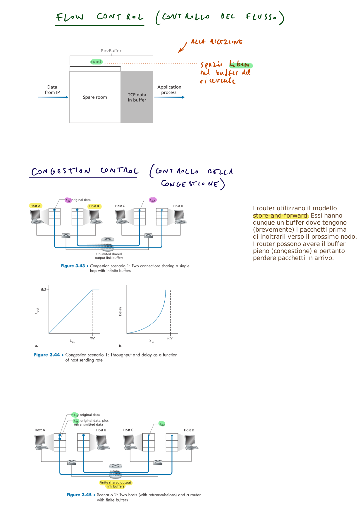
*Figura 9.1 — Architettura interna del router: commutazione store-and-forward e buffer di memoria.*

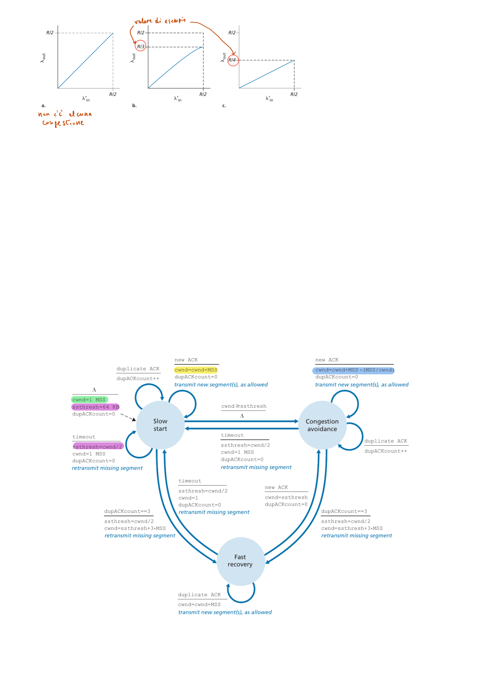
*Figura 9.2 — Fenomeni di accodamento in ingresso/uscita e perdita di pacchetti per overflow.*

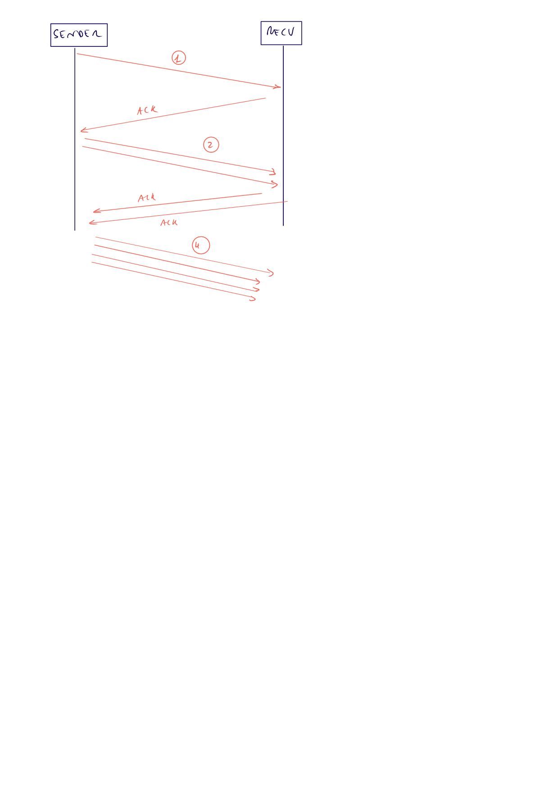
*Figura 9.3 — Gestione della fabric di commutazione ad alta velocità.*

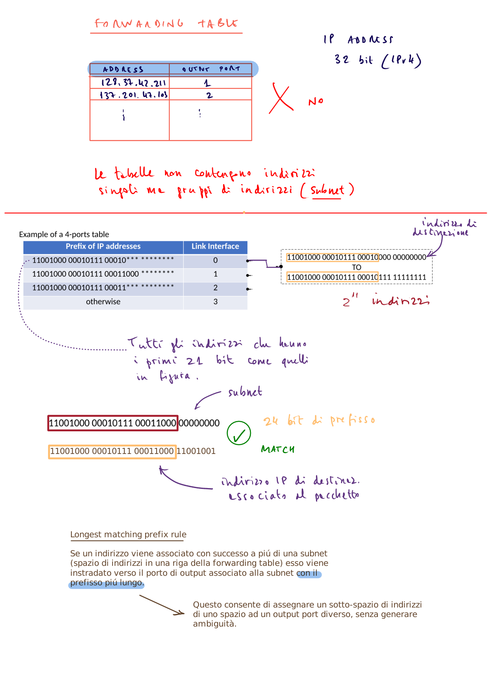
*Figura 9.4 — Regola del Longest Matching Prefix calcolata bit a bit in binario.*

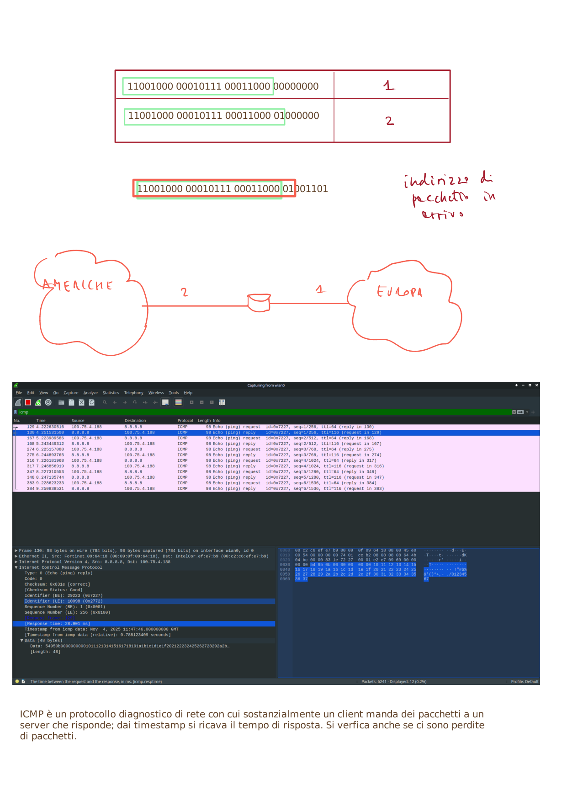
*Figura 9.5 — Esempio pratico di disaggregazione delle rotte su tabella di inoltro.*

---

## 10. Indirizzamento IP, DHCP, NAT e IPv6
<div align="right"><em><a href="#indice">Torna all'indice</a></em></div>

### 10.1 Indirizzo IP (IPv4)

- **32 bit** (4 byte), scritto in **notazione decimale con punti**
- ~2³² ≈ **4 miliardi** di indirizzi possibili

```
193.32.216.9 = 11000001 00100000 11011000 00001001
```

- L'IP è associato all'**interfaccia** (non all'host)
- Un host ha tipicamente 1 interfaccia, un router ne ha più

### 10.2 Subnetting

Le reti sono organizzate gerarchicamente in **sottoreti**:
- Prima parte dell'IP = subnet (parte di rete)
- Seconda parte = host (interfaccia specifica)

**Subnet mask:** specifica quali bit appartengono alla subnet.

```
IP:          193.32.216.9  = 11000001 00100000 11011000 00001001
Subnet Mask: 255.255.255.0 = 11111111 11111111 11111111 00000000
Notazione:   193.32.216.0/24
```

**Esempi subnet mask valide:**

| Notazione | Binary | Tipo |
|-----------|--------|------|
| 255.255.255.0 (/24) | 11111111 11111111 11111111 00000000 | ✅ Valida |
| 255.255.128.0 (/17) | 11111111 11111111 10000000 00000000 | ✅ Valida |
| 255.255.10.0 | 11111111 11111111 00001010 00000000 | ❌ NON valida (bit non contigui) |

**Determinare stessa subnet:** confrontare i prefissi.

| IP 1 | Subnet Mask | IP 2 | Risultato |
|------|-------------|------|-----------|
| 231.23.11.117 | /24 | 231.23.11.9 | Stessa subnet |
| 110.32.100.10 | /11 | 110.64.100.11 | Subnet diverse |

**Comandi Linux:**
```bash
ifconfig          # Vedi configurazione interfacce
ip addr           # Alternativa moderna a ifconfig
ipconfig          # Windows
```

### 10.3 DHCP — Dynamic Host Configuration Protocol

**DHCP** assegna automaticamente IP agli host. Fornisce anche:
- Subnet mask
- Gateway predefinito
- Indirizzo DNS locale

Formalmente è un protocollo **applicativo**. È **plug-and-play**.

**4 passi DHCP:**

```
Nuovo Host                           Server DHCP
  │── DHCP Discover ─────────────────►│ Broadcast (src: 0.0.0.0, dst: 255.255.255.255)
  │◄── DHCP Offer ─────────────────────│ Offre configurazione (yiaddr)
  │── DHCP Request ───────────────────►│ Accetta l'offerta
  │◄── DHCP ACK ────────────────────────│ Conferma
```

**Relay DHCP:** se il server DHCP è in un'altra subnet, un router configurato come relay agent inoltra i messaggi.

```bash
ip addr    # Vedi IP e maschera (Linux)
ip route   # Vedi gateway predefinito
```

### 10.4 NAT — Network Address Translation

**NAT** permette di condividere un singolo IP pubblico per un'intera rete locale.

**Indirizzi privati riservati:**
- `10.0.0.0/8`
- `172.16.0.0/12`
- `192.168.0.0/16`

**Come funziona:**
1. Host interno (`192.168.1.5:4321`) → router NAT
2. Router sostituisce IP+porta sorgente con IP pubblico + porta casuale (es. `203.1.2.3:5001`)
3. Aggiunge mappatura alla **NAT translation table**
4. Quando il server risponde a `203.1.2.3:5001`, il router reinoltra all'host interno

### 10.5 IPv6

**Motivazione:** esaurimento indirizzi IPv4.

| Caratteristica | IPv4 | IPv6 |
|---------------|------|------|
| Indirizzo | 32 bit | **128 bit** (~3.4×10³⁸) |
| Notazione | x.x.x.x | x:x:x:x:x:x:x:x (esadecimale) |
| Checksum | Presente | **Rimosso** |
| Header | Variabile | Fisso 40 byte |
| NAT | Necessario | Non necessario |

**Esempio indirizzo IPv6:**
```
2001:0db8:85a3:0000:0000:8a2e:0370:7334
# Abbreviato:
2001:db8:85a3::8a2e:370:7334
```

**Transizione IPv4→IPv6:** si usano **tunnel** (datagrammi IPv6 incapsulati in IPv4).

### 10.6 Schemi e Appunti dalle Lavagne (Lezione 17)

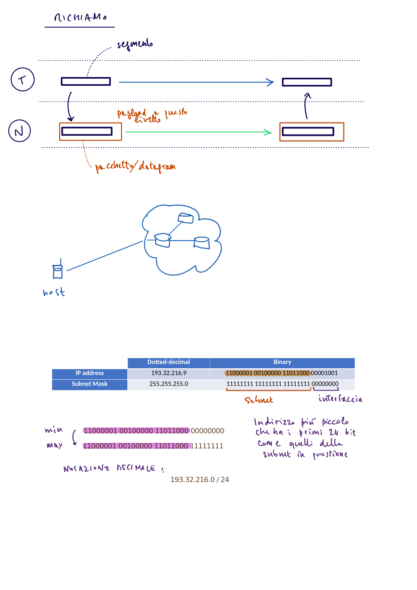
*Figura 10.1 — Calcolo in binario delle maschere di sottorete e separazione NetID / HostID.*

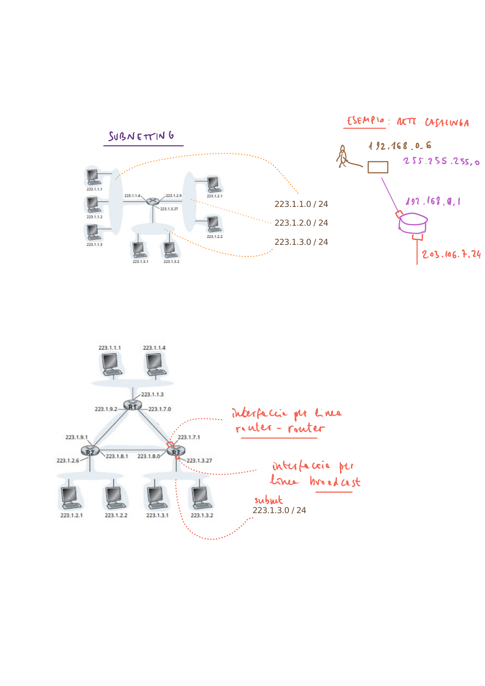
*Figura 10.2 — Individuazione dell'indirizzo di rete (tutti 0) e dell'indirizzo di broadcast (tutti 1).*

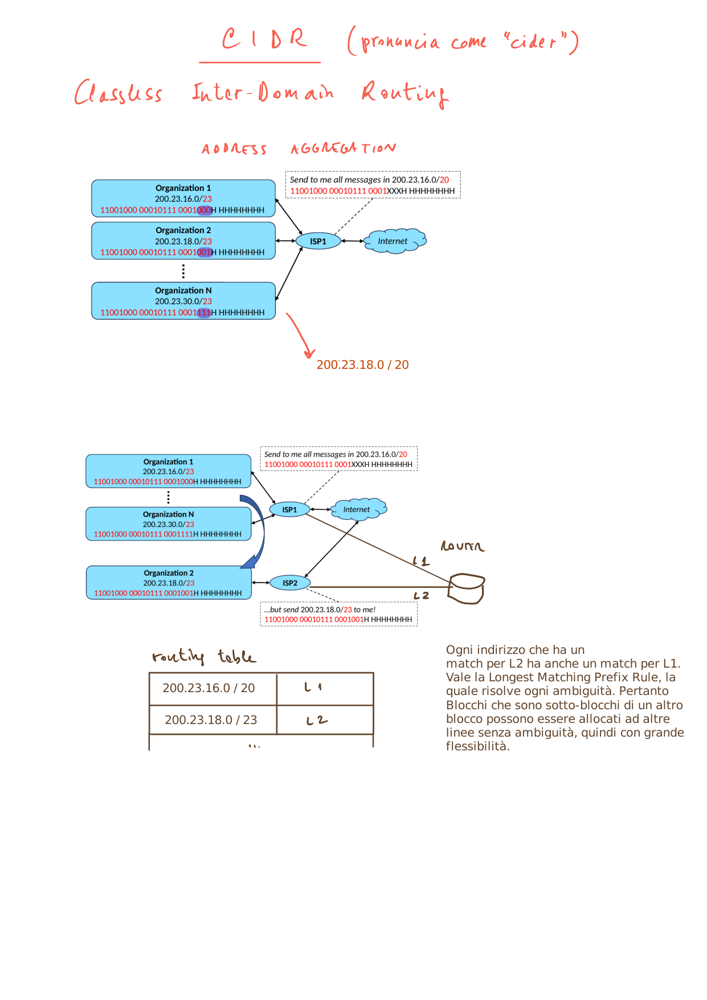
*Figura 10.3 — Esercizio svolto di subnetting: partizionamento dell'indirizzo 193.32.216.0 / 24.*


*Figura 10.4 — Tabella di riepilogo con range di host assegnabili per ciascuna sottorete.*

---

## 11. Il Piano di Controllo — Algoritmi di Routing
<div align="right"><em><a href="#indice">Torna all'indice</a></em></div>

### 11.1 Introduzione al Routing

I router usano **algoritmi di routing** per determinare i percorsi ottimali (costo minimo) dai mittenti ai destinatari.

**I router non conoscono la rete all'avvio:** devono scoprire la topologia attraverso messaggi con i vicini.

### 11.2 Flooding

Ogni router inoltra tutti i pacchetti in ingresso a tutti i link (tranne quello di origine).

**Pro:** esplora tutti i percorsi, estremamente robusto.
**Contro:** traffico enorme, impraticabile per reti grandi.

### 11.3 Formulazione del Problema di Routing

Rete modellata come **grafo G=(N,E)**:
- **N**: nodi (router)
- **E**: archi (link) con costo `c(x,y)`
- Se `(x,y)∉E`: `c(x,y)=∞`
- Grafo non orientato: `c(x,y)=c(y,x)`

**Obiettivo:** trovare il percorso di costo minimo.

### 11.4 Algoritmo Distance Vector (DV)

**Approccio distribuito e asincrono.** Ogni router conosce solo la distanza dai vicini.

**Equazione di Bellman-Ford:**
```
D(x, y) = min_v { c(x,v) + D(v, y) }
```

**Funzionamento:**
1. Ogni nodo `x` mantiene `D(x, y)` per ogni destinazione `y`
2. Periodicamente invia il proprio vettore di distanze ai vicini
3. Aggiorna le stime quando riceve un vettore da un vicino:
   `D(x,y) = min_v{ c(x,v) + D_v(y) }`
4. Si ripete fino alla convergenza

**Problema Count-to-Infinity:** in caso di guasto, convergenza molto lenta o cicli.

**Soluzione parziale — Poisoned Reverse:** se Z raggiunge X attraverso Y, Z comunica a Y che `D(Z,X)=∞` (evita cicli a 2 nodi).

### 11.5 Algoritmo Link-State (LS) — Dijkstra

**Approccio centralizzato.** Sfrutta la conoscenza completa della rete.

**Come si ottiene la conoscenza completa (4 passi):**
1. **Scoperta vicini**: manda "hello" su tutti i link
2. **Setup costi**: imposta le distanze ai vicini
3. **Costruzione pacchetto**: ID vicini + costi
4. **Scambio broadcast**: invia il pacchetto a tutti gli altri router

**Algoritmo di Dijkstra (pseudocodice):**

```
LinkState(x):
    N' = {x}
    for all nodes v:
        D(v) = c(x,v) se vicino, else ∞
    repeat:
        w = nodo non in N' con D(w) minimo
        add w to N'
        for each neighbor v of w not in N':
            D(v) = min(D(v), D(w)+c(w,v))
    until N' = N
```

**Complessità:** O(n²) base, O(n log n) con heap.

### 11.6 Confronto DV vs. LS

| Caratteristica | Distance Vector (DV) | Link-State (LS) |
|----------------|---------------------|-----------------|
| **Conoscenza** | Solo dai vicini (locale) | Intera rete (globale) |
| **Complessità messaggi** | Bassa | Alta (broadcast) |
| **Convergenza** | Lenta, count-to-infinity | Veloce |
| **Robustezza** | Bassa (errori si propagano) | Alta (calcoli indipendenti) |

> **In Internet si usano entrambi:** OSPF usa LS, BGP usa DV.

### 11.7 Schemi e Appunti dalle Lavagne (Lezioni 18, 19, 20 e 21)

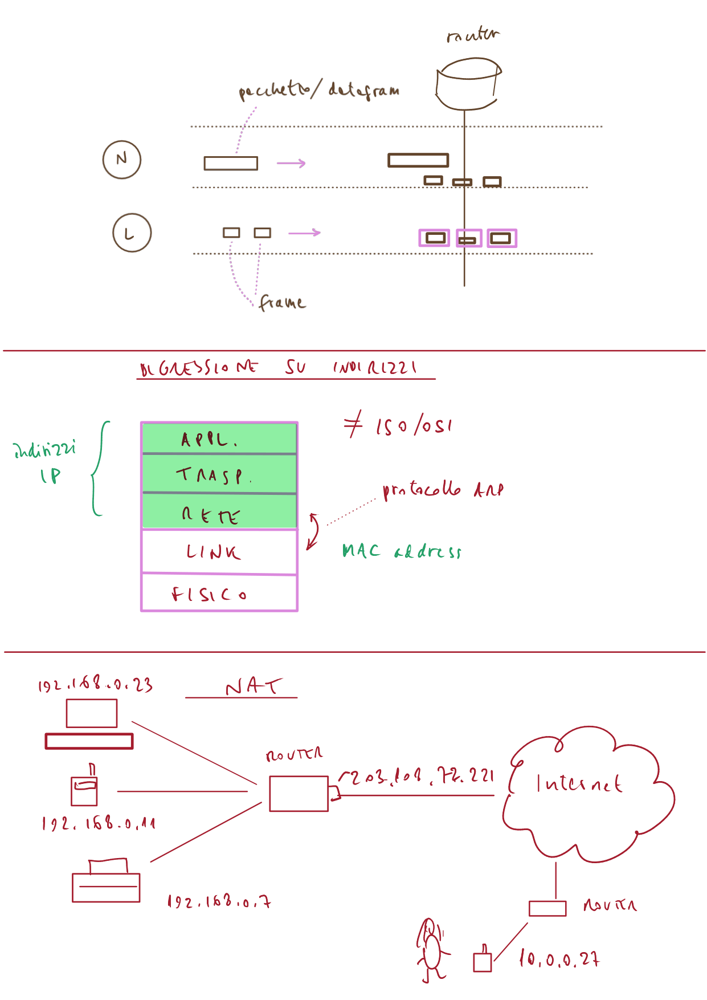
*Figura 11.1 — Rappresentazione formale della rete come grafo $G = (N, E)$ con pesi sui link.*

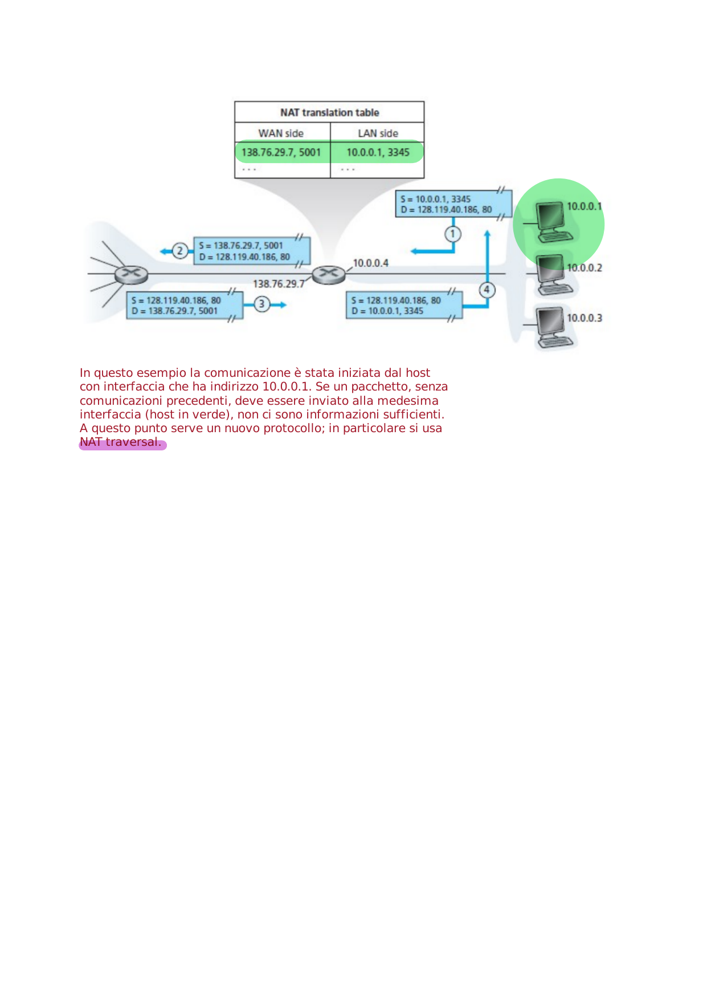
*Figura 11.2 — Proprietà di ottimalità dei percorsi e instradamento a costo minimo.*

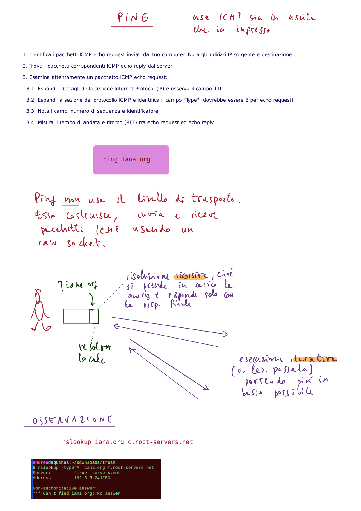
*Figura 11.3 — Analisi dei pacchetti ICMP Echo Request ed Echo Reply.*

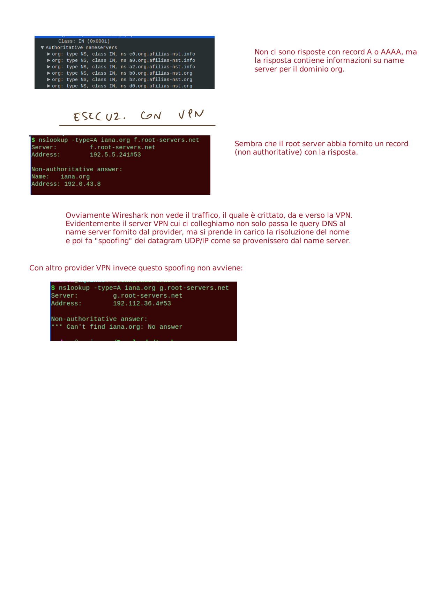
*Figura 11.4 — Meccanismo di Traceroute basato sul decremento del TTL e messaggi Time Exceeded.*

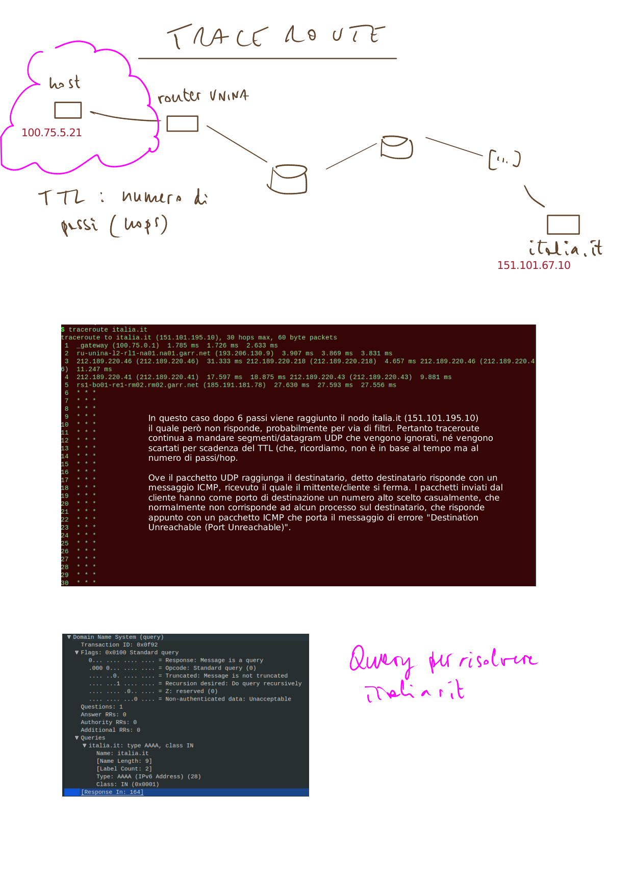
*Figura 11.5 — Esame dei campi del datagramma IP e del payload UDP nelle sonde di rete.*

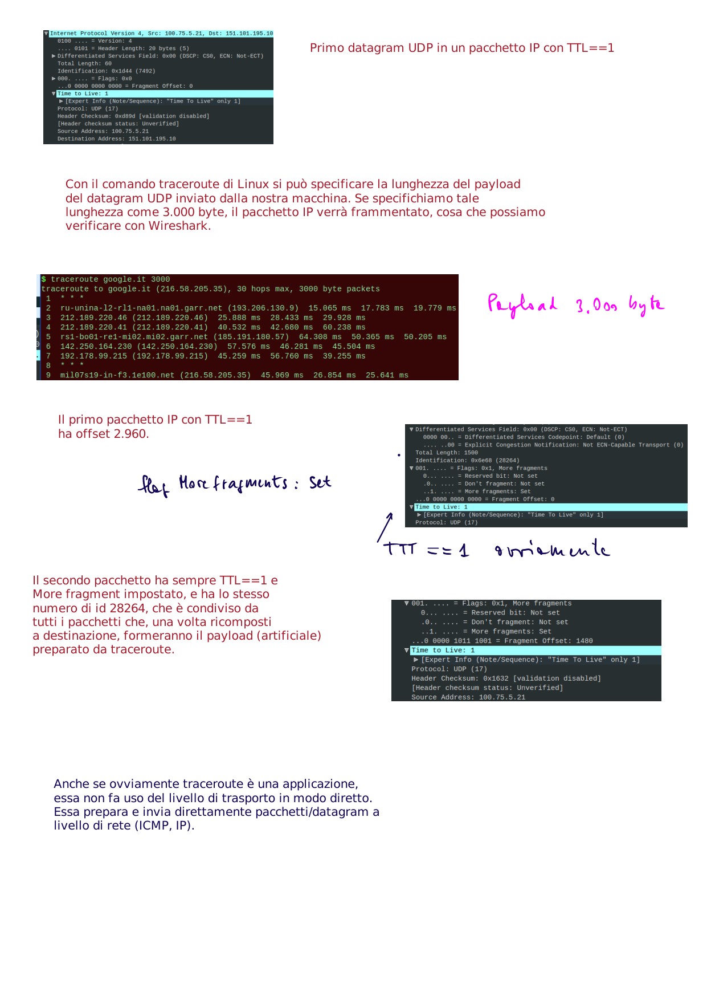
*Figura 11.6 — Sequenza di risposte dai router intermedi lungo il cammino.*

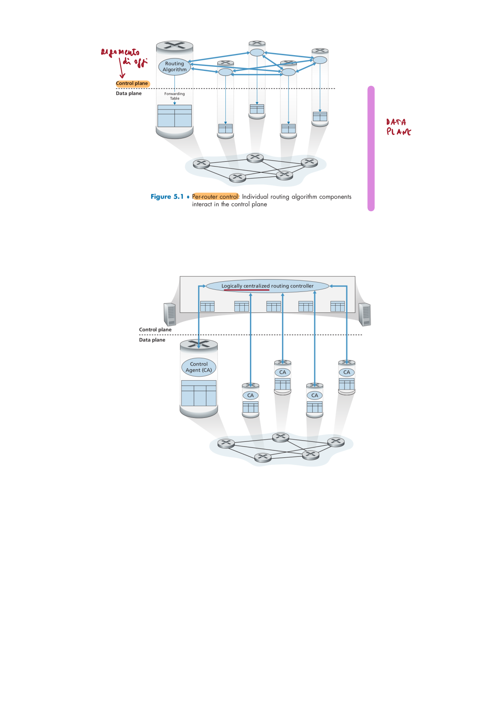
*Figura 11.7 — Algoritmo Distance Vector: formulazione di Bellman-Ford e inizializzazione.*

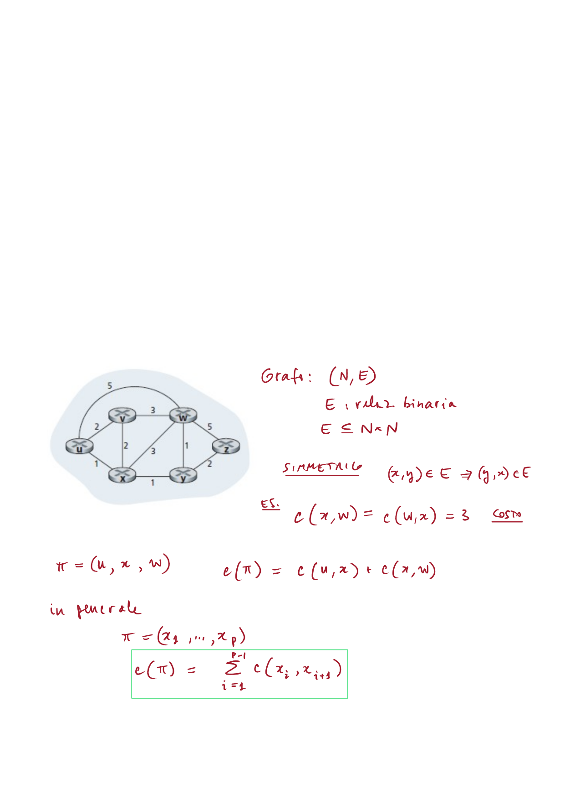
*Figura 11.8 — Procedura di notifica periodica delle distanze ai soli vicini diretti.*

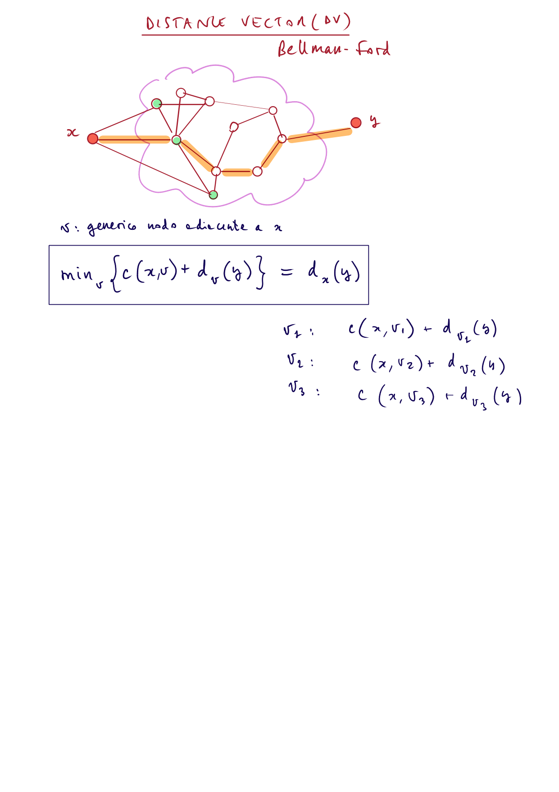
*Figura 11.9 — Aggiornamento delle tabelle di inoltro e convergenza del grafo.*

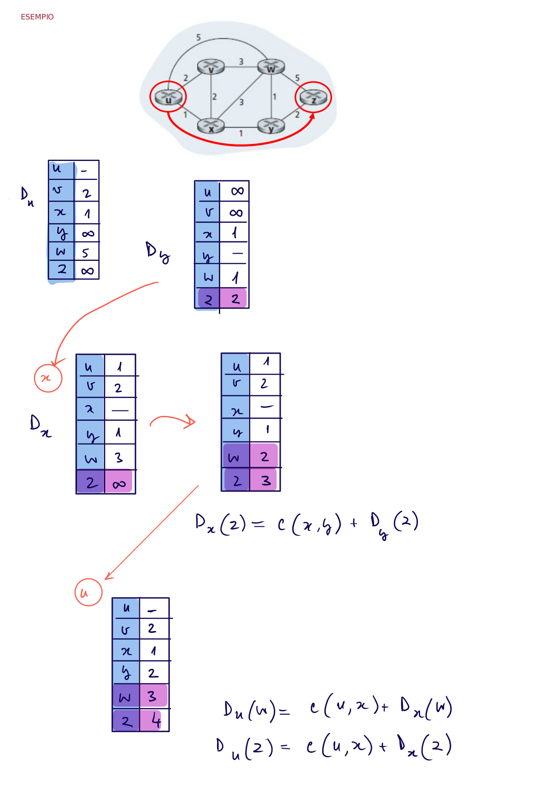
*Figura 11.10 — Analisi del fenomeno del Count-to-Infinity in presenza di guasti ai link.*

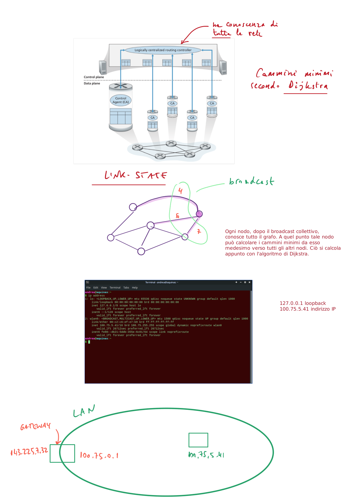
*Figura 11.11 — Algoritmo Link-State: broadcast dei pacchetti LSP e conoscenza globale della topologia.*

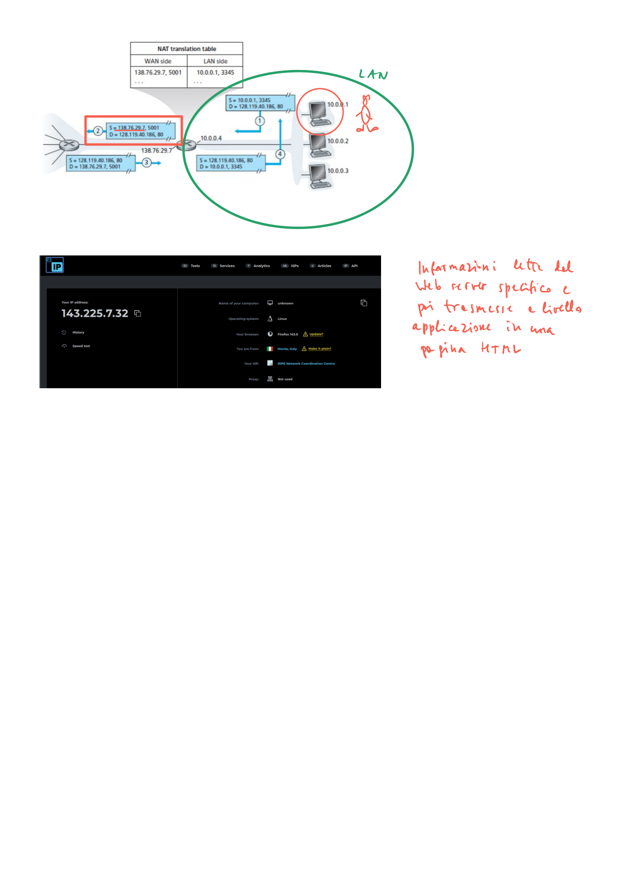
*Figura 11.12 — Calcolo dell'albero di copertura dei cammini minimi da nodo radice.*

---

## 12. Il Livello di Collegamento (Link Layer) e il Livello Fisico
<div align="right"><em><a href="#indice">Torna all'indice</a></em></div>

### 12.1 Funzioni del Link Layer

- Trasmissione di pacchetti su link (da nodo a nodo della rete)
- **Physical layer**: struttura dei link (mezzo, connettori, cavi) e rappresentazione dei bit

### 12.2 Framming e Rilevamento Errori

**Frame = incapsulamento del datagramma IP:**
```
┌──────────┬──────────┬────────────────────┬──────────┐
│ Header   │ Header   │      Payload        │  Trailer │
│ Ethernet │    IP    │   (TCP/UDP + dati)  │  (CRC)   │
└──────────┴──────────┴────────────────────┴──────────┘
```

**Parità semplice:** bit aggiunto per rendere il numero di '1' pari/dispari. Rileva errori su singoli bit.

**CRC (Cyclic Redundancy Check):** tecnica principale per rilevamento errori.
- Polinomio generatore `G` di r+1 bit (noto a mittente e destinatario)
- Mittente calcola r bit di CRC: `D,R` divisibile per `G`
- Destinatario divide per `G`: resto ≠ 0 → errore
- Rileva tutti i burst error di ≤ r bit

### 12.3 Protocolli MAC

In un mezzo condiviso (broadcast), più nodi trasmettono → **collisioni**.

**3 categorie MAC:**

#### 12.3.1 Channel Partitioning

- **TDMA**: slot temporali fissi per nodo
- **FDMA**: frequenza fissa per nodo
- **CDMA**: codice univoco per nodo
- Pro: nessuna collisione. Contro: spreco se slot/frequenze non usati.

#### 12.3.2 Random Access

**CSMA (Carrier Sense Multiple Access):** controlla se il canale è libero prima di trasmettere.

**CSMA/CD** (con Collision Detection — Ethernet):
1. Controlla se il canale è libero
2. Se libero, trasmette
3. Mentre trasmette, verifica collisioni
4. Se collisione: **stop**, aspetta K ∈ {0,...,2ⁿ-1} periodi (**binary exponential backoff**)

#### 12.3.3 Taking Turns

- **Polling**: master seleziona nodi a turno (es. Bluetooth)
  - Pro: nessuna collisione. Contro: overhead, singolo punto di guasto.
- **Token-passing**: token circolante; chi ha il token trasmette
  - Pro: nessuna collisione, decentralizzato. Contro: problemi se token non rilasciato.

### 12.4 Indirizzi MAC

- **6 byte** (2⁴⁸ possibili indirizzi)
- Notazione esadecimale: `1A:23:F9:CD:06:9B`
- **Broadcast MAC**: `FF:FF:FF:FF:FF:FF`
- Locale alla LAN (link-layer), mentre IP è globale (network-layer)

**Comunicazione in una LAN:**
1. A inserisce il MAC di B nel frame
2. B riceve il frame, confronta il MAC → accetta se uguale, scarta altrimenti

### 12.5 ARP — Address Resolution Protocol

**Problema:** come trovare il MAC di un host conoscendo solo il suo IP?

**Funzionamento ARP:**
1. A vuole il MAC di B (stessa subnet)
2. A invia **ARP Request in broadcast**: "Chi ha l'IP x.x.x.x?"
3. B risponde **unicast ad A** con il proprio MAC
4. A memorizza `(IP → MAC)` nella **ARP cache** (scade dopo ~20 min)

**Comunicazione fuori dalla subnet:**
A usa ARP per trovare il MAC del **gateway** (router), poi invia il frame al router.

### 12.6 Ethernet

Tecnologia LAN più diffusa. Sviluppata negli anni '70, standardizzata da **IEEE 802.3**.

**Frame Ethernet:**
```
┌──────────────┬──────────┬──────────┬──────┬────────────┬──────┐
│ Preamble (8B)│ Dst MAC  │ Src MAC  │ Type │ Data       │  CRC │
│              │  (6B)    │  (6B)    │ (2B) │ 46-1500 B  │ (4B) │
└──────────────┴──────────┴──────────┴──────┴────────────┴──────┘
```

| Campo | Descrizione |
|-------|-------------|
| **Preamble** | Sequenza di sync (`10101010...10101011`) |
| **Dst/Src MAC** | Indirizzi MAC destinazione/sorgente |
| **Type** | Protocollo superiore (es. 0x0800 = IPv4) |
| **Data** | Payload (46-1500 byte, MTU = 1500 byte) |
| **CRC** | Rilevamento errori |

> Ethernet è **connectionless** e **non affidabile**: nessun handshake, nessuna retransmission (gestiti da TCP).

### 12.7 Switch di Rete

- **Transparent**: gli host non sanno che esiste
- **Self-learning**: impara da solo quali MAC sono su quali porte
- **Store-and-forward**: riceve frame completo poi lo reinvia

**Switch Table (MAC table):**
- Frame da `src` su porta `p` → aggiunge `(src, p)` alla tabella
- Invio a `dst`:
  - In tabella → invia sulla porta corrispondente (filtering/forwarding)
  - Non in tabella → flood su tutte le porte tranne origine

### 12.8 Schemi e Appunti dalle Lavagne (Lezioni 22, 23 e 24)

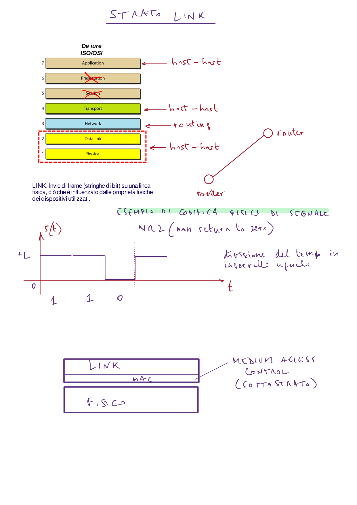
*Figura 12.1 — Livello Link: trasmissione di stringhe di bit (frame) influenzata dalle proprietà fisiche del mezzo.*

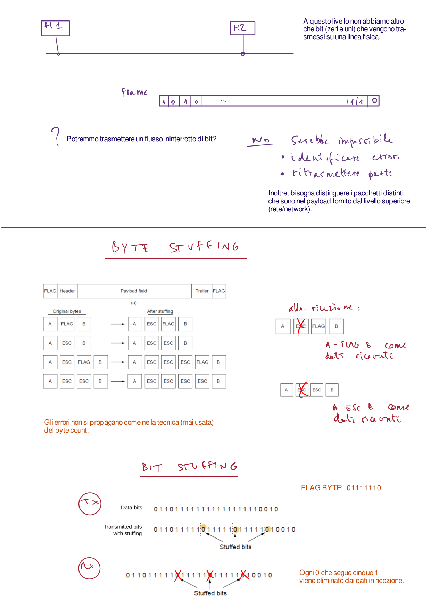
*Figura 12.2 — Adattatore di rete (scheda NIC) e demarcazione tra host e canale fisico.*

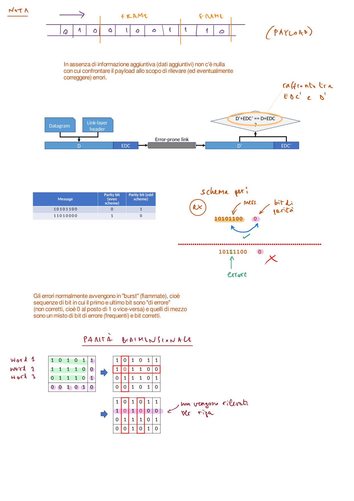
*Figura 12.3 — Tecniche di framing e trasparenza dei dati.*

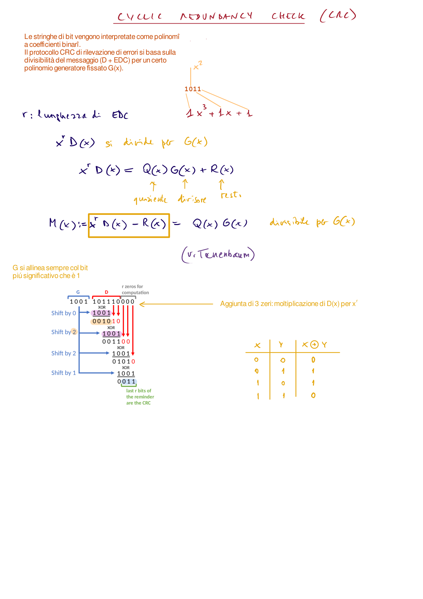
*Figura 12.4 — Rilevamento e correzione degli errori: bit di parità bidimensionale e CRC.*

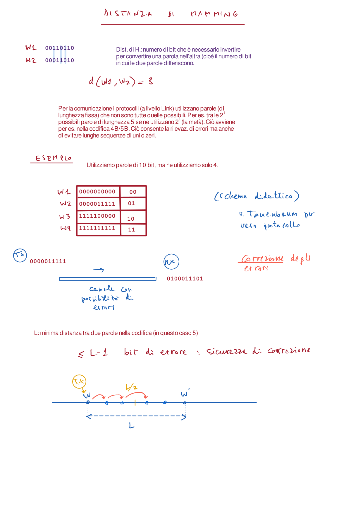
*Figura 12.5 — Incapsulamento del datagramma IP all'interno del frame di livello 2.*

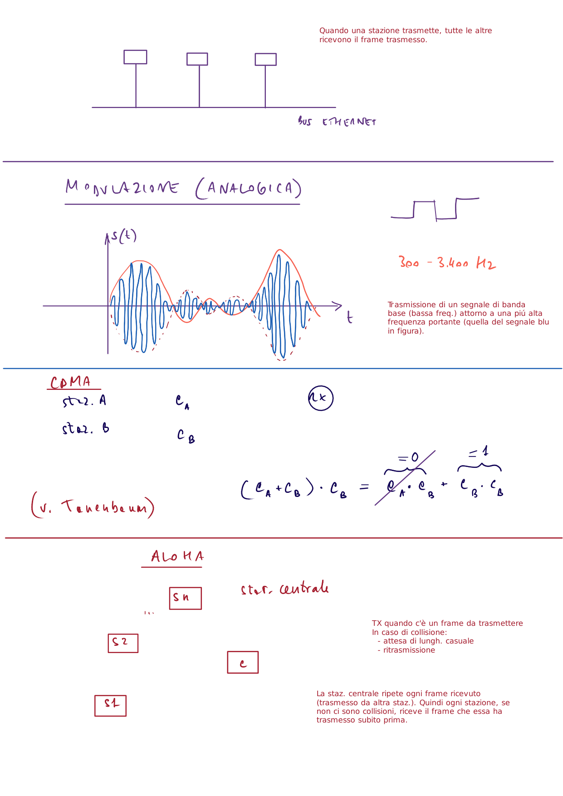
*Figura 12.6 — Reti ad accesso condiviso: diffusione in broadcast e ricezione da parte di tutte le stazioni.*

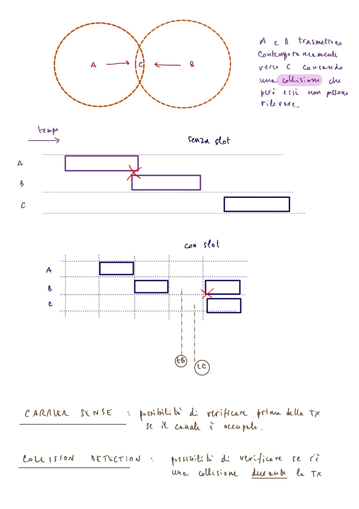
*Figura 12.7 — Concetto di collisione ed efficienza del canale condiviso.*

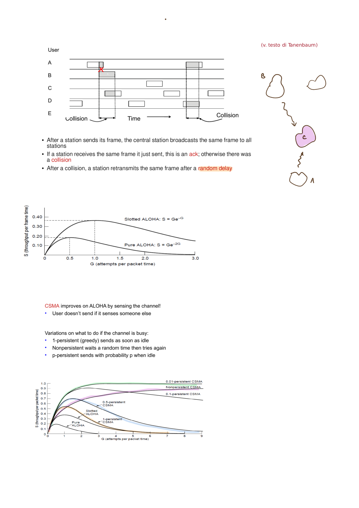
*Figura 12.8 — Protocollo CSMA/CD: ascolto del canale prima e durante la trasmissione.*

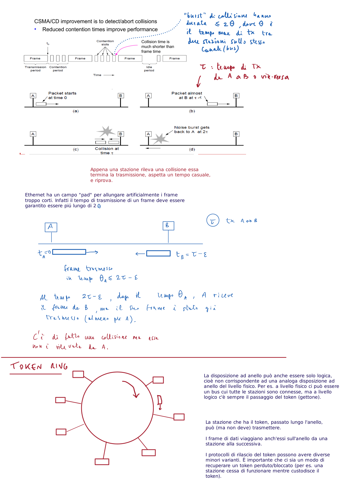
*Figura 12.9 — Condizione sul tempo minimo di trasmissione per rilevare collisioni su tutto il dominio.*

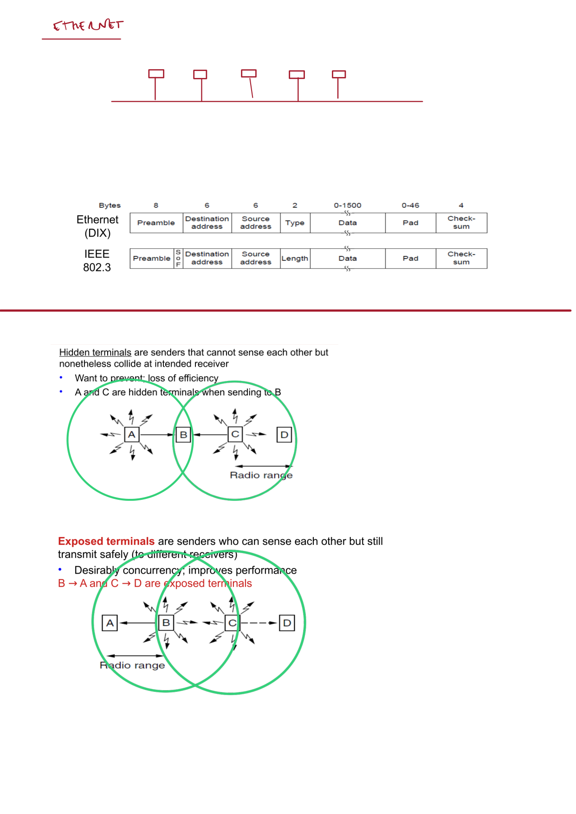
*Figura 12.10 — Algoritmo di backoff esponenziale binario: gestione dei ritrasferimenti post-collisione.*

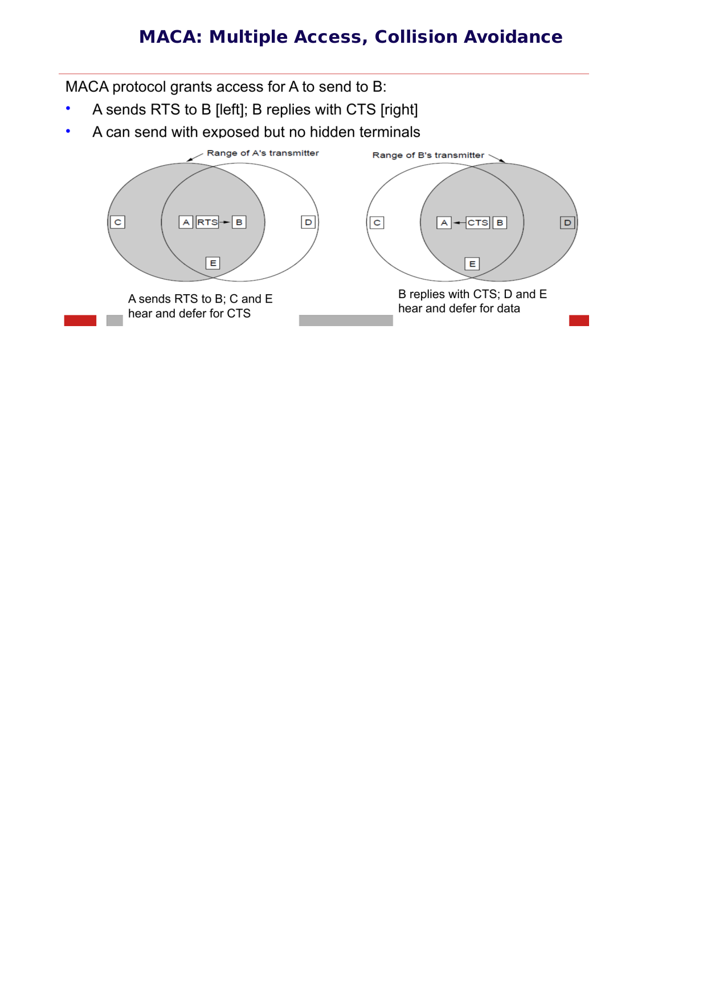
*Figura 12.11 — Prestazioni di Ethernet e confronto con i protocolli ad accesso casuale puro.*

---

## 13. Sicurezza delle Reti
<div align="right"><em><a href="#indice">Torna all'indice</a></em></div>

### 13.1 Obiettivi della Sicurezza

| Obiettivo | Descrizione |
|-----------|-------------|
| **Confidenzialità** | Solo mittente e destinatario possono capire il contenuto |
| **Integrità** | Il contenuto non deve essere alterato |
| **Disponibilità** | Servizi accessibili agli utenti autorizzati |
| **Autenticazione** | Verifica dell'identità di mittente/destinatario |
| **Non-ripudio** | Il mittente non può negare di aver inviato il messaggio |

### 13.2 Tipi di Attacchi

#### Eavesdropping (Intercettazione)
Un attaccante **legge** i messaggi (es. con Wireshark).
**Protezione:** cifratura.

#### Man-in-the-Middle (MitM)
L'attaccante **legge, altera o inietta** messaggi tra mittente e destinatario.
- **IP Spoofing**: pacchetti con IP sorgente falso
- **ARP Poisoning**: risposte ARP false per redirigere il traffico
- **DNS Poisoning**: modifica risposte DNS

#### Denial of Service (DoS/DDoS)
Rende un servizio non disponibile inondandolo di richieste.
- **Bandwidth flooding**: inonda il link di destinazione
- **SYN flood**: connessioni TCP half-open
- **DDoS**: attacco coordinato da botnet

### 13.3 Crittografia Simmetrica

Stessa chiave per cifrare e decifrare:
```
Testo chiaro ──[Chiave K]──► Cifrato
Cifrato ──[Chiave K]──► Testo chiaro
```

| Algoritmo | Chiave | Stato |
|-----------|--------|-------|
| DES | 56 bit | Insicuro |
| 3DES | 168 bit | Deprecato |
| **AES** | 128/192/256 bit | ✅ Standard attuale |

**Svantaggio:** Key distribution problem.

### 13.4 Crittografia Asimmetrica (Chiave Pubblica)

Due chiavi:
- **K⁺ (pubblica)**: nota a tutti, per **cifrare**
- **K⁻ (privata)**: solo al proprietario, per **decifrare**

```
Mittente:     Testo ──[K⁺ dest]──► Cifrato
Destinatario: Cifrato ──[K⁻ proprio]──► Testo
```

**Algoritmi:** RSA (fattorizzazione), Diffie-Hellman (scambio chiavi).

**Firma digitale:** il mittente "firma" con K⁻; chiunque verifica con K⁺.

### 13.5 Integrità — Hash e MAC

**Funzioni hash crittografiche:**
- Output di lunghezza fissa (digest)
- One-way: impossibile ricavare input dall'hash
- Collision-free

| Algoritmo | Bit | Stato |
|-----------|-----|-------|
| MD5 | 128 | Insicuro |
| SHA-1 | 160 | Deprecato |
| SHA-256 | 256 | ✅ Sicuro |

**MAC (Message Authentication Code):**
```
MAC = H(messaggio + chiave_segreta)
```
Garantisce **integrità** e **autenticità**.

### 13.6 TLS/SSL

**TLS** protegge la comunicazione HTTPS. Fornisce:
- **Cifratura** (confidenzialità)
- **Autenticazione del server** (certificato)
- **Integrità** dei messaggi

**Handshake TLS (semplificato):**
```
Client ──ClientHello (versione, cifrari) ──────────────────► Server
Client ◄── ServerHello (cifrario scelto) + Certificato ─────
Client ──ClientKeyExchange + ChangeCipherSpec + Finished ──► Server
Client ◄── ChangeCipherSpec + Finished ──────────────────────
Client ◄══════════ Comunicazione cifrata ════════════════════ Server
```

### 13.7 Firewall e IDS

**Firewall:** filtra il traffico in base a regole predefinite.

| Tipo | Livello |
|------|---------|
| **Packet filter** | Filtra su IP/porta/protocollo |
| **Stateful filter** | Tiene traccia dello stato delle connessioni |
| **Application gateway** | Filtra a livello applicativo |

**IDS (Intrusion Detection System):** monitora il traffico per pattern sospetti.
**IPS (Intrusion Prevention System):** come IDS ma può bloccare automaticamente.

### 13.8 Schemi e Appunti dalle Lavagne (Lezioni 25 e 26)

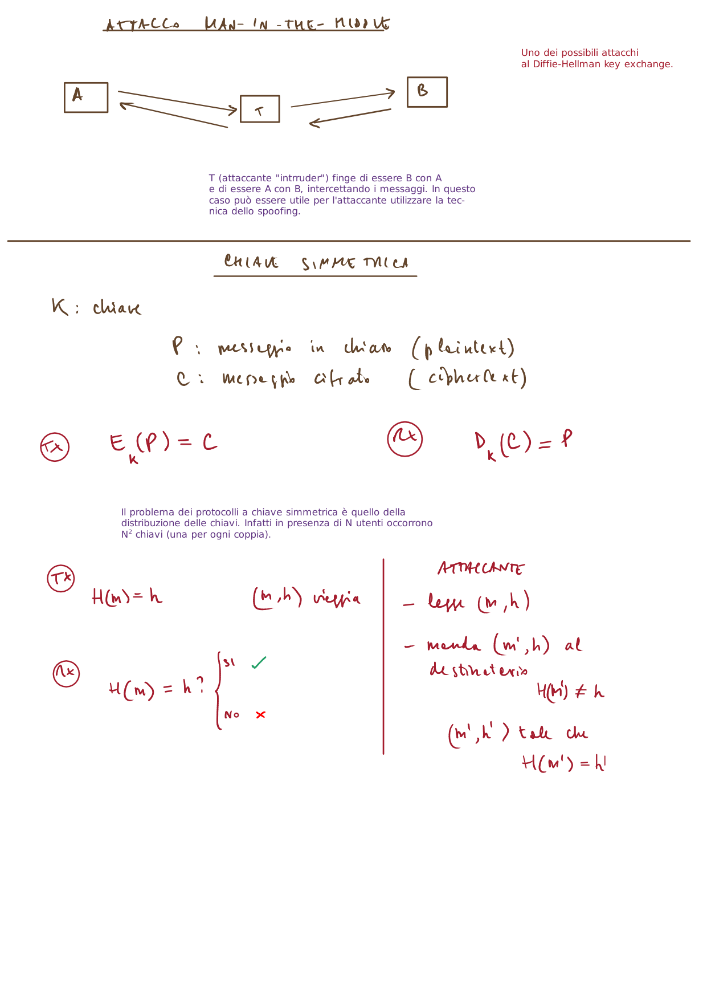
*Figura 13.1 — Protocollo di scambio di chiavi Diffie-Hellman: modulo primo $p$ e generatore $g$.*

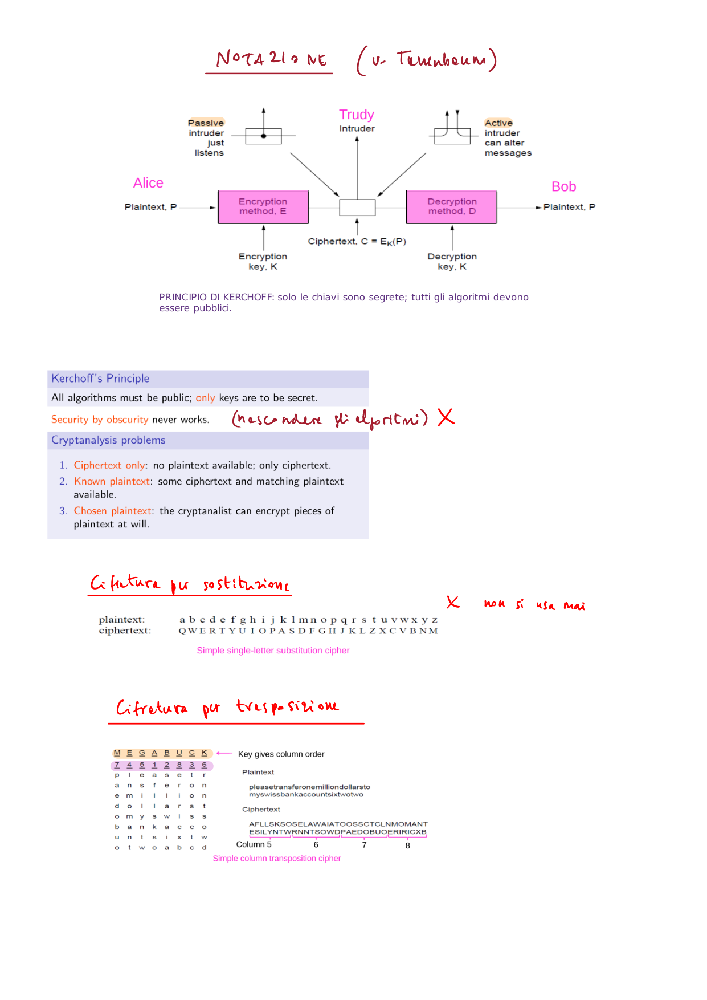
*Figura 13.2 — Calcolo della chiave simmetrica comune senza trasmettere il segreto sul canale.*

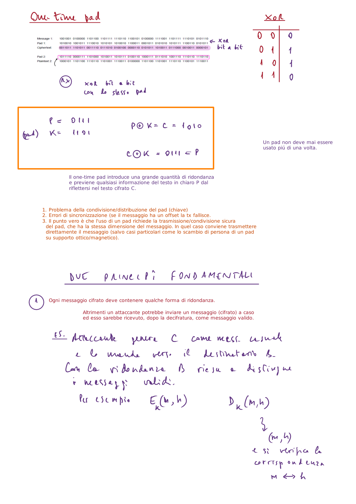
*Figura 13.3 — Attacco Man-in-the-Middle (Intruder T) su Diffie-Hellman in assenza di autenticazione.*

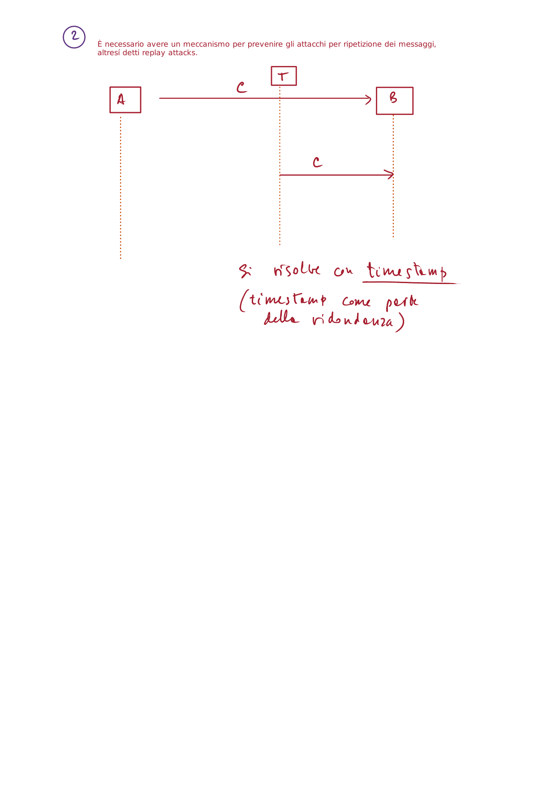
*Figura 13.4 — Risoluzione della vulnerabilità MitM mediante certificati digitali e firma a chiave pubblica.*

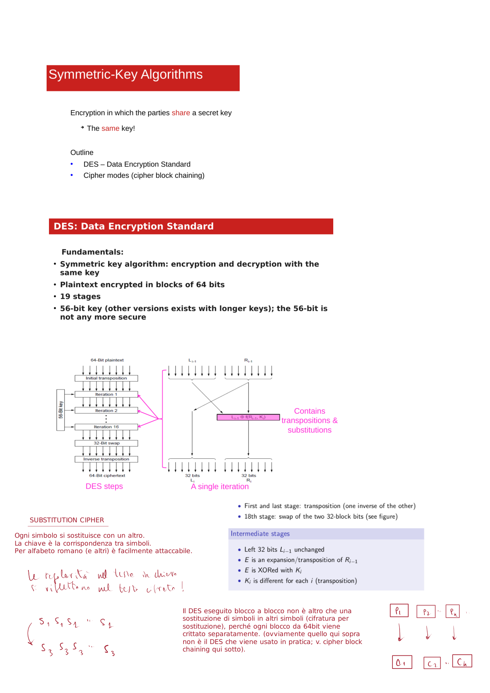
*Figura 13.5 — Cifrari a sostituzione monoalfabetica: mappatura di ciascun simbolo con la chiave segreta.*

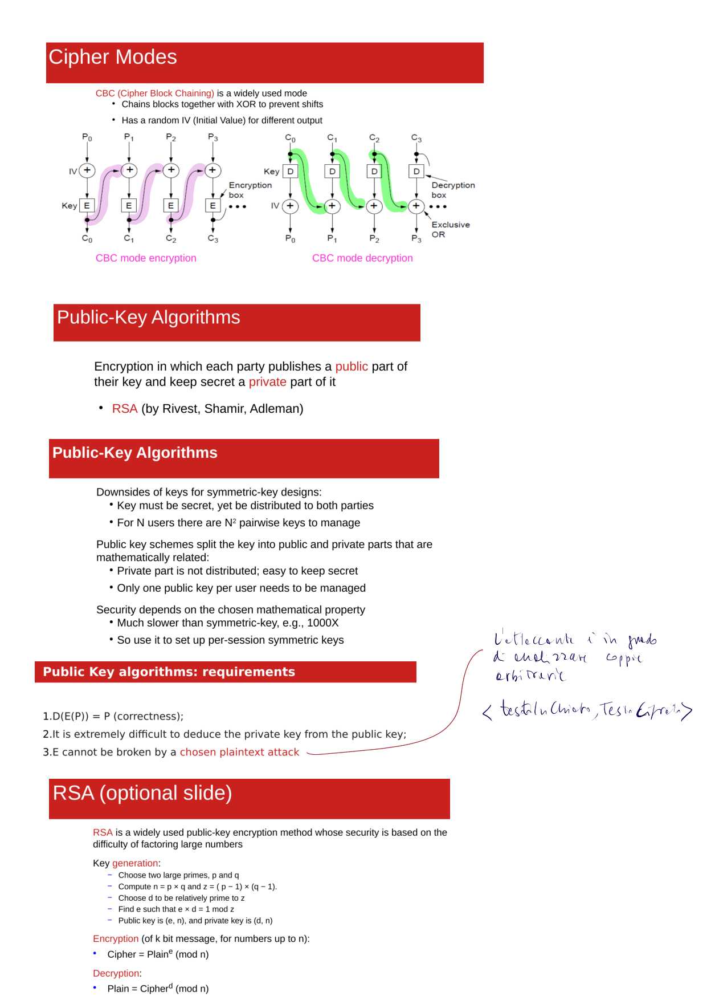
*Figura 13.6 — Cifrari a trasposizione e permutazione dell'ordine dei caratteri nel testo cifrato.*

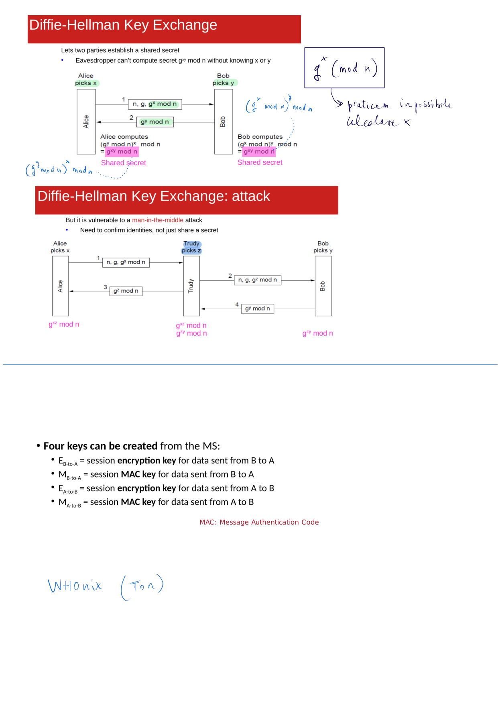
*Figura 13.7 — Principi di crittanalisi: vulnerabilità delle sostituzioni all'analisi delle frequenze.*

---

## 14. Programmazione REST e Formati di Scambio Dati
<div align="right"><em><a href="#indice">Torna all'indice</a></em></div>

### 14.1 REST — Representational State Transfer

Stile architetturale per web service basato su HTTP.

**Principi REST:**
1. **Architettura client-server**: separazione client/server
2. **Statelessness**: ogni richiesta è indipendente
3. **Cacheability**: le risposte indicano se cacheable
4. **Uniform Interface**: risorse + metodi HTTP
5. **Layered system**: client non sa se parla con server finale o intermediario
6. **Code on demand** (opzionale): server invia codice eseguibile

### 14.2 Risorse e URI

Tutto è una **risorsa** identificata da URI:

```
GET    /utenti           → Elenco utenti
GET    /utenti/123       → Utente con ID 123
POST   /utenti           → Crea nuovo utente
PUT    /utenti/123       → Aggiorna utente 123 (completo)
PATCH  /utenti/123       → Aggiorna utente 123 (parziale)
DELETE /utenti/123       → Elimina utente 123
```

### 14.3 Formati di Scambio Dati

**JSON:**
```json
{
    "nome": "Mario",
    "cognome": "Rossi",
    "età": 25,
    "email": "mario@esempio.it",
    "attivo": true
}
```

**XML:**
```xml
<?xml version="1.0" encoding="UTF-8"?>
<utente>
    <nome>Mario</nome>
    <cognome>Rossi</cognome>
    <email>mario@esempio.it</email>
</utente>
```

### 14.4 Interazione con REST API (curl)

```bash
# GET
curl https://api.esempio.com/utenti

# GET con autenticazione
curl -H "Authorization: Bearer TOKEN" https://api.esempio.com/utenti/123

# POST
curl -X POST -H "Content-Type: application/json" \
     -d '{"nome": "Mario"}' https://api.esempio.com/utenti

# PUT
curl -X PUT -H "Content-Type: application/json" \
     -d '{"nome": "Mario Rossi"}' https://api.esempio.com/utenti/123

# DELETE
curl -X DELETE https://api.esempio.com/utenti/123
```

**Codici risposta REST comuni:**

| Codice | Significato |
|--------|-------------|
| 200 OK | Successo |
| 201 Created | Risorsa creata |
| 204 No Content | Successo senza risposta |
| 400 Bad Request | Parametri non validi |
| 401 Unauthorized | Autenticazione richiesta |
| 403 Forbidden | Accesso negato |
| 404 Not Found | Risorsa non trovata |
| 500 Internal Server Error | Errore del server |

---

## 15. Esercizi Risolti e Sessioni di Domande e Risposte
<div align="right"><em><a href="#indice">Torna all'indice</a></em></div>

### 15.1 Esercizi su HTTP (L04)

#### Esercizio 1 — RTT con connessioni non persistenti

**Testo:** Browser richiede 1 HTML + 5 JPEG. RTT=20ms, t_HTML=2ms, t_JPEG=5ms. Connessioni non persistenti sequenziali.

**Soluzione:**

Ogni oggetto: TCP handshake (1 RTT) + req/risposta HTTP (1 RTT + t_trasmissione).

- HTML: 20 + 20 + 2 = **42 ms**
- Ogni JPEG: 20 + 20 + 5 = **45 ms**

**Totale sequenziale:** 42 + 5×45 = 42 + 225 = **267 ms**

**Con connessioni parallele:** 42 + 45 = **87 ms**

### 15.2 Esercizi su UDP — Checksum

#### Esercizio 2 — Calcolo Checksum

**Testo:** 3 parole a 16 bit:
```
Parola 1: 1101011011000110
Parola 2: 0110110011001101
Parola 3: 1000000101001011
```

**Soluzione:**

Somma 1+2:
```
  1101011011000110
+ 0110110011001101
= 10100001110010011  → overflow → +1 → 0100001110010100
```

Somma con parola 3:
```
  0100001110010100
+ 1000000101001011
= 1100010011011111
```

Checksum = complemento a 1: `0011101100100000`

**Verifica:** `1100010011011111 + 0011101100100000 = 1111111111111111` ✅

### 15.3 Esercizi su Go-Back-N

#### Esercizio 3 — Analisi GBN

**Testo:** GBN con N=4, sequenza 3 bit (0-7). Ordine invio: 0,1,2,3,4,5. Pacchetto 2 perso.

**Soluzione:**

```
Mittente → pkt 0 → Destinatario: ricevuto, ACK 0
Mittente → pkt 1 → Destinatario: ricevuto, ACK 1
Mittente → pkt 2 → PERSO
Mittente → pkt 3 → Destinatario: fuori ordine, SCARTATO, invia ACK 1 (dup)
[Timeout per pkt 2]
Mittente → pkt 2 → Destinatario: ricevuto, ACK 2
Mittente → pkt 3 → Destinatario: ricevuto, ACK 3
...
```

Con GBN, pkt 3 viene scartato e **deve essere ritrasmesso** anche se correttamente ricevuto.

### 15.4 Esercizi su IP e Subnetting

#### Esercizio 4 — Suddivisione in Sottoreti

**Testo:** Suddividi `192.168.10.0/24` in 4 sottoreti uguali.

**Soluzione:**

256 indirizzi / 4 = 64 indirizzi per sottorete → **/26** (subnet mask /26 = 255.255.255.192)

| Sottorete | Rete | Range host | Broadcast |
|-----------|------|------------|-----------|
| 1 | 192.168.10.0/26 | .1 – .62 | .63 |
| 2 | 192.168.10.64/26 | .65 – .126 | .127 |
| 3 | 192.168.10.128/26 | .129 – .190 | .191 |
| 4 | 192.168.10.192/26 | .193 – .254 | .255 |

#### Esercizio 5 — ARP

**Testo:** Host A (`192.168.1.10`, `AA:BB:CC:DD:EE:01`) vuole comunicare con B (`192.168.1.20`). Descrivi il processo ARP.

**Soluzione:**

1. A controlla ARP cache → MAC di B non trovato
2. A invia **ARP Request in broadcast** (dst MAC: FF:FF:FF:FF:FF:FF): "Chi ha `192.168.1.20`?"
3. Tutti ricevono; solo B risponde con **ARP Reply unicast**: "Io ho `192.168.1.20`, il mio MAC è `BB:CC:DD:EE:FF:02`"
4. A aggiorna la ARP cache: `192.168.1.20 → BB:CC:DD:EE:FF:02`
5. A può ora inviare frame direttamente a B

### 15.5 Algoritmo di Dijkstra

#### Esercizio 6 — Link-State da nodo u

**Grafo:**
```
u ─2─ v ─3─ w
│     │     │
5     1     4
│     │     │
x ─3─ y ─2─ z
```

**Costi:** u-v:2, u-x:5, v-w:3, v-z:1, w-z:4, x-y:3, y-z:2

**Iterazioni Dijkstra da u:**

| Passo | N' | D(v) | D(w) | D(x) | D(y) | D(z) |
|-------|-----|------|------|------|------|------|
| Init | {u} | 2 | ∞ | 5 | ∞ | ∞ |
| 1 | {u,v} | 2 | 5 | 5 | ∞ | 3 |
| 2 | {u,v,z} | 2 | 5 | 5 | 5 | 3 |
| 3 | {u,v,z,w} | — | 5 | 5 | 5 | — |
| 4 | {u,v,z,w,x o y} | — | — | 5 | 5 | — |
| 5 | {u,v,z,w,x,y} | — | — | 5 | 5 | — |

**Percorsi ottimali da u:**

| Destinazione | Costo | Percorso |
|-------------|-------|---------|
| v | 2 | u→v |
| z | 3 | u→v→z |
| w | 5 | u→v→w |
| x | 5 | u→x |
| y | 5 | u→v→z→y |

---

---

## 16. Guide Pratiche di Laboratorio con Wireshark
<div align="right"><em><a href="#indice">Torna all'indice</a></em></div>

Questo capitolo raccoglie e documenta dettagliatamente tutte le esercitazioni pratiche svolte con il packet sniffer **Wireshark** nel corso delle lezioni, con istruzioni sui comandi di sistema, filtri da applicare e analisi delle risposte.

### 16.1 Installazione e Configurazione di Wireshark su Linux (Ubuntu/Debian)

Per eseguire catture di rete come utente non privilegiato (evitando di eseguire l'intera GUI con `sudo`), è fondamentale configurare correttamente i gruppi di sistema e le Linux Capabilities sul binario `dumpcap`.

**1. Installazione via APT:**
```bash
sudo apt update
sudo apt install wireshark
```
Durante l'installazione, alla schermata interattiva di debconf che richiede:
> *"Should non-superusers be able to capture packets?"*
selezionare tassativamente **Sì (Yes)**.

**2. Verifica e configurazione dei gruppi utente:**
```bash
# Verifica se esiste il gruppo di sistema 'wireshark'
getent group wireshark

# Aggiungi l'utente corrente al gruppo wireshark
sudo usermod -aG wireshark $USER

# Riconfigura il pacchetto nel caso in cui fosse stato selezionato 'No' in precedenza
sudo dpkg-reconfigure wireshark-common
```

**3. Impostazione delle Capabilities su dumpcap:**
Il binario di cattura necessita dei permessi di accesso grezzo alla rete (`cap_net_raw`) e amministrazione delle interfacce (`cap_net_admin`):
```bash
# Assegna le capabilities
sudo setcap cap_net_raw,cap_net_admin+eip /usr/bin/dumpcap

# Verifica i permessi impostati
getcap /usr/bin/dumpcap
# Output corretto: /usr/bin/dumpcap = cap_net_admin,cap_net_raw+eip

# Assicura i permessi di esecuzione
sudo chmod +x /usr/bin/dumpcap

# Applica le modifiche senza riavviare
newgrp wireshark
```

---

### 16.2 Laboratorio HTTP GET Base (L04)

**Obiettivo:** Esaminare la struttura dettagliata di un'interazione HTTP client-server, osservando la richiesta `GET` e la risposta `200 OK`.

**Procedura passo-passo:**
1. Aprire Wireshark e selezionare l'interfaccia di rete principale (es. `eth0` o `wlan0`).
2. Nella barra del filtro di visualizzazione (*Display Filter*), inserire:
   ```
   http
   ```
3. Avviare la cattura dei pacchetti (icona della pinna blu).
4. Aprire il browser web e digitare l'URL di test:
   ```
   http://www.columbia.edu/~fdc/sample.html
   ```
5. Una volta visualizzata la pagina, fermare immediatamente la cattura (quadrato rosso).

**Analisi dei messaggi catturati:**
- **Messaggio di Richiesta (`GET /~fdc/sample.html HTTP/1.1`):**
  - **Versione HTTP:** Il browser moderno usa tipicamente `HTTP/1.1`.
  - **Campi Header:**
    - `Host: www.columbia.edu`
    - `User-Agent`: Stringa identificativa del browser e del SO.
    - `Accept`: Tipi MIME accettati (es. `text/html,application/xhtml+xml`).
    - `Accept-Language`: Lingue preferite dal client (es. `it-IT,it;q=0.9,en-US;q=0.8`).
    - `Accept-Encoding`: Algoritmi di compressione supportati (`gzip, deflate, br`).
- **Messaggio di Risposta (`HTTP/1.1 200 OK`):**
  - **Codice di stato:** `200 OK` (richiesta completata con successo).
  - `Content-Type: text/html; charset=ISO-8859-1`
  - `Content-Length`: Dimensione in byte del payload HTML.
  - `Last-Modified`: Data dell'ultimo aggiornamento del documento sul server (aggiornato periodicamente dal server di test per evitare caching permanente).

---

### 16.3 Laboratorio HTTP con Download Multi-segmento (L05)

**Obiettivo:** Comprendere il riassemblaggio di un messaggio a livello applicazione suddiviso in più segmenti TCP a causa dei limiti di MTU/MSS.

**Concetto chiave:**
Un singolo messaggio HTTP con un corpo (entity body) di dimensioni rilevanti non può entrare in un unico pacchetto IP (limitato dalla MTU standard di 1500 byte, pari a un MSS tipico di 1460 byte). Wireshark evidenzia i segmenti intermedi con la dicitura:
```
[TCP segment of a reassembled PDU]
```

**Analisi del flusso:**
1. Il client invia il pacchetto HTTP contenente il messaggio `GET`.
2. Il server invia una serie di pacchetti TCP contenenti frammenti del file HTML. Ciascun pacchetto trasporta un blocco di dati con numero di sequenza incrementale:
   - Pacchetto 1: `Seq = 1`, `Len = 1460`
   - Pacchetto 2: `Seq = 1461`, `Len = 1460`
   - Pacchetto N: `Seq = ...`, `Len = ...`
3. Il client invia i relativi riscontri (`ACK`) per confermare la ricezione dei byte.
4. L'ultimo segmento TCP chiude il trasferimento del corpo del messaggio: Wireshark riassembla tutti i segmenti e visualizza l'intestazione HTTP della risposta (`HTTP/1.1 200 OK`) associata a questo pacchetto finale.

---

### 16.4 Laboratorio Analisi DNS con nslookup (L10)

**Obiettivo:** Ispezionare i pacchetti DNS (UDP porta 53), identificando la struttura delle query e delle risposte, la gerarchia dei record e il comportamento dei server ricorsivi.

**Filtro Wireshark fondamentale:**
```
dns
```

**Parte 1 — Query Standard di Tipo A (Indirizzo IPv4):**
Eseguire nel terminale:
```bash
nslookup www.unina.it
```
- **Porto destinazione della Query:** `UDP 53`.
- **Porto sorgente della Risposta:** `UDP 53` (inviata dal resolver locale configurato sull'host).
- **Sezione *Queries*:** contiene il nome cercato (`www.unina.it`), la classe `IN` (Internet) e il Type `A` (IPv4).
- **Sezione *Answers*:** restituisce i record `A` contenenti gli indirizzi IP associati al nome di dominio.

**Parte 2 — Query di Tipo NS (Name Server autoritativi):**
Eseguire nel terminale:
```bash
nslookup -type=NS unina.it
```
- La risposta contiene l'elenco dei server autoritativi per il dominio (es. `ns1.unina.it`, `ns2.unina.it`).
- **Additional Records:** Spesso il server include record di tipo `A` (chiamati *Glue Records*) che specificano gli indirizzi IP dei name server elencati, consentendo al client di contattarli senza dover emettere ulteriori interrogazioni DNS separate.

---

### 16.5 Laboratorio Traceroute, ICMP e Frammentazione IP (L19)

**Obiettivo:** Ricostruire il percorso attraverso i router di rete tramite l'utility `traceroute` e analizzare la gestione del campo Time To Live (TTL) e della frammentazione dei datagrammi IP.

**Principio di funzionamento di Traceroute:**
Traceroute invia sonde UDP verso porte elevate non utilizzate (es. > 33434):
1. **Sonda con $TTL = 1$**: il primo router decrementa il TTL a 0, scarta il pacchetto e invia al mittente un messaggio:
   ```
   ICMP Type 11, Code 0: Time-to-live exceeded in transit
   ```
   L'indirizzo IP sorgente di questo pacchetto ICMP rivela l'identità del primo router (hop 1).
2. **Sonda con $TTL = 2$**: scade al secondo router, che risponde analogamente.
3. Il processo prosegue incrementando il TTL finché la sonda raggiunge l'host destinazione, il quale (non trovando alcun servizio in ascolto sulla porta UDP elevata) risponde con:
   ```
   ICMP Type 3, Code 3: Destination Unreachable (Port Unreachable)
   ```
   A questo punto Traceroute sa di aver raggiunto la meta e conclude la scansione.

**Comandi di test:**
```bash
# Traceroute standard
traceroute italia.it

# Traceroute con pacchetti di dimensione maggiorata (3000 byte per forzare la frammentazione)
traceroute italia.it 3000
```

**Analisi della Frammentazione IP in Wireshark:**
- Con datagrammi da 3000 byte su una rete con MTU di 1500 byte, il datagramma IP viene suddiviso in 3 frammenti:
  1. **Frammento 1:** `Offset = 0`, flag `More Fragments (MF) = 1`, lunghezza 1500 byte (20B header IP + 1480B payload).
  2. **Frammento 2:** `Offset = 185` (poiché $185 \times 8 = 1480$ byte), flag `MF = 1`, lunghezza 1500 byte.
  3. **Frammento 3:** `Offset = 370` ($370 \times 8 = 2960$ byte), flag `MF = 0` (ultimo frammento), lunghezza residua (~68 byte).
- Tutti i frammenti condividono lo stesso identico valore nel campo **Identification** dell'header IPv4.

---

### 16.6 Tabella Riepilogativa dei Filtri Wireshark per l'Esame

| Protocollo | Filtro di Visualizzazione (*Display Filter*) | Note ed Utilizzo |
|------------|---------------------------------------------|------------------|
| **HTTP** | `http` | Mostra solo le richieste e risposte HTTP |
| **HTTP Errori** | `http.response.code >= 400` | Isola solo errori client (`4xx`) e server (`5xx`) |
| **DNS** | `dns` | Mostra query e risposte DNS |
| **DNS Tipo A** | `dns.qry.type == 1` | Isola solo le query per indirizzi IPv4 |
| **TCP** | `tcp.port == 80` oppure `tcp.port == 443` | Traffico TCP su web (HTTP o HTTPS) |
| **Handshake TCP** | `tcp.flags.syn == 1` | Filtra solo pacchetti `SYN` e `SYN-ACK` di apertura |
| **Reset TCP** | `tcp.flags.reset == 1` | Identifica connessioni abortite o rifiutate |
| **ICMP** | `icmp` | Mostra messaggi ping e risposte traceroute |
| **Time Exceeded** | `icmp.type == 11` | Pacchetti TTL scaduto generati da Traceroute |
| **Host Specifico** | `ip.addr == 192.168.1.1` | Tutto il traffico da/verso uno specifico host IP |


---

## 17. Sessione di Ripasso e Domande d'Esame Svolte (QA01)
<div align="right"><em><a href="#indice">Torna all'indice</a></em></div>

In questo capitolo sono raccolte le domande di ripasso formali ed aperte del documento d'esame **QA01**, con le relative soluzioni e approfondimenti numerici svolti dal docente.

### 17.1 Domande su HTTP (Application Layer)

#### Domanda 1(a) — Struttura dell'URL
*Spiegare quali sono le parti di un URL e qual è l'uso di ciascuna.*

**Risposta Svolta:**
Un **Uniform Resource Locator (URL)** identifica univocamente una risorsa sulla rete globale ed è strutturato come:
```
<protocollo>://<host>:<porta>/<percorso>?<parametri>#<frammento>
```
1. **Protocollo / Schema** (es. `http`, `https`, `ftp`): definisce le regole di comunicazione e il linguaggio da utilizzare per recuperare la risorsa.
2. **Host / Nome di Dominio** (es. `www.unina.it` o indirizzo IP `192.168.1.1`): individua la macchina server che ospita la risorsa.
3. **Porta** (opzionale, default 80 per HTTP, 443 per HTTPS): identifica il processo server a livello di trasporto a cui recapitare la richiesta.
4. **Percorso / Path** (es. `/dipartimento/corsi/reti.html`): specifica la collocazione gerarchica della risorsa nel file system logico del server.
5. **Query String** (es. `?id=42&lang=it`): serie di coppie chiave-valore per inviare parametri dinamici ad applicazioni o script lato server.
6. **Frammento / Anchor** (es. `#sezione-2`): riferimento interno al documento, interpretato solo dal browser del client senza essere inviato al server.

#### Domanda 1(b) — Three-Way Handshake prima di HTTP
*Spiegare brevemente il three-way handshake usato per stabilire una connessione HTTP.*

**Risposta Svolta:**
Poiché HTTP si basa sul protocollo affidabile orientato alla connessione **TCP**, prima di inviare qualsiasi richiesta HTTP deve essere completato il Three-Way Handshake:
1. **Client $\to$ Server (`SYN`):** Il client sceglie un numero di sequenza iniziale casuale $ISN_c$ e invia un segmento con flag `SYN = 1`, `Seq = ISN_c`.
2. **Server $\to$ Client (`SYN-ACK`):** Il server alloca i buffer, sceglie il proprio $ISN_s$ e risponde con `SYN = 1`, `ACK = 1`, `Seq = ISN_s`, `Ack = ISN_c + 1`.
3. **Client $\to$ Server (`ACK`):** Il client conferma con `ACK = 1`, `Seq = ISN_c + 1`, `Ack = ISN_s + 1`. In questo terzo pacchetto il client può già inserire i dati della prima richiesta `HTTP GET` (risparmiando un RTT).

#### Domanda 1(c) — Pipelining in HTTP
*Illustrare cosa è il pipelining in HTTP.*

**Risposta Svolta:**
In **HTTP/1.1 con connessioni persistenti**, il **pipelining** consente al client di inviare richieste successive per risorse multiple (es. immagini collegate in una pagina HTML) senza dover attendere la ricezione della risposta alla richiesta precedente.
Il server è vincolato a processare e restituire le risposte **nello stesso identico ordine** in cui ha ricevuto le relative richieste (FIFO). Questo meccanismo riduce drasticamente i tempi di attesa dell'RTT, ma è affetto dal problema dell'**Head-of-Line Blocking (HOL)** a livello applicativo: se la prima richiesta richiede un tempo di calcolo elevato sul server, tutte le risposte successive rimangono bloccate in coda.

#### Domanda 1(d) — Protocollo di trasporto di HTTP
*Su quali protocolli a livello di trasporto è basato il protocollo HTTP?*

**Risposta Svolta:**
- **HTTP/1.0, HTTP/1.1 e HTTP/2** sono basati tassativamente su **TCP**, sfruttando la sua garanzia di consegna affidabile, ordinata e senza duplicati, oltre al controllo di congestione e flusso.
- **HTTP/3** è basato su **QUIC**, un protocollo di trasporto di nuova generazione che poggia su **UDP**, spostando la gestione dell'affidabilità, della crittografia (TLS 1.3 integrata) e del multiplexing nativo a livello utente per eliminare completamente l'HOL blocking.

---

### 17.2 Domande su DNS (Application Layer)

#### Domanda 2(a) — Modifica dell'indirizzo IP e ruolo del TTL
*Supponiamo che si cambi l'indirizzo IP di una macchina denominata `server-1.ortofrutta.it`. Spiegare come è gestito l'aggiornamento affinché la modifica sia riflessa nel DNS.*

**Risposta Svolta:**
Nel sistema DNS **non esiste un meccanismo di invalidazione attiva (push / flush globale)** da parte del server autoritativo verso le cache di tutti gli altri DNS resolver distribuiti nel mondo:
1. L'amministratore aggiorna il record di tipo `A` sul **Name Server autoritativo** della zona `ortofrutta.it`.
2. I client e i server ricorsivi locali continuano a utilizzare le vecchie informazioni memorizzate nella propria **cache locale** fino alla scadenza naturale del contatore **Time To Live (TTL)** associato al record.
3. Durante questo intervallo di tempo (periodo di transizione), si verificano temporanei errori o fallimenti di connessione per gli host che consultano record cache non ancora scaduti. Questo comportamento è una scelta architetturale del DNS, che privilegia la scalabilità e le prestazioni globali rispetto alla consistenza immediata (modello *eventual consistency*).
4. Alla scadenza del TTL, la cache elimina la voce obsoleta; alla richiesta successiva emetterà una nuova query ricorsiva al server autoritativo, prelevando il nuovo indirizzo IP.
> **Best Practice:** Se è pianificata una migrazione di IP, gli amministratori riducono preventivamente il TTL (es. da 86400 secondi / 24 ore a 300 secondi / 5 minuti) qualche giorno prima, in modo che il disallineamento al momento del passaggio effettivo duri pochissimi minuti.

#### Domanda 2(b) — Risoluzione dei nomi e utilizzo dei record NS in cache
*Supponiamo di risolvere il nome `feijoada.dsc.utfpr.edu.br` da un portatile nei laboratori di UniNA (cache locale vuota). La richiesta va a `dscna2.unina.it`, che possiede già in cache un record NS con l'IP del server DNS per `dsc.utfpr.edu.br`. Spiegare come viene gestita la richiesta.*

**Risposta Svolta:**
1. Poiché il server DNS di UniNA (`dscna2.unina.it`) ha già in cache il record `NS` per il sotto-dominio `dsc.utfpr.edu.br`, **non deve risalire l'intera gerarchia globale** (Root server `.`, TLD `.br`, server per `edu.br` e `utfpr.edu.br`).
2. Il server di UniNA contatta direttamente l'indirizzo IP specificato nel record NS di `dsc.utfpr.edu.br`, inviando l'interrogazione per `feijoada.dsc.utfpr.edu.br`.
3. Il server autoritativo per `dsc.utfpr.edu.br` riceve la query, individua nel proprio database di zona il record `A` corrispondente all'host `feijoada` e risponde direttamente al server di UniNA con l'indirizzo IP cercato.
4. `dscna2.unina.it` memorizza il risultato nella propria cache e lo inoltra infine al calcolatore portatile richiedente.

---

### 17.3 Domande su Indirizzi IP e Routing CIDR (Network Layer)

#### Domanda 3(a) — Calcolo del Longest Prefix Match
*Si consideri la seguente tavola di routing di un router che implementa CIDR:*

| Subnet | Next Hop |
|---|---|
| `147.142.168.0/21` | `L1` |
| `147.142.172.0/23` | `L2` |
| `default` | `R0` |

*Due pacchetti IP arrivano al router con indirizzi di destinazione:*
- *Pacchetto 1: `147.142.203.165`*
- *Pacchetto 2: `147.142.173.85`*

*Descrivere dettagliatamente come tali pacchetti sono gestiti e inoltrati.*

**Risoluzione Matematica e Binaria:**

**1. Conversione dei prefissi della tabella in binario:**
I primi due ottetti (`147.142`) sono comuni a tutte le rotte:
- `147` = `10010011`
- `142` = `10001110`

Esaminiamo il terzo ottetto per ciascuna rotta:
- **Rotta 1 (`/21` = 16 + 5 bit del terzo ottetto):**
  - Terzo ottetto: `168` = `10101 000`
  - I primi 5 bit sono: **`10101`**
- **Rotta 2 (`/23` = 16 + 7 bit del terzo ottetto):**
  - Terzo ottetto: `172` = `1010110 0`
  - I primi 7 bit sono: **`1010110`**

---

**2. Analisi Pacchetto 1 (`147.142.203.165`):**
- Terzo ottetto: `203` = `11001011`
- Confronto con Rotta 1 (`/21`): i primi 5 bit di `203` sono `11001`. Il prefisso della rotta è `10101`. **Non c'è match!**
- Confronto con Rotta 2 (`/23`): i primi 7 bit di `203` sono `1100101`. Il prefisso della rotta è `1010110`. **Non c'è match!**
- **Inoltro:** Il pacchetto 1 non corrisponde ad alcuna subnet specifica e viene inoltrato sull'interfaccia di **`default` $\to$ `R0`**.

---

**3. Analisi Pacchetto 2 (`147.142.173.85`):**
- Terzo ottetto: `173` = `10101101`
- Confronto con Rotta 1 (`/21`):
  - Primi 5 bit di `173`: `10101`
  - Prefisso Rotta 1: `10101` $\implies$ **MATCH! (lunghezza prefisso = 21)**
- Confronto con Rotta 2 (`/23`):
  - Primi 7 bit di `173`: `1010110`
  - Prefisso Rotta 2: `1010110` $\implies$ **MATCH! (lunghezza prefisso = 23)**
- **Applicazione della regola del Longest Prefix Match:**
  Entrambe le rotte corrispondono, ma la Rotta 2 ha un prefisso più lungo e specifico ($23 > 21$).
- **Inoltro:** Il pacchetto 2 viene instradato verso il next-hop **`L2`**.

---

#### Domanda 3(b) — Perché i router degli ISP usano CIDR e subnet aggregate
*Spiegare perché i grandi router degli ISP operano con prefissi aggregati (es. `189.103.176.0/20`) anziché su singoli indirizzi IP.*

**Risposta Svolta:**
1. **Scalabilità delle tabelle di routing:** Lo spazio di indirizzamento IPv4 comprende $2^{32} \approx 4.3$ miliardi di indirizzi. Se ogni host o server richiedesse una voce separata nella tabella di routing, la dimensione delle tabelle saturerebbe la memoria ad altissima velocità dei router (memorie TCAM - Ternary Content-Addressable Memory).
2. **Aggregazione delle rotte (Route Summarization / Supernetting):** Il CIDR consente a un ISP di annunciare al resto del mondo un unico blocco aggregato (es. `/20`, che comprende $2^{12} = 4096$ indirizzi IP individuali). I router della dorsale internet devono solo memorizzare questo singolo prefisso.
3. **Riduzione dell'overhead di elaborazione:** Prefissi aggregati riducono drasticamente sia la complessità della ricerca (lookup) per ogni pacchetto in transito sia il traffico di segnalazione dei protocolli di routing (BGP), che altrimenti dovrebbero propagare aggiornamenti continui per la caduta o l'accensione di singoli host.

---

### 17.4 Schemi e Appunti dalle Lavagne (Sessione QA01)

Di seguito sono riportate le lavagne manoscritte della sessione di ripasso con gli appunti grafici del docente:

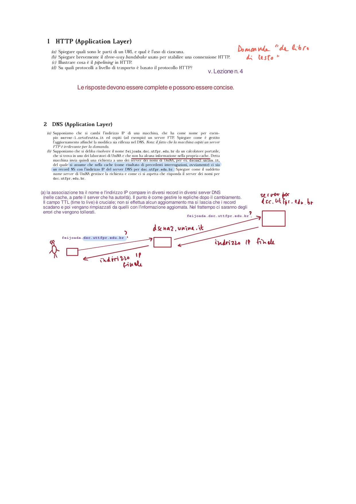
*Figura 17.1 — Discussione sulle repliche DNS, campo TTL e tolleranza degli errori temporanei di caching.*

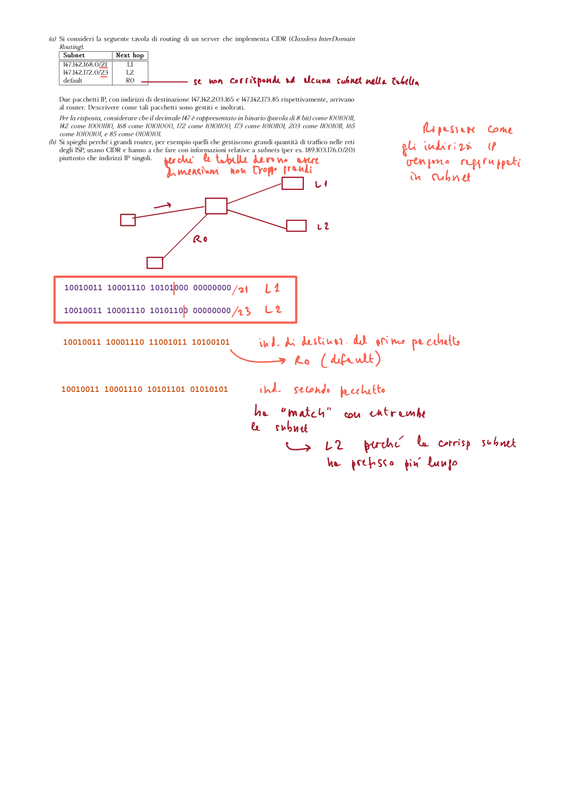
*Figura 17.2 — Calcoli di conversione binaria per il Longest Prefix Matching sui pacchetti d'esame.*

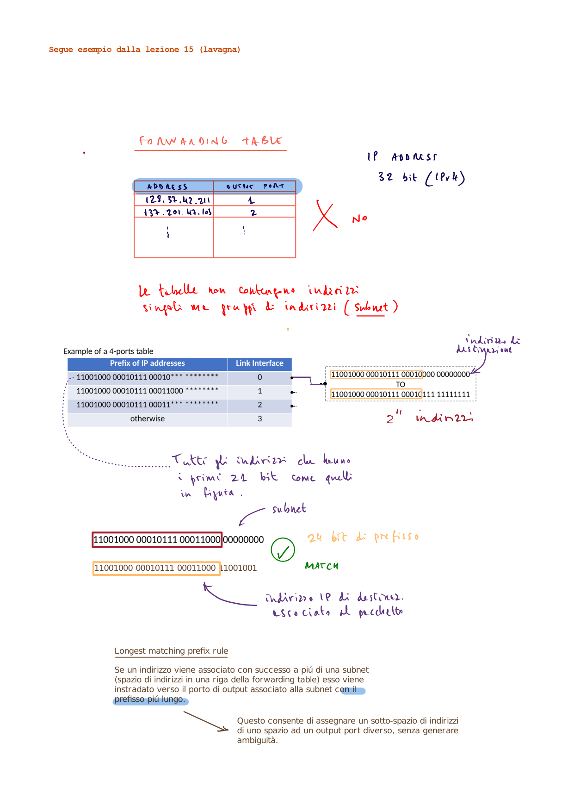
*Figura 17.3 — Regola del Longest Matching Prefix e suddivisione di spazi di indirizzamento senza ambiguità.*


---

## Indice delle Sottosezioni
<div align="right"><em><a href="#indice">Torna all'indice</a></em></div>

### Indice delle Sottosezioni Capitolo 1
- [1.1 Cos'è una Rete di Calcolatori](#11-cosè-una-rete-di-calcolatori)
- [1.2 Internet — La Rete delle Reti](#12-internet-la-rete-delle-reti)
- [1.3 Componenti di una Rete](#13-componenti-di-una-rete)
- [1.4 Comunicazione dei Dati](#14-comunicazione-dei-dati)
- [1.5 Tipi di Connessione e Topologie di Rete](#15-tipi-di-connessione-e-topologie-di-rete)
- [1.6 Categorie di Reti](#16-categorie-di-reti)
- [1.7 Internet Service Providers (ISP)](#17-internet-service-providers-isp)
- [1.8 Il Modello a Strati (Stack Protocollare)](#18-il-modello-a-strati-stack-protocollare)
- [1.9 Schemi e Appunti dalle Lavagne (Lezione 2)](#19-schemi-e-appunti-dalle-lavagne-lezione-2)

### Indice delle Sottosezioni Capitolo 2
- [2.1 Applicazioni di Rete](#21-applicazioni-di-rete)
- [2.2 Architetture delle Applicazioni di Rete](#22-architetture-delle-applicazioni-di-rete)
- [2.3 Comunicazione tra Processi](#23-comunicazione-tra-processi)
- [2.4 QoS — Servizi dello Strato di Trasporto](#24-qos-servizi-dello-strato-di-trasporto)
- [2.5 Protocolli del Livello Applicazione](#25-protocolli-del-livello-applicazione)
- [2.6 FTP — File Transfer Protocol](#26-ftp-file-transfer-protocol)
- [2.7 Schemi e Appunti dalle Lavagne (Lezione 3)](#27-schemi-e-appunti-dalle-lavagne-lezione-3)

### Indice delle Sottosezioni Capitolo 3
- [3.1 World Wide Web e HTTP](#31-world-wide-web-e-http)
- [3.2 URL — Uniform Resource Locator](#32-url-uniform-resource-locator)
- [3.3 HTTP e il Protocollo di Trasporto](#33-http-e-il-protocollo-di-trasporto)
- [3.4 Connessioni HTTP: Persistenti vs. Non Persistenti](#34-connessioni-http-persistenti-vs-non-persistenti)
- [3.5 Formato dei Messaggi HTTP](#35-formato-dei-messaggi-http)
- [3.6 Cookie](#36-cookie)
- [3.7 Web Caching (Proxy)](#37-web-caching-proxy)
- [3.8 Schemi e Appunti dalle Lavagne (Lezione 4)](#38-schemi-e-appunti-dalle-lavagne-lezione-4)

### Indice delle Sottosezioni Capitolo 4
- [4.1 Architettura della Posta Elettronica](#41-architettura-della-posta-elettronica)
- [4.2 SMTP — Simple Mail Transfer Protocol](#42-smtp-simple-mail-transfer-protocol)
- [4.3 Accesso alle Email — POP3, IMAP, HTTP](#43-accesso-alle-email-pop3-imap-http)
- [4.4 Applicazioni P2P e BitTorrent](#44-applicazioni-p2p-e-bittorrent)
- [4.5 DNS — Domain Name System](#45-dns-domain-name-system)
- [4.6 Schemi e Appunti dalle Lavagne (Lezione 7)](#46-schemi-e-appunti-dalle-lavagne-lezione-7)

### Indice delle Sottosezioni Capitolo 5
- [5.1 Socket nell'Architettura a Strati](#51-socket-nellarchitettura-a-strati)
- [5.2 Strutture Dati per le Socket](#52-strutture-dati-per-le-socket)
- [5.3 Creazione della Socket](#53-creazione-della-socket)
- [5.4 Binding della Socket](#54-binding-della-socket)
- [5.5 Programmazione Socket UDP](#55-programmazione-socket-udp)
- [5.6 Programmazione Socket TCP](#56-programmazione-socket-tcp)
- [5.7 Schemi e Appunti dalle Lavagne (Lezioni 8 e 9)](#57-schemi-e-appunti-dalle-lavagne-lezioni-8-e-9)

### Indice delle Sottosezioni Capitolo 6
- [6.1 Dal Livello Applicazione al Livello di Trasporto](#61-dal-livello-applicazione-al-livello-di-trasporto)
- [6.2 Responsabilità del Livello di Trasporto](#62-responsabilità-del-livello-di-trasporto)
- [6.3 Multiplexing e Demultiplexing](#63-multiplexing-e-demultiplexing)
- [6.4 UDP — User Datagram Protocol](#64-udp-user-datagram-protocol)
- [6.5 Formato del Datagramma UDP](#65-formato-del-datagramma-udp)
- [6.6 Checksum UDP](#66-checksum-udp)
- [6.7 Trasferimento Affidabile dei Dati](#67-trasferimento-affidabile-dei-dati)
- [6.8 Schemi e Appunti dalle Lavagne (Lezioni 10, 11 e 12)](#68-schemi-e-appunti-dalle-lavagne-lezioni-10-11-e-12)

### Indice delle Sottosezioni Capitolo 7
- [7.1 Caratteristiche di TCP](#71-caratteristiche-di-tcp)
- [7.2 Buffer TCP](#72-buffer-tcp)
- [7.3 Maximum Segment Size (MSS)](#73-maximum-segment-size-mss)
- [7.4 Segmento TCP](#74-segmento-tcp)
- [7.5 Numeri di Sequenza e Acknowledgment](#75-numeri-di-sequenza-e-acknowledgment)
- [7.6 Stima del RTT e Timeout](#76-stima-del-rtt-e-timeout)
- [7.7 Ritrasmissione Rapida (Fast Retransmit)](#77-ritrasmissione-rapida-fast-retransmit)
- [7.8 Three-Way Handshake (Stabilimento Connessione)](#78-three-way-handshake-stabilimento-connessione)
- [7.9 Teardown della Connessione](#79-teardown-della-connessione)
- [7.10 Schemi e Appunti dalle Lavagne (Lezioni 13 e 16)](#710-schemi-e-appunti-dalle-lavagne-lezioni-13-e-16)

### Indice delle Sottosezioni Capitolo 8
- [8.1 Flow Control (Controllo di Flusso)](#81-flow-control-controllo-di-flusso)
- [8.2 Congestion Control (Controllo della Congestione)](#82-congestion-control-controllo-della-congestione)
- [8.3 Algoritmo di Jacobson — Rate Regulation](#83-algoritmo-di-jacobson-rate-regulation)

### Indice delle Sottosezioni Capitolo 9
- [9.1 Funzioni del Livello di Rete](#91-funzioni-del-livello-di-rete)
- [9.2 Servizi del Livello di Rete](#92-servizi-del-livello-di-rete)
- [9.3 Router: Forwarding e Routing](#93-router-forwarding-e-routing)
- [9.4 Tipi di Router](#94-tipi-di-router)
- [9.5 Componenti di un Router](#95-componenti-di-un-router)
- [9.6 Longest Prefix Matching](#96-longest-prefix-matching)
- [9.7 Schemi e Appunti dalle Lavagne (Lezioni 14 e 15)](#97-schemi-e-appunti-dalle-lavagne-lezioni-14-e-15)

### Indice delle Sottosezioni Capitolo 10
- [10.1 Indirizzo IP (IPv4)](#101-indirizzo-ip-ipv4)
- [10.2 Subnetting](#102-subnetting)
- [10.3 DHCP — Dynamic Host Configuration Protocol](#103-dhcp-dynamic-host-configuration-protocol)
- [10.4 NAT — Network Address Translation](#104-nat-network-address-translation)
- [10.5 IPv6](#105-ipv6)
- [10.6 Schemi e Appunti dalle Lavagne (Lezione 17)](#106-schemi-e-appunti-dalle-lavagne-lezione-17)

### Indice delle Sottosezioni Capitolo 11
- [11.1 Introduzione al Routing](#111-introduzione-al-routing)
- [11.2 Flooding](#112-flooding)
- [11.3 Formulazione del Problema di Routing](#113-formulazione-del-problema-di-routing)
- [11.4 Algoritmo Distance Vector (DV)](#114-algoritmo-distance-vector-dv)
- [11.5 Algoritmo Link-State (LS) — Dijkstra](#115-algoritmo-link-state-ls-dijkstra)
- [11.6 Confronto DV vs. LS](#116-confronto-dv-vs-ls)
- [11.7 Schemi e Appunti dalle Lavagne (Lezioni 18, 19, 20 e 21)](#117-schemi-e-appunti-dalle-lavagne-lezioni-18-19-20-e-21)

### Indice delle Sottosezioni Capitolo 12
- [12.1 Funzioni del Link Layer](#121-funzioni-del-link-layer)
- [12.2 Framming e Rilevamento Errori](#122-framming-e-rilevamento-errori)
- [12.3 Protocolli MAC](#123-protocolli-mac)
- [12.4 Indirizzi MAC](#124-indirizzi-mac)
- [12.5 ARP — Address Resolution Protocol](#125-arp-address-resolution-protocol)
- [12.6 Ethernet](#126-ethernet)
- [12.7 Switch di Rete](#127-switch-di-rete)
- [12.8 Schemi e Appunti dalle Lavagne (Lezioni 22, 23 e 24)](#128-schemi-e-appunti-dalle-lavagne-lezioni-22-23-e-24)

### Indice delle Sottosezioni Capitolo 13
- [13.1 Obiettivi della Sicurezza](#131-obiettivi-della-sicurezza)
- [13.2 Tipi di Attacchi](#132-tipi-di-attacchi)
- [13.3 Crittografia Simmetrica](#133-crittografia-simmetrica)
- [13.4 Crittografia Asimmetrica (Chiave Pubblica)](#134-crittografia-asimmetrica-chiave-pubblica)
- [13.5 Integrità — Hash e MAC](#135-integrità-hash-e-mac)
- [13.6 TLS/SSL](#136-tlsssl)
- [13.7 Firewall e IDS](#137-firewall-e-ids)
- [13.8 Schemi e Appunti dalle Lavagne (Lezioni 25 e 26)](#138-schemi-e-appunti-dalle-lavagne-lezioni-25-e-26)

### Indice delle Sottosezioni Capitolo 14
- [14.1 REST — Representational State Transfer](#141-rest-representational-state-transfer)
- [14.2 Risorse e URI](#142-risorse-e-uri)
- [14.3 Formati di Scambio Dati](#143-formati-di-scambio-dati)
- [14.4 Interazione con REST API (curl)](#144-interazione-con-rest-api-curl)

### Indice delle Sottosezioni Capitolo 15
- [15.1 Esercizi su HTTP (L04)](#151-esercizi-su-http-l04)
- [15.2 Esercizi su UDP — Checksum](#152-esercizi-su-udp-checksum)
- [15.3 Esercizi su Go-Back-N](#153-esercizi-su-go-back-n)
- [15.4 Esercizi su IP e Subnetting](#154-esercizi-su-ip-e-subnetting)
- [15.5 Algoritmo di Dijkstra](#155-algoritmo-di-dijkstra)

### Indice delle Sottosezioni Capitolo 16
- [16.1 Installazione e Configurazione di Wireshark su Linux (Ubuntu/Debian)](#161-installazione-e-configurazione-di-wireshark-su-linux-ubuntudebian)
- [16.2 Laboratorio HTTP GET Base (L04)](#162-laboratorio-http-get-base-l04)
- [16.3 Laboratorio HTTP con Download Multi-segmento (L05)](#163-laboratorio-http-con-download-multi-segmento-l05)
- [16.4 Laboratorio Analisi DNS con nslookup (L10)](#164-laboratorio-analisi-dns-con-nslookup-l10)
- [16.5 Laboratorio Traceroute, ICMP e Frammentazione IP (L19)](#165-laboratorio-traceroute-icmp-e-frammentazione-ip-l19)
- [16.6 Tabella Riepilogativa dei Filtri Wireshark per l'Esame](#166-tabella-riepilogativa-dei-filtri-wireshark-per-lesame)

### Indice delle Sottosezioni Capitolo 17
- [17.1 Domande su HTTP (Application Layer)](#171-domande-su-http-application-layer)
- [17.2 Domande su DNS (Application Layer)](#172-domande-su-dns-application-layer)
- [17.3 Domande su Indirizzi IP e Routing CIDR (Network Layer)](#173-domande-su-indirizzi-ip-e-routing-cidr-network-layer)
- [17.4 Schemi e Appunti dalle Lavagne (Sessione QA01)](#174-schemi-e-appunti-dalle-lavagne-sessione-qa01)
