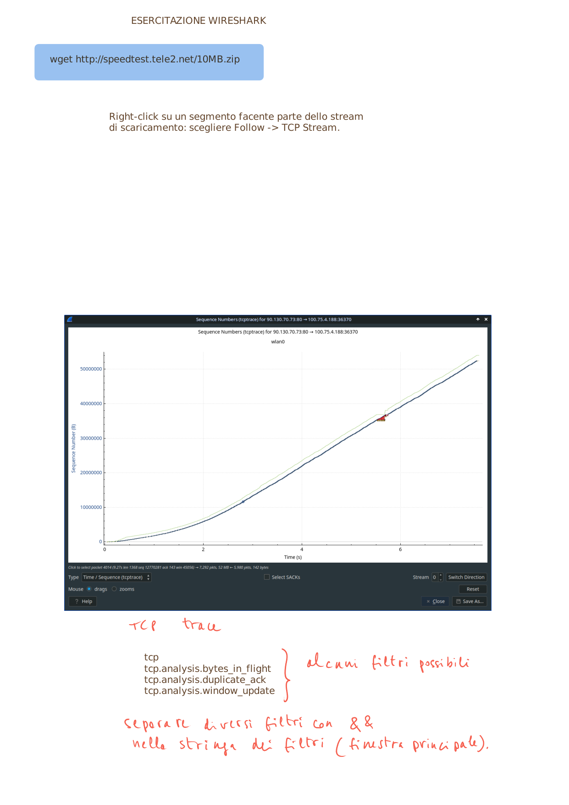

# Reti di Calcolatori I — Guida Completa allo Studio

> **Corso di Laurea in Informatica — A.A. 2025-2026**
> Questa guida copre **tutti gli argomenti** delle lezioni 1–26 del corso **Computer Networks I**.
> Il documento è completamente sostitutivo allo studio delle slide ed è scritto interamente in **italiano**.
> Include **tutte le 63 lavagne manoscritte originali** (board), i **laboratori pratici completi con Wireshark** e le **sessioni di domande d'esame (QA01)**.

---

<a id="indice"></a>
## Indice

1. [Introduzione alle Reti di Calcolatori](#1-introduzione-alle-reti-di-calcolatori) — [Sottosezioni](#indice-delle-sottosezioni-capitolo-1)
2. [Il Livello Applicazione — Architetture e Protocolli Base](#2-il-livello-applicazione--architetture-e-protocolli-base) — [Sottosezioni](#indice-delle-sottosezioni-capitolo-2)
3. [Il Protocollo HTTP](#3-il-protocollo-http) — [Sottosezioni](#indice-delle-sottosezioni-capitolo-3)
4. [Posta Elettronica, P2P e DNS](#4-posta-elettronica-p2p-e-dns) — [Sottosezioni](#indice-delle-sottosezioni-capitolo-4)
5. [Programmazione di Rete con i Socket](#5-programmazione-di-rete-con-i-socket) — [Sottosezioni](#indice-delle-sottosezioni-capitolo-5)
6. [Il Livello di Trasporto — UDP e Trasferimento Affidabile](#6-il-livello-di-trasporto--udp-e-trasferimento-affidabile) — [Sottosezioni](#indice-delle-sottosezioni-capitolo-6)
7. [Il Protocollo TCP](#7-il-protocollo-tcp) — [Sottosezioni](#indice-delle-sottosezioni-capitolo-7)
8. [Controllo di Flusso e Controllo della Congestione](#8-controllo-di-flusso-e-controllo-della-congestione) — [Sottosezioni](#indice-delle-sottosezioni-capitolo-8)
9. [Il Livello di Rete — IP e Router](#9-il-livello-di-rete--ip-e-router) — [Sottosezioni](#indice-delle-sottosezioni-capitolo-9)
10. [Indirizzamento IP, DHCP, NAT e IPv6](#10-indirizzamento-ip-dhcp-nat-e-ipv6) — [Sottosezioni](#indice-delle-sottosezioni-capitolo-10)
11. [Il Piano di Controllo — Algoritmi di Routing](#11-il-piano-di-controllo--algoritmi-di-routing) — [Sottosezioni](#indice-delle-sottosezioni-capitolo-11)
12. [Il Livello di Collegamento (Link Layer) e il Livello Fisico](#12-il-livello-di-collegamento-link-layer-e-il-livello-fisico) — [Sottosezioni](#indice-delle-sottosezioni-capitolo-12)
13. [Sicurezza delle Reti](#13-sicurezza-delle-reti) — [Sottosezioni](#indice-delle-sottosezioni-capitolo-13)
14. [Programmazione REST e Formati di Scambio Dati](#14-programmazione-rest-e-formati-di-scambio-dati) — [Sottosezioni](#indice-delle-sottosezioni-capitolo-14)
15. [Esercizi Risolti e Sessioni di Domande e Risposte](#15-esercizi-risolti-e-sessioni-di-domande-e-risposte) — [Sottosezioni](#indice-delle-sottosezioni-capitolo-15)
16. [Guide Pratiche di Laboratorio con Wireshark](#16-guide-pratiche-di-laboratorio-con-wireshark) — [Sottosezioni](#indice-delle-sottosezioni-capitolo-16)
17. [Sessione di Ripasso e Domande d'Esame Svolte (QA01)](#17-sessione-di-ripasso-e-domande-desame-svolte-qa01) — [Sottosezioni](#indice-delle-sottosezioni-capitolo-17)

---

## 1. Introduzione alle Reti di Calcolatori
<div align="right"><em><a href="#indice">Torna all'indice</a></em></div>

### 1.1 Cos'è una Rete di Calcolatori

Una **rete di calcolatori** (computer network) è un insieme di dispositivi separati ma interconnessi che collaborano per svolgere un compito comune. Formalmente:

- È una **raccolta di dispositivi di calcolo autonomi interconnessi** che possono scambiare informazioni tra loro.
- La rete più importante ed estesa è **Internet**.

**Utilizzi delle reti di calcolatori:**

| Utilizzo | Descrizione |
|----------|-------------|
| **Accesso alle informazioni** | Navigazione web, ricerca, consultazione di risorse remote |
| **Comunicazione persona-persona** | E-mail, messaggistica istantanea, videoconferenza |
| **Commercio elettronico** | Acquisti online, servizi bancari, transazioni digitali |
| **Intrattenimento** | Streaming, giochi online, musica, video |
| **Internet delle Cose (IoT)** | Dispositivi intelligenti connessi (casa, industria, trasporti) |

### 1.2 Internet — La Rete delle Reti

**Internet** è la più grande rete di calcolatori al mondo. È tecnicamente un'enorme **Wide Area Network (WAN)** che permette a sotto-reti e dispositivi di connettersi tra nazioni e continenti.

**Breve storia di Internet:**

| Anno | Evento |
|------|--------|
| ~1950 | J.C.R. Licklider teorizza l'idea di una rete "universale" |
| 1969 | ARPA finanzia ARPANET con 4 nodi (SRI, UCLA, UCSB, UTAH) |
| 1974 | R. Kahn e V. Cerf progettano **TCP/IP** |
| 1986 | NSF finanzia **NSFNET** |
| 1990 | ARPANET dismessa |
| 1995 | Internet moderna: rimosse le ultime restrizioni commerciali |

### 1.3 Componenti di una Rete

Una rete è descritta con la terminologia della **teoria dei grafi**:

- **Nodi** (*nodes*): dispositivi connessi alla rete (router, switch, host)
- **Link di comunicazione** (*communication links*): connessioni tra i nodi
- **Cammino** (*path*): sequenza di nodi/link
- **Host**: nodi terminali (foglie) che forniscono o utilizzano servizi
- **Dispositivi di routing**: nodi intermedi che instradano i pacchetti

**Principali dispositivi di rete:**

| Dispositivo | Funzione |
|-------------|----------|
| **Router** | Instrada i pacchetti tra reti diverse |
| **Switch** | Commuta i frame all'interno di una LAN |
| **Hub** | Ripete il segnale su tutti i port (obsoleto) |
| **Access Point** | Permette connessioni wireless a una rete cablata |
| **Modem/ONT** | Adatta il segnale per linee telefoniche o fibra |

### 1.4 Comunicazione dei Dati

La **comunicazione dei dati** coinvolge 5 elementi fondamentali:

1. **Messaggio**: i dati da trasmettere (testo, numeri, immagini, audio, video)
2. **Mittente** (*sender*): l'entità che invia il messaggio
3. **Destinatario** (*receiver*): l'entità che deve ricevere il messaggio
4. **Mezzo** (*medium*): il canale attraverso cui il messaggio viaggia
5. **Protocollo** (*protocol*): l'insieme di regole di comunicazione

**Tipi di flusso dati:**

| Tipo | Descrizione |
|------|-------------|
| **Simplex** | Monodirezionale (un solo senso) |
| **Half-duplex** | Bidirezionale a turni |
| **Full-duplex** | Bidirezionale simultaneo |

**Concetti chiave di velocità:**

- **Transmission rate**: quantità massima di informazione trasmissibile da un dispositivo (bit/s)
- **Bandwidth**: quantità massima su un cammino completo (link + nodi), in bit/s
- **Throughput**: quantità istantanea effettiva trasmessa, in bit/s

### 1.5 Tipi di Connessione e Topologie di Rete

**Tipi di connessione:**
- **Point-to-point**: link dedicato tra due dispositivi
- **Multipoint (broadcast)**: più dispositivi condividono un singolo link

**Topologie di rete principali:**

| Topologia | Descrizione | Pro | Contro |
|-----------|-------------|-----|--------|
| **Bus** | Host collegati a un cavo backbone centrale | Semplice, economico | Singolo punto di guasto |
| **Ring** | Host in punto a punto a esattamente altri due | Semplice | Guasti bloccano la rete |
| **Star** | Host collegati a un controller centrale | Robusta, scalabile | Singolo punto di guasto (controller) |
| **Tree** | Più stelle integrate via bus | Versatile | Debolezza del bus |
| **Mesh** | Host collegati in modo non gerarchico | Robusta, sicura | Costosa, non scalabile |
| **Hybrid** | Mix di topologie | Flessibile | Complessità aumentata |

> **Nota:** Full Mesh richiede n(n-1)/2 link fisici duplex.

### 1.6 Categorie di Reti

| Tipo | Acronimo | Portata | Esempio |
|------|----------|---------|---------|
| Personal Area Network | **PAN** | ~1-10 m | Bluetooth |
| Local Area Network | **LAN/WLAN** | Edificio, campus | Ethernet, Wi-Fi |
| Metropolitan Area Network | **MAN** | Città | Rete via cavo cittadina |
| Wide Area Network | **WAN** | Nazione, mondo | Internet |

### 1.7 Internet Service Providers (ISP)

Un **ISP** fornisce servizi per l'accesso, l'utilizzo e la partecipazione a Internet.

**Gerarchia degli ISP:**
- **ISP di accesso**: coprono aree locali (es. Fastweb, TIM in Italia)
- **ISP regionali/nazionali**: coprono aree più ampie
- **IXP (Internet Exchange Point)**: punto neutrale tra ISP per lo scambio di traffico

**Tecnologie di accesso:**

| Tecnologia | Velocità |
|-----------|----------|
| Analogica | 56 kbps |
| ISDN | 128 kbps |
| ADSL | 1–20 Mbps |
| Doppino in rame | 10–100 Mbps |
| **Fibra ottica** | 50 Mbps – 40 Gbps |

### 1.8 Il Modello a Strati (Stack Protocollare)

Le reti adottano un'**architettura a strati** per gestire la complessità.

**Modello TCP/IP (de facto — 5 strati):**

```
┌─────────────────────────┐
│    Applicazione         │  HTTP, FTP, DNS, SMTP...
├─────────────────────────┤
│    Trasporto            │  TCP, UDP
├─────────────────────────┤
│    Rete (Network)       │  IP, DHCP, NAT
├─────────────────────────┤
│    Collegamento (Link)  │  Ethernet, Wi-Fi, ARP
├─────────────────────────┤
│    Fisico (Physical)    │  Cavi, fibra, onde radio
└─────────────────────────┘
```

**Modello ISO/OSI (de iure — 7 strati):**

```
┌───────────────┐
│  Applicazione │ (7)
├───────────────┤
│ Presentazione │ (6)
├───────────────┤
│   Sessione    │ (5)
├───────────────┤
│  Trasporto    │ (4)
├───────────────┤
│     Rete      │ (3)
├───────────────┤
│  Collegamento │ (2)
├───────────────┤
│    Fisico     │ (1)
└───────────────┘
```

> In pratica si usa TCP/IP; ISO/OSI è usato come riferimento concettuale.

**Principio di incapsulamento:**

```
Applicazione: [ DATI ]
Trasporto:    [ Header TCP | DATI ]                 → segmento
Rete:         [ Header IP | Header TCP | DATI ]     → datagramma
Link:         [ Header Eth | ... | DATI | Trailer ] → frame
```

### 1.9 Schemi e Appunti dalle Lavagne (Lezione 2)

I seguenti schemi riproducono fedelmente le lavagne manoscritte della lezione sull'architettura a livelli e il modello di rete:


*Figura 1.1 — Comunicazione tra due macchine a ogni strato e protocolli corrispondenti.*


*Figura 1.2 — Host terminali vs nodi intermedi di commutazione e instradamento.*


*Figura 1.3 — Stack protocollare e incapsulamento sequenziale dei dati.*


*Figura 1.4 — Percorso end-to-end dei dati attraverso la rete fisica.*

---

## 2. Il Livello Applicazione — Architetture e Protocolli Base
<div align="right"><em><a href="#indice">Torna all'indice</a></em></div>

### 2.1 Applicazioni di Rete

Un'**applicazione di rete** è composta da più programmi che girano su diversi host e comunicano attraverso la rete.

**Applicazioni comuni:** social network, Web, messaggistica, e-mail, giochi online, streaming, P2P, VoIP, accesso remoto (SSH).

### 2.2 Architetture delle Applicazioni di Rete

#### 2.2.1 Architettura Client-Server

- C'è un host **sempre attivo** (il **server**) con indirizzo fisso e noto
- I **client** richiedono servizi; non comunicano direttamente tra loro
- Spesso si usano più server (data center) per gestire le richieste

**Scalabilità:** data center locali → server distribuiti nel mondo → data center distribuiti.

#### 2.2.2 Architettura Peer-to-Peer (P2P)

- Non esistono server fissi sempre attivi
- Le comunicazioni avvengono **direttamente tra coppie di host** (peer)
- **Vantaggi:** scalabilità (ogni nuovo peer aggiunge capacità), basso costo
- **Svantaggi:** sicurezza, performance dipende dalla disponibilità dei peer

### 2.3 Comunicazione tra Processi

- **Processo client**: avvia la comunicazione
- **Processo server**: attende di essere contattato

#### 2.3.1 Socket

Un **socket** è l'interfaccia software tra livello applicazione e livello di trasporto (come una cassetta delle lettere). Usata come **API** tra applicazione e rete.

#### 2.3.2 Indirizzamento dei Processi

Per identificare il processo destinatario servono **due elementi**:
1. **Indirizzo IP** (32 bit) — identifica l'host
2. **Numero di porta** (16 bit) — identifica il processo sull'host

**Porte well-known (0-1023):**

| Porta | Protocollo |
|-------|-----------|
| 20, 21 | FTP |
| 22 | SSH |
| 25 | SMTP |
| 53 | DNS |
| 80 | HTTP |
| 110 | POP3 |
| 143 | IMAP |
| 443 | HTTPS |

### 2.4 QoS — Servizi dello Strato di Trasporto

| Servizio | Descrizione |
|----------|-------------|
| **Affidabilità** | Dati arrivano corretti e completi |
| **Throughput** | Velocità garantita (bit/s) |
| **Timing** | Bit arriva entro un intervallo di tempo |
| **Sicurezza** | Cifratura e decifratura dei messaggi |

**Protocolli di trasporto:**

| Protocollo | Caratteristiche | Uso tipico |
|------------|-----------------|-----------|
| **TCP** | Connection-oriented, affidabile, controllo flusso/congestione | Web, e-mail, FTP |
| **UDP** | Connectionless, nessuna garanzia, veloce e leggero | DNS, streaming, VoIP |

### 2.5 Protocolli del Livello Applicazione

Un **protocollo applicativo** definisce:
1. Tipi di messaggi (richieste e risposte)
2. Sintassi dei messaggi (campi e delimitazione)
3. Semantica dei campi
4. Regole su quando/come inviare messaggi

**Tabella principali protocolli:**

| Applicazione | Protocollo | Descrizione |
|--------------|------------|-------------|
| Web | HTTP/HTTPS | Trasferimento ipertestuale |
| E-mail invio | SMTP/SMTPS | Simple Mail Transfer Protocol |
| E-mail ricezione | POP3, IMAP | Post Office / Internet Mail Access |
| DNS | DNS | Sistema nomi di dominio |
| Configurazione IP | DHCP | Configurazione automatica |
| Trasferimento file | FTP/FTPS | File Transfer Protocol |
| Accesso remoto | SSH / Telnet | Secure Shell / Telnet |
| Gestione rete | SNMP | Simple Network Management |

### 2.6 FTP — File Transfer Protocol

**FTP** (prima versione 1971) trasferisce file tra host attraverso la rete. Versione base: trasferimento **in chiaro**. **FTPS**: versione sicura cifrata.

**Comandi FTP su Linux:**

```bash
sudo apt-get install ftp
ftp INDIRIZZO_SERVER
```

| Comando | Descrizione |
|---------|-------------|
| `ls` | Elenca file nella directory remota |
| `cd` / `lcd` | Cambia dir remota / locale |
| `get` / `put` | Scarica / carica file |
| `mkdir` / `rmdir` | Crea / rimuove directory remota |
| `delete` | Cancella file remoto |

### 2.7 Schemi e Appunti dalle Lavagne (Lezione 3)


*Figura 2.1 — Principio di disaccoppiamento: le applicazioni delegano la gestione del flusso al livello di trasporto.*


*Figura 2.2 — Servizi del trasporto visti dal livello applicazione (astrazione logica).*

---

## 3. Il Protocollo HTTP
<div align="right"><em><a href="#indice">Torna all'indice</a></em></div>

### 3.1 World Wide Web e HTTP

**HTTP (HyperText Transfer Protocol)** è il protocollo alla base del World Wide Web.

**Caratteristiche:**
- **Client-server**: browser (client) invia richieste, server risponde
- **Stateless**: il server non mantiene informazioni sull'interazione precedente
- Piattaforma per YouTube, Gmail, social network, ecc.

| Versione | Anno | Note |
|----------|------|------|
| HTTP/1.0 | 1996 | Connessioni non persistenti di default |
| HTTP/1.1 | 1997 | Connessioni persistenti, pipelining |
| HTTP/2 | 2015 | Multiplexing, priorità, compressione header |
| HTTP/3 | 2022 | Basato su UDP/QUIC, ~30% più veloce |

### 3.2 URL — Uniform Resource Locator

Struttura dell'URL:
```
[protocollo]://[usrinfo@][host][:porta][/path][?query][#fragment]
```

| Componente | Obbligatorio | Descrizione |
|------------|-------------|-------------|
| `[protocollo]` | Sì | HTTP, HTTPS, FTP, ecc. |
| `[host]` | Sì | Nome o IP del server |
| `[:porta]` | No | Porta (inferita dal protocollo se assente) |
| `[/path]` | Sì | Percorso della risorsa |
| `[?query]` | No | Parametri di richiesta |
| `[#fragment]` | No | Elemento nella risorsa |

La maggior parte delle pagine = 1 file HTML + oggetti aggiuntivi (immagini, video, ecc.).

### 3.3 HTTP e il Protocollo di Trasporto

- **HTTP usa principalmente TCP** (affidabilità)
- **HTTP/3 usa UDP/QUIC** (~30% più veloce)
- **HTTP è stateless**: semplifica il design del server

### 3.4 Connessioni HTTP: Persistenti vs. Non Persistenti

#### 3.4.1 Connessioni Non Persistenti

Una connessione TCP per ogni oggetto. Per 1 HTML + 10 immagini → **11 connessioni TCP separate**.

**Tempo di risposta:**
```
Totale = 2 RTT + tempo di trasmissione del file
```
- 1° RTT: TCP handshake (SYN → SYN-ACK → ACK)
- 2° RTT: richiesta/risposta HTTP

```
Client                    Server
  │── SYN ──────────────►│
  │◄─ SYN-ACK ───────────│
  │── ACK + req HTTP ────►│
  │◄─ risposta HTTP ──────│
```

#### 3.4.2 Connessioni Persistenti

La connessione TCP rimane aperta dopo ogni risposta:
- Tutti gli oggetti di una pagina su **una singola connessione TCP**
- Risparmio di ~1-2 RTT per oggetto

**Pipelining (HTTP/1.1+):** richieste inviate senza aspettare le risposte precedenti.

| Tipo | Velocità | Risorse |
|------|----------|---------|
| Non persistente | Lenta | Molte |
| Persistente | Veloce | Poche |
| Persistente + Pipelining | Molto veloce | Poche |

### 3.5 Formato dei Messaggi HTTP

#### 3.5.1 Messaggio di Richiesta

```
GET /somedir/page.html HTTP/1.1\r\n
Host: www.someschool.edu\r\n
Connection: close\r\n
User-agent: Mozilla/5.0\r\n
Accept-language: fr\r\n
\r\n
```

**Metodi HTTP:**

| Metodo | Descrizione | Body |
|--------|-------------|------|
| **GET** | Recupera una risorsa | Vuoto |
| **POST** | Invia dati al server | Contiene i dati |
| **HEAD** | Come GET senza risposta corpo | Vuoto |
| **PUT** | Carica un oggetto nel server | Contiene l'oggetto |
| **DELETE** | Cancella un oggetto | Vuoto |

#### 3.5.2 Messaggio di Risposta

```
HTTP/1.1 200 OK\r\n
Connection: close\r\n
Date: Tue, 18 Aug 2015 15:44:04 GMT\r\n
Content-Length: 6821\r\n
Content-Type: text/html\r\n
\r\n
(dati oggetto...)
```

**Codici di stato più comuni:**

| Codice | Messaggio | Descrizione |
|--------|-----------|-------------|
| **200** | OK | Richiesta riuscita |
| **301** | Moved Permanently | Risorsa spostata (nuovo URL in Location) |
| **400** | Bad Request | Richiesta malformata |
| **404** | Not Found | Risorsa non trovata |
| **505** | HTTP Version Not Supported | Versione HTTP non supportata |

### 3.6 Cookie

**Cookie**: token digitale (ID alfanumerico) usato dai server per identificare un cliente specifico (HTTP è stateless).

**4 componenti della tecnologia cookie:**
1. Header `Set-cookie: ID` nella risposta HTTP
2. Header `Cookie: ID` nelle richieste successive
3. File cookie sul sistema del client (gestito dal browser)
4. Database di back-end sul server

**Utilizzi:** carrello acquisti, login automatico, raccomandazioni, sessioni.

**Controversia:** monitoraggio dell'utente → invasione della privacy.

### 3.7 Web Caching (Proxy)

Un **proxy server** soddisfa le richieste HTTP per conto del server originale.

**Funzionamento:**
1. Browser → prima richiesta alla cache
2. **Hit**: oggetto trovato → restituisce dalla memoria locale
3. **Miss**: recupera dal server originale, salva copia, invia al browser

La cache è contemporaneamente **server** (verso client) e **client** (verso server originale).

**Hit rate tipico:** 20–70%.

**GET Condizionale** (evita cache obsoleta):
```
GET /oggetto.html HTTP/1.1
If-Modified-Since: Tue, 18 Aug 2015 15:11:03 GMT
```
- Non modificato → `304 Not Modified` (nessun corpo, usa copia locale)
- Modificato → `200 OK` + nuovo oggetto

### 3.8 Schemi e Appunti dalle Lavagne (Lezione 4)


*Figura 3.1 — Diagramma temporale dello scambio messaggi HTTP, handshaking TCP e stima dell'RTT.*

---

## 4. Posta Elettronica, P2P e DNS
<div align="right"><em><a href="#indice">Torna all'indice</a></em></div>

### 4.1 Architettura della Posta Elettronica

**Componenti:**
- **User agent**: applicazione email (Outlook, Thunderbird, K-9 Mail)
- **Mail Server**: archivia email e mantiene caselle di posta

**Protocolli:**
- **SMTP** (porta 25): tra mail server (invio)
- **POP3** (porta 110) / **IMAP** / **HTTP**: tra user agent e mail server (ricezione)

### 4.2 SMTP — Simple Mail Transfer Protocol

Usa **TCP porta 25**. Processo di invio (Alice → Bob):

1. Alice compone il messaggio nell'user agent e lo invia
2. User agent → mail server di Alice → coda messaggi
3. Client SMTP di Alice apre connessione TCP al server SMTP di Bob
4. Handshaking SMTP → invio messaggio
5. Server di Bob deposita nella casella di Bob
6. Bob legge con il proprio user agent

### 4.3 Accesso alle Email — POP3, IMAP, HTTP

#### 4.3.1 POP3

3 fasi: **Autorizzazione** → **Transazione** → **Aggiornamento**.
Limitazioni: solo download/cancellazione, nessuna organizzazione in cartelle remote.

#### 4.3.2 IMAP

Funzionalità avanzate:
- Cartelle sul server
- Ricerca in cartelle remote
- Recupero parziale dei messaggi
- Più client connessi contemporaneamente

#### 4.3.3 HTTP per la Posta

Approccio mainstream (Gmail, Yahoo!, ecc.):
- L'user agent è il browser web
- Comunicazione via HTTP (non POP3/IMAP)
- I mail server usano comunque SMTP tra loro

### 4.4 Applicazioni P2P e BitTorrent

**BitTorrent** (~150-170 milioni utenti nel 2023):

**Terminologia:**
- **Torrent**: insieme dei peer che partecipano alla distribuzione di un file
- **Chunk**: parte del file (tipicamente 256 KB)
- **Tracker**: nodo che tiene traccia dei peer partecipanti (server)

**Quando un peer si unisce:**
1. Si registra con il tracker
2. Riceve indirizzi IP di un sottoinsieme casuale di peer
3. Tenta connessioni TCP con i peer della lista

**Strategia di download — Rarest-first:**
I chunk con meno copie disponibili vengono prioritizzati.

**Strategia di upload — Trading:**
- Priorità ai **4 migliori vicini** (velocità più alta, aggiornato ogni 10s)
- Ogni 30s: un vicino casuale riceve chunk (**optimistic unchoking**)

### 4.5 DNS — Domain Name System

#### 4.5.1 Cos'è il DNS

Traduzione da **hostname** → **indirizzo IP** (es. `www.unina.it` → `143.225.15.50`).

Caratteristiche del DNS:
- **Distribuito**: database distribuito
- **Gerarchico**: organizzato in livelli
- Usa tipicamente **UDP porta 53**

#### 4.5.2 Gerarchia dello Spazio dei Nomi

Organizzata da **ICANN** (~250 TLD):
- **TLD Generici**: `.com`, `.org`, `.edu`, `.net`...
- **TLD Nazionali (ccTLD)**: `.it`, `.uk`, `.us`...

**Root server**: 13 server (a–m.root-servers.net), altamente replicati.

#### 4.5.3 Resource Record DNS

| Campo | Descrizione |
|-------|-------------|
| **NAME** | Dominio (chiave di ricerca) |
| **TTL** | Durata record (es. 86400 s = 1 giorno) |
| **CLASS** | `IN` (Internet) |
| **TYPE** | Tipo di record |
| **RDATA** | Valore |

**Tipi di record:**

| Tipo | Descrizione |
|------|-------------|
| **A** | Indirizzo IPv4 |
| **AAAA** | Indirizzo IPv6 |
| **NS** | Name Server del dominio |
| **MX** | Mail eXchange |
| **CNAME** | Alias per nome canonico |
| **PTR** | Reverse lookup (IP → nome) |
| **SOA** | Start of Authority |

#### 4.5.4 DNS Resolver (Local DNS Server)

Gestito dagli ISP. Il **Google Public DNS** è `8.8.8.8` e `8.8.4.4`.

**Caching DNS:** i record vengono memorizzati con scadenza = TTL.

**Round-Robin DNS:** per siti trafficati (Google, Amazon), il DNS ruota l'ordine di risposta tra più IP per distribuire il carico.

### 4.6 Schemi e Appunti dalle Lavagne (Lezione 7)


*Figura 4.1 — Tabella dei record DNS e formati di risorsa.*


*Figura 4.2 — Flusso delle interrogazioni DNS nella gerarchia dei server.*


*Figura 4.3 — Esempio pratico di risoluzione dei nomi tra server autoritativi.*


*Figura 4.4 — Caching locale e gestione del campo Time To Live (TTL).*

---

## 5. Programmazione di Rete con i Socket
<div align="right"><em><a href="#indice">Torna all'indice</a></em></div>

### 5.1 Socket nell'Architettura a Strati

Le socket implementano (come black-box) le funzionalità TCP/UDP e IP.

```
  La Tua Applicazione
  ──────────────────────
  Transport   Socket API
  ──────────────────────
  Network (IP)
  ──────────────────────
  Access Layer  (OS + HW)
```

In Unix: **Berkeley sockets** (BSD/POSIX) — API native in C.

### 5.2 Strutture Dati per le Socket

```c
#include <netinet/in.h>
#include <arpa/inet.h>

struct sockaddr_in {
    short          sin_family;   // AF_INET (IPv4)
    unsigned short sin_port;     // es. htons(3490)
    struct in_addr sin_addr;     // indirizzo IP
    char           sin_zero[8];  // padding (zero)
};

struct in_addr {
    unsigned long s_addr;  // IP (usa inet_addr() o INADDR_ANY)
};
```

### 5.3 Creazione della Socket

```c
#include <sys/socket.h>
int sockfd = socket(int domain, int type, int protocol);
// domain: AF_INET
// type: SOCK_STREAM (TCP) o SOCK_DGRAM (UDP)
// protocol: tipicamente 0
```

> Le socket seguono la filosofia Unix "tutto è un file": associate a un file descriptor.

### 5.4 Binding della Socket

```c
int val = bind(int socket, const struct sockaddr *address, socklen_t address_len);
// Ritorna 0 su successo, -1 su errore
// Obbligatorio per i server, opzionale per i client
```

### 5.5 Programmazione Socket UDP

**Flusso client-server:**

```
Client UDP              Server UDP
──────────────          ──────────────
Crea Socket             Crea Socket
                        Bind (porta)
                        Attendi msg
Invia Msg ────────────►
◄───────────── Risposta
Chiudi Socket
```

**Funzioni di invio/ricezione:**

```c
// Invio UDP
int ob = sendto(int osock, const void *obuf, size_t olen, int flags,
                const struct sockaddr *oaddr, socklen_t oaddr_len);

// Ricezione UDP
int ib = recvfrom(int isock, void *ibuf, size_t ilen, int flags,
                  struct sockaddr *iaddr, socklen_t *iaddr_len);
```

**Esempio Client UDP:**

```c
int main() {
    int sockfd = socket(AF_INET, SOCK_DGRAM, 0);
    struct sockaddr_in servaddr;
    memset(&servaddr, 0, sizeof(servaddr));
    servaddr.sin_family    = AF_INET;
    servaddr.sin_port      = htons(8080);
    servaddr.sin_addr.s_addr = INADDR_ANY; // o inet_addr("192.168.1.10")

    sendto(sockfd, "Hello", 5, 0, (struct sockaddr*)&servaddr, sizeof(servaddr));

    char buf[1024]; socklen_t len = sizeof(servaddr);
    int n = recvfrom(sockfd, buf, 1024, MSG_WAITALL, (struct sockaddr*)&servaddr, &len);
    buf[n] = '\0'; printf("Ricevuto: %s\n", buf);
    close(sockfd); return 0;
}
```

**Esempio Server UDP:**

```c
int main() {
    int sockfd = socket(AF_INET, SOCK_DGRAM, 0);
    struct sockaddr_in servaddr, cliaddr;
    memset(&servaddr, 0, sizeof(servaddr));
    servaddr.sin_family = AF_INET;
    servaddr.sin_addr.s_addr = INADDR_ANY;
    servaddr.sin_port = htons(8080);
    bind(sockfd, (struct sockaddr*)&servaddr, sizeof(servaddr));

    char buf[1024]; socklen_t len = sizeof(cliaddr);
    int n = recvfrom(sockfd, buf, 1024, MSG_WAITALL, (struct sockaddr*)&cliaddr, &len);
    buf[n] = '\0'; printf("Ricevuto: %s\n", buf);
    sendto(sockfd, "Hello from server", 17, 0, (struct sockaddr*)&cliaddr, len);
    close(sockfd); return 0;
}
```

> **Socket UDP identificata da:** indirizzo IP di destinazione + porta di destinazione.

### 5.6 Programmazione Socket TCP

In TCP si effettua un **handshake** prima di trasmettere. Server-side: **due socket**.
- **Welcoming socket**: sempre attiva, accetta handshake
- **Socket client-specifica**: creata dopo l'handshake

```
Client TCP              Server TCP
──────────────          ──────────────────────────
Crea Socket             Crea Socket + Bind
                        listen() — coda connessioni
Connetti (SYN) ───────►
                        accept() — nuova socket
Invia Msg ────────────►
◄───────────── Risposta
Chiudi Socket           Chiudi socket client
```

**Funzioni specifiche TCP:**

```c
int val = connect(int socket, const struct sockaddr *address, socklen_t len);
int val = listen(int socket, int backlog);  // backlog = max connessioni in coda
int new_sockfd = accept(int socket, struct sockaddr *address, socklen_t *len);
int ob = send(int osock, const void *obuf, size_t olen, int flags);
int ib = read(int isock, void *ibuf, size_t ilen);
```

**Esempio Server TCP:**

```c
int main() {
    int sockfd = socket(AF_INET, SOCK_STREAM, 0);
    struct sockaddr_in servaddr, cliaddr;
    memset(&servaddr, 0, sizeof(servaddr));
    servaddr.sin_family = AF_INET;
    servaddr.sin_addr.s_addr = INADDR_ANY;
    servaddr.sin_port = htons(8080);

    bind(sockfd, (struct sockaddr*)&servaddr, sizeof(servaddr));
    listen(sockfd, 3);

    int addrlen = sizeof(cliaddr);
    int new_socket = accept(sockfd, (struct sockaddr*)&cliaddr, (socklen_t*)&addrlen);

    char buf[1024];
    int n = read(new_socket, buf, 1024);
    printf("Ricevuto: %s\n", buf);
    send(new_socket, "Hello from server", 17, 0);

    close(new_socket); close(sockfd); return 0;
}
```

> **Socket TCP identificata da 4 elementi:** IP sorgente, porta sorgente, IP destinazione, porta destinazione.

### 5.7 Schemi e Appunti dalle Lavagne (Lezioni 8 e 9)


*Figura 5.1 — Comunicazione tra processi remoti tramite socket come porta di interfaccia tra applicazione e SO.*


*Figura 5.2 — Incapsulamento del payload applicativo all'interno del segmento di trasporto.*


*Figura 5.3 — Costruzione di una richiesta HTTP raw da zero inviata direttamente su socket TCP.*

---

## 6. Il Livello di Trasporto — UDP e Trasferimento Affidabile
<div align="right"><em><a href="#indice">Torna all'indice</a></em></div>

### 6.1 Dal Livello Applicazione al Livello di Trasporto

Un **protocollo di trasporto** fornisce **comunicazione logica** tra processi applicativi su host diversi.

Il livello di trasporto converte i messaggi applicativi in **segmenti** (TCP) o **datagrammi** (UDP), li passa al livello di rete.

### 6.2 Responsabilità del Livello di Trasporto

| # | Responsabilità | UDP | TCP |
|---|---------------|-----|-----|
| 1 | **Process-to-process delivery** (porte, mux/demux) | ✅ | ✅ |
| 2 | **Integrity checking** (checksum) | ✅ | ✅ |
| 3 | **Reliable data transfer** | ❌ | ✅ |
| 4 | **Congestion/flow control** | ❌ | ✅ |

### 6.3 Multiplexing e Demultiplexing

**Il problema:** più processi accedono alla rete contemporaneamente.

**Soluzione:** socket identificate da **numeri di porta** (16 bit, 0-65535).
- **Well-known ports** (0-1023): riservate per protocolli noti
- **Multiplexing** (mittente): crea segmenti da più processi assegnando identificatore
- **Demultiplexing** (destinatario): reindirizza segmento alla socket giusta

**Socket UDP:** identificata da **2 elementi** (dest IP, dest port)
**Socket TCP:** identificata da **4 elementi** (src IP, src port, dest IP, dest port)

**Tool nmap:**
```bash
sudo nmap [target]           # Port-scan
sudo nmap -sV [target]       # Identifica servizi
sudo nmap --top-port N [target]  # Top N porte
```

### 6.4 UDP — User Datagram Protocol

**Caratteristiche:**
- **Connectionless**: nessun handshaking
- Nessuna garanzia sulla consegna
- Nessun controllo di congestione/flusso
- Solo port + checksum rispetto a IP

**Perché usare UDP?**

| Motivo | Spiegazione |
|--------|-------------|
| Controllo applicazione | Più diretto, utile per real-time |
| Connessione rapida | Nessun handshake → nessun ritardo |
| Nessuno stato | Server supporta più client contemporaneamente |
| Overhead minimo | 8 byte header vs. 20 byte di TCP |

**Usi comuni:**

| Servizio | Trasporto |
|----------|-----------|
| DNS | UDP |
| SNMP | UDP |
| Streaming multimediale | UDP o TCP |
| Telefonia Internet | UDP o TCP |
| E-mail, Web, FTP | TCP |

### 6.5 Formato del Datagramma UDP

```
 ├──────────────────────────────────────┤
 │  Source Port (16) | Dest Port (16)   │  Header (8 byte)
 │  Length (16)      | Checksum (16)    │
 ├──────────────────────────────────────┤
 │          Data (N byte)               │
 └──────────────────────────────────────┘
```

### 6.6 Checksum UDP

**Calcolo (mittente):** complemento a 1 della somma di tutte le parole a 16-bit del datagramma.

**Verifica (destinatario):** somma tutti i bit (checksum incluso) → deve dare `1111111111111111`.

**Esempio:**
```
0110011001100000
+ 0101010101010101
= 1011101110110101  (prima somma)
+ 1000111100001100
= 10100101011000001 → overflow → +1 → 0100101011000010

Checksum = complemento a 1 = 1011010100111101
Verifica: 0100101011000010 + 1011010100111101 = 1111111111111111 ✅
```

### 6.7 Trasferimento Affidabile dei Dati

3 garanzie per un canale affidabile:
1. Nessun bit corrotto
2. Nessun bit perso o duplicato
3. Tutti i bit nell'esatto ordine di invio

#### 6.7.1 Stop-and-Wait — Corruzioni

**ACK**: messaggio ricevuto integro. **NCK**: errore, ripetere.
**Soluzione NCK corrotto:** aggiungere **numero di sequenza** (1 bit bastano in stop-and-wait).

#### 6.7.2 Stop-and-Wait — Perdita di Pacchetti

**Timeout:** se non arriva ACK entro il timeout, ritrasmette.
- Timeout troppo lungo → rallenta la comunicazione
- Timeout troppo corto → pacchetti si sovrappongono
- Deve essere > RTT

**Prestazioni stop-and-wait:** terribili.
- Esempio: 1 Gbps, RTT=30ms, pacchetto=1000B → trasmissione dura 0.008ms → mittente aspetta il **99.97%** del tempo.

#### 6.7.3 Pipelining

Il mittente invia più pacchetti senza aspettare gli ACK.

**Go-Back-N (GBN):** finestra di N pacchetti non-acknowledged; il destinatario scarta tutti i pacchetti fuori ordine.

```
Window: [base, nextseqnum-1] = trasmessi ma non ACK
        [nextseqnum, base+N-1] = possono essere inviati
```

**Svantaggio:** in caso di perdita, ritrasmette il pacchetto perso **e tutti i successivi**.

**Selective Repeat (SR):** ritrasmette **solo** i pacchetti persi/corrotti; i fuori-ordine vengono bufferizzati.

> **Vincolo SR:** numero di sequenza ≥ 2 × window size.

### 6.8 Schemi e Appunti dalle Lavagne (Lezioni 10, 11 e 12)


*Figura 6.1 — Livello di trasporto: comunicazione punto-punto logica tra host terminali.*


*Figura 6.2 — Analisi temporale RDT nel caso critico di Timeout inferiore all'RTT: gestione dei duplicati.*


*Figura 6.3 — Perché l'affidabilità completa spetta allo strato di trasporto e non alla rete IP sottostante.*

---

## 7. Il Protocollo TCP
<div align="right"><em><a href="#indice">Torna all'indice</a></em></div>

### 7.1 Caratteristiche di TCP

- **Connection-oriented**: handshake prima della trasmissione
- **Affidabile**: checksum, ritrasmissioni, ACK, timer, numeri di sequenza
- **Full-duplex**: bidirezionale simultaneo
- **Point-to-point**: singolo mittente e singolo destinatario
- **Stream-oriented**: più segmenti possono far parte di un flusso più grande

### 7.2 Buffer TCP

```
Processo A (mittente)
    │
[Send-buffer] ← Applicazione scrive qui
    │
[Segmenti TCP] ─────────────────► Rete
                                   │
                              [Receive-buffer]
                                   │
                              Processo B legge
```

I buffer disaccoppiano la trasmissione dai ritardi dell'applicazione, dell'OS e della rete.

### 7.3 Maximum Segment Size (MSS)

```
MSS + 40 byte = MTU
```

- **MTU** (Ethernet) = 1500 byte
- Header TCP + IP = 40 byte
- **MSS tipico = 1460 byte**

### 7.4 Segmento TCP

```
 ├─────────────────────────────────────────────────────────┤
 │  Source Port (16)      |  Destination Port (16)         │
 │  Sequence Number (32)                                    │
 │  Acknowledgment Number (32)                              │
 │  HdrLen | Flags (CWR,ECE,URG,ACK,PSH,RST,SYN,FIN) | RcvWnd │
 │  Checksum (16)         |  Urgent Data Pointer (16)      │
 │  Options (variabile)                                     │
 ├─────────────────────────────────────────────────────────┤
 │  Data (≤ MSS byte)                                       │
 └─────────────────────────────────────────────────────────┘
```

**Campi principali:**

| Campo | Bit | Descrizione |
|-------|-----|-------------|
| Source/Dest Port | 16+16 | Porte sorgente e destinazione |
| Sequence Number | 32 | Posizione nel byte-stream |
| Acknowledgment Number | 32 | Prossimo byte atteso |
| Receive Window | 16 | Byte accettabili (flow control) |
| Header Length | 4 | Numero di parole 32-bit nell'header |
| Checksum | 16 | Controllo integrità |
| ACK flag | 1 | Indica ACK valido |
| SYN/FIN/RST | 1 ciascuno | Setup/teardown/reset connessione |

### 7.5 Numeri di Sequenza e Acknowledgment

TCP tratta i dati come un **stream ordinato di byte**.

**Sequence Number**: posizione nel byte-stream del primo byte del segmento.

**Esempio** (500.000 byte, MSS=1.000):
- Segmento 1: seq=0
- Segmento 2: seq=1.000
- Segmento 3: seq=2.000 ... ecc.

**Acknowledgment Number**: numero di sequenza del **prossimo byte atteso**.

**Esempio full-duplex** (invio di 'c' da A a B con echo):
1. A→B: `seq=42, ack=79, data='c'`
2. B→A: `seq=79, ack=43, data='c'` (echo + conferma)
3. A→B: `seq=43, ack=80` (ACK puro)

### 7.6 Stima del RTT e Timeout

```
EstimatedRTT = (1-α)·EstimatedRTT + α·SampleRTT   (α = 0.125)
DevRTT = (1-β)·DevRTT + β·|SampleRTT - EstimatedRTT|   (β = 0.25)
TimeoutInterval = EstimatedRTT + 4·DevRTT
```

- Valore iniziale: **1 secondo**
- Aumenta quando il RTT oscilla

### 7.7 Ritrasmissione Rapida (Fast Retransmit)

1. Destinatario riceve segmento con seq > atteso → invia **ACK duplicato**
2. Se mittente riceve **3 ACK duplicati** → ritrasmette immediatamente (**fast retransmit**)

> Perché 3 e non 1? Perché 1 ACK duplicato può avere cause diverse dalla perdita (es. riordino).

### 7.8 Three-Way Handshake (Stabilimento Connessione)

```
Client                              Server
  │── SYN=1, SEQ=client_isn ───────►│  [SYN]
  │◄─ SYN=1, ACK=1, ────────────────│  [SYN-ACK]
  │   SEQ=server_isn,               │
  │   ACK=client_isn+1              │
  │── SYN=0, SEQ=client_isn+1 ─────►│  [ACK]
  │   ACK=server_isn+1              │
  │◄══════════ Connessione ════════►│
```

- **SYN**: nessun payload, SYN=1, numero di sequenza casuale (ISN)
- **SYN-ACK**: server alloca buffer e variabili, risponde con il proprio ISN
- **ACK**: client alloca buffer, eventualmente con payload

> **SYN flood**: attacco DoS che sfrutta il three-way handshake lasciando connessioni half-open.

### 7.9 Teardown della Connessione

```
Client                              Server
  │── FIN=1 ──────────────────────►│
  │◄─ ACK=1 ───────────────────────│
  │◄─ FIN=1 ───────────────────────│
  │── ACK=1 ──────────────────────►│
  └────── Connessione rilasciata ───┘
```

ACK e FIN del server possono essere nello stesso segmento o separati. I timer gestiscono le perdite durante il teardown.

### 7.10 Schemi e Appunti dalle Lavagne (Lezioni 13 e 16)


*Figura 7.1 — Flusso di byte TCP, numerazione progressiva dei segmenti e campo Sequence Number.*


*Figura 7.2 — Meccanismo degli ACK cumulativi e avanzamento della finestra.*


*Figura 7.3 — Diagramma temporale di sincronizzazione e scambio dati TCP.*


*Figura 7.4 — Esercitazione Wireshark su stream TCP: download file 10MB e analisi del throughput.*

---

## 8. Controllo di Flusso e Controllo della Congestione
<div align="right"><em><a href="#indice">Torna all'indice</a></em></div>

### 8.1 Flow Control (Controllo di Flusso)

**Scopo:** Abbinare la velocità del mittente alla velocità di lettura del destinatario.

**Meccanismo:**

Sul **destinatario (B)**:
```
rwnd = RcvBuffer - (LastByteRcvd - LastByteRead)
```

Sul **mittente (A)**:
```
LastByteSent - LastByteAcked ≤ rwnd
```

Il campo **Receive Window** nel segmento TCP comunica `rwnd` al mittente.

### 8.2 Congestion Control (Controllo della Congestione)

**Il problema:** overflow nei buffer dei router.

**Due approcci:**
1. **End-to-end** (standard TCP): congestione inferita dagli end-system (perdite, ritardi)
2. **Network-assisted** (opzionale): router forniscono feedback esplicito (flag CWR, ECE)

### 8.3 Algoritmo di Jacobson — Rate Regulation

Il mittente mantiene **cwnd (congestion window)**:
```
LastByteSent - LastByteAcked ≤ min{cwnd, rwnd}
```

**Rilevamento della congestione** — *loss events*:
- Timeout scade
- 3 ACK duplicati ricevuti

**Rate adjustment:** Bandwidth probing — aumenta cwnd se ACK arrivano, decresce in caso di loss events.

**3 Fasi dell'algoritmo:**

#### 8.3.1 Slow Start (Avvio Lento)

- cwnd = 1 MSS
- Dopo ogni ACK: `cwnd += 1 MSS` → **crescita esponenziale**
- Quando cwnd ≥ ssthresh → passa a Congestion Avoidance

#### 8.3.2 Additive Increase (Congestion Avoidance)

- Dopo ogni RTT: `cwnd += 1 MSS` → **crescita lineare**
- Loss event con **timeout**: `ssthresh = cwnd/2`, `cwnd = 1 MSS` → torna a Slow Start
- Loss event con **3 ACK dup**: `ssthresh = cwnd/2`, `cwnd = ssthresh` → Fast Recovery

#### 8.3.3 Fast Recovery (TCP Reno, opzionale)

- Dopo 3 ACK duplicati: `cwnd = ssthresh + 3 MSS`
- Continua con aumento additivo (evita slow start)

**Comportamento a "dente di sega":**
```
cwnd
│     /\        /\
│    /  \      /  \
│   /    \    /    \
│  /      \  /      \
└──────────────────────► Tempo
```

---

## 9. Il Livello di Rete — IP e Router
<div align="right"><em><a href="#indice">Torna all'indice</a></em></div>

### 9.1 Funzioni del Livello di Rete

**Host-to-host delivery:**
- **All'host mittente**: incapsula segmenti in datagrammi, li invia
- **All'host destinatario**: riceve datagrammi, estrae segmenti, li consegna al trasporto

Protocolli principali: **IP, DHCP, NAT**.

### 9.2 Servizi del Livello di Rete

**Servizi che Internet potrebbe offrire** (ma tipicamente non offre):
- Consegna garantita, con ritardo limitato, in ordine, con banda minima, con sicurezza

**Servizio offerto da Internet:** **Best-effort**
- La rete fa del suo meglio
- Nessuna garanzia su ordine, consegna, ritardo, banda
- Funziona bene con sufficiente banda (Netflix, VoIP, conferenze, ecc.)

### 9.3 Router: Forwarding e Routing

**1. Forwarding (Piano dei Dati):**
- Azione locale: trasferisce pacchetto dall'input link all'output link appropriato
- Operazione **veloce** (nanoseccondi), implementata in **hardware**

**2. Routing (Piano di Controllo):**
- Processo globale: determina percorsi end-to-end
- Operazione **lenta** (secondi), implementata via **software**

**Forwarding table:** associa indirizzi di destinazione a interfacce di output.

**Creazione delle tabelle:**
- **Distribuita**: ogni router ha un componente di routing (approccio tradizionale)
- **Centralizzata**: controller remoto calcola e distribuisce → **SDN (Software-Defined Networking)**

### 9.4 Tipi di Router

| Tipo | Descrizione | Esempio |
|------|-------------|---------|
| **Home router** | Uso domestico | TP-Link AX6600 |
| **Business router** | Uso aziendale | Cisco RV016 |
| **Edge router** | Connette LAN ↔ ISP | Juniper MX2020 |
| **Core router** | Backbone Internet | Cisco CRS-1 |

### 9.5 Componenti di un Router

```
Input Links ──► [Input Port 1...N] ──► [Switch Fabric] ──► [Output Port 1...N] ──► Output Links
                       │                                           │
                  [Forwarding Table]              [Routing Processor]
```

- **Input ports**: lookup della forwarding table, preparano il switching
- **Switch fabric**: connette input a output ports
- **Output ports**: trasmettono i pacchetti sul link in uscita
- **Routing processor**: calcola/aggiorna la forwarding table

### 9.6 Longest Prefix Matching

**Forwarding table esempio:**

| Prefisso IP | Interfaccia |
|-------------|-------------|
| 11001000 00010111 00010*** ******** | 0 |
| 11001000 00010111 00011000 ******** | 1 |
| 11001000 00010111 00011*** ******** | 2 |
| Otherwise | 3 |

**Regola:** Se un IP corrisponde a più voci, vince la voce con il **prefisso più lungo**.

**Esempio:** IP `...00011000 10101010` → corrisponde a interfaccia 1 (24 bit match) e 2 (21 bit match) → **interfaccia 1 vince**.

### 9.7 Schemi e Appunti dalle Lavagne (Lezioni 14 e 15)


*Figura 9.1 — Architettura interna del router: commutazione store-and-forward e buffer di memoria.*


*Figura 9.2 — Fenomeni di accodamento in ingresso/uscita e perdita di pacchetti per overflow.*


*Figura 9.3 — Gestione della fabric di commutazione ad alta velocità.*


*Figura 9.4 — Regola del Longest Matching Prefix calcolata bit a bit in binario.*


*Figura 9.5 — Esempio pratico di disaggregazione delle rotte su tabella di inoltro.*

---

## 10. Indirizzamento IP, DHCP, NAT e IPv6
<div align="right"><em><a href="#indice">Torna all'indice</a></em></div>

### 10.1 Indirizzo IP (IPv4)

- **32 bit** (4 byte), scritto in **notazione decimale con punti**
- ~2³² ≈ **4 miliardi** di indirizzi possibili

```
193.32.216.9 = 11000001 00100000 11011000 00001001
```

- L'IP è associato all'**interfaccia** (non all'host)
- Un host ha tipicamente 1 interfaccia, un router ne ha più

### 10.2 Subnetting

Le reti sono organizzate gerarchicamente in **sottoreti**:
- Prima parte dell'IP = subnet (parte di rete)
- Seconda parte = host (interfaccia specifica)

**Subnet mask:** specifica quali bit appartengono alla subnet.

```
IP:          193.32.216.9  = 11000001 00100000 11011000 00001001
Subnet Mask: 255.255.255.0 = 11111111 11111111 11111111 00000000
Notazione:   193.32.216.0/24
```

**Esempi subnet mask valide:**

| Notazione | Binary | Tipo |
|-----------|--------|------|
| 255.255.255.0 (/24) | 11111111 11111111 11111111 00000000 | ✅ Valida |
| 255.255.128.0 (/17) | 11111111 11111111 10000000 00000000 | ✅ Valida |
| 255.255.10.0 | 11111111 11111111 00001010 00000000 | ❌ NON valida (bit non contigui) |

**Determinare stessa subnet:** confrontare i prefissi.

| IP 1 | Subnet Mask | IP 2 | Risultato |
|------|-------------|------|-----------|
| 231.23.11.117 | /24 | 231.23.11.9 | Stessa subnet |
| 110.32.100.10 | /11 | 110.64.100.11 | Subnet diverse |

**Comandi Linux:**
```bash
ifconfig          # Vedi configurazione interfacce
ip addr           # Alternativa moderna a ifconfig
ipconfig          # Windows
```

### 10.3 DHCP — Dynamic Host Configuration Protocol

**DHCP** assegna automaticamente IP agli host. Fornisce anche:
- Subnet mask
- Gateway predefinito
- Indirizzo DNS locale

Formalmente è un protocollo **applicativo**. È **plug-and-play**.

**4 passi DHCP:**

```
Nuovo Host                           Server DHCP
  │── DHCP Discover ─────────────────►│ Broadcast (src: 0.0.0.0, dst: 255.255.255.255)
  │◄── DHCP Offer ─────────────────────│ Offre configurazione (yiaddr)
  │── DHCP Request ───────────────────►│ Accetta l'offerta
  │◄── DHCP ACK ────────────────────────│ Conferma
```

**Relay DHCP:** se il server DHCP è in un'altra subnet, un router configurato come relay agent inoltra i messaggi.

```bash
ip addr    # Vedi IP e maschera (Linux)
ip route   # Vedi gateway predefinito
```

### 10.4 NAT — Network Address Translation

**NAT** permette di condividere un singolo IP pubblico per un'intera rete locale.

**Indirizzi privati riservati:**
- `10.0.0.0/8`
- `172.16.0.0/12`
- `192.168.0.0/16`

**Come funziona:**
1. Host interno (`192.168.1.5:4321`) → router NAT
2. Router sostituisce IP+porta sorgente con IP pubblico + porta casuale (es. `203.1.2.3:5001`)
3. Aggiunge mappatura alla **NAT translation table**
4. Quando il server risponde a `203.1.2.3:5001`, il router reinoltra all'host interno

### 10.5 IPv6

**Motivazione:** esaurimento indirizzi IPv4.

| Caratteristica | IPv4 | IPv6 |
|---------------|------|------|
| Indirizzo | 32 bit | **128 bit** (~3.4×10³⁸) |
| Notazione | x.x.x.x | x:x:x:x:x:x:x:x (esadecimale) |
| Checksum | Presente | **Rimosso** |
| Header | Variabile | Fisso 40 byte |
| NAT | Necessario | Non necessario |

**Esempio indirizzo IPv6:**
```
2001:0db8:85a3:0000:0000:8a2e:0370:7334
# Abbreviato:
2001:db8:85a3::8a2e:370:7334
```

**Transizione IPv4→IPv6:** si usano **tunnel** (datagrammi IPv6 incapsulati in IPv4).

### 10.6 Schemi e Appunti dalle Lavagne (Lezione 17)


*Figura 10.1 — Calcolo in binario delle maschere di sottorete e separazione NetID / HostID.*


*Figura 10.2 — Individuazione dell'indirizzo di rete (tutti 0) e dell'indirizzo di broadcast (tutti 1).*


*Figura 10.3 — Esercizio svolto di subnetting: partizionamento dell'indirizzo 193.32.216.0 / 24.*


*Figura 10.4 — Tabella di riepilogo con range di host assegnabili per ciascuna sottorete.*

---

## 11. Il Piano di Controllo — Algoritmi di Routing
<div align="right"><em><a href="#indice">Torna all'indice</a></em></div>

### 11.1 Introduzione al Routing

I router usano **algoritmi di routing** per determinare i percorsi ottimali (costo minimo) dai mittenti ai destinatari.

**I router non conoscono la rete all'avvio:** devono scoprire la topologia attraverso messaggi con i vicini.

### 11.2 Flooding

Ogni router inoltra tutti i pacchetti in ingresso a tutti i link (tranne quello di origine).

**Pro:** esplora tutti i percorsi, estremamente robusto.
**Contro:** traffico enorme, impraticabile per reti grandi.

### 11.3 Formulazione del Problema di Routing

Rete modellata come **grafo G=(N,E)**:
- **N**: nodi (router)
- **E**: archi (link) con costo `c(x,y)`
- Se `(x,y)∉E`: `c(x,y)=∞`
- Grafo non orientato: `c(x,y)=c(y,x)`

**Obiettivo:** trovare il percorso di costo minimo.

### 11.4 Algoritmo Distance Vector (DV)

**Approccio distribuito e asincrono.** Ogni router conosce solo la distanza dai vicini.

**Equazione di Bellman-Ford:**
```
D(x, y) = min_v { c(x,v) + D(v, y) }
```

**Funzionamento:**
1. Ogni nodo `x` mantiene `D(x, y)` per ogni destinazione `y`
2. Periodicamente invia il proprio vettore di distanze ai vicini
3. Aggiorna le stime quando riceve un vettore da un vicino:
   `D(x,y) = min_v{ c(x,v) + D_v(y) }`
4. Si ripete fino alla convergenza

**Problema Count-to-Infinity:** in caso di guasto, convergenza molto lenta o cicli.

**Soluzione parziale — Poisoned Reverse:** se Z raggiunge X attraverso Y, Z comunica a Y che `D(Z,X)=∞` (evita cicli a 2 nodi).

### 11.5 Algoritmo Link-State (LS) — Dijkstra

**Approccio centralizzato.** Sfrutta la conoscenza completa della rete.

**Come si ottiene la conoscenza completa (4 passi):**
1. **Scoperta vicini**: manda "hello" su tutti i link
2. **Setup costi**: imposta le distanze ai vicini
3. **Costruzione pacchetto**: ID vicini + costi
4. **Scambio broadcast**: invia il pacchetto a tutti gli altri router

**Algoritmo di Dijkstra (pseudocodice):**

```
LinkState(x):
    N' = {x}
    for all nodes v:
        D(v) = c(x,v) se vicino, else ∞
    repeat:
        w = nodo non in N' con D(w) minimo
        add w to N'
        for each neighbor v of w not in N':
            D(v) = min(D(v), D(w)+c(w,v))
    until N' = N
```

**Complessità:** O(n²) base, O(n log n) con heap.

### 11.6 Confronto DV vs. LS

| Caratteristica | Distance Vector (DV) | Link-State (LS) |
|----------------|---------------------|-----------------|
| **Conoscenza** | Solo dai vicini (locale) | Intera rete (globale) |
| **Complessità messaggi** | Bassa | Alta (broadcast) |
| **Convergenza** | Lenta, count-to-infinity | Veloce |
| **Robustezza** | Bassa (errori si propagano) | Alta (calcoli indipendenti) |

> **In Internet si usano entrambi:** OSPF usa LS, BGP usa DV.

### 11.7 Schemi e Appunti dalle Lavagne (Lezioni 18, 19, 20 e 21)


*Figura 11.1 — Rappresentazione formale della rete come grafo $G = (N, E)$ con pesi sui link.*


*Figura 11.2 — Proprietà di ottimalità dei percorsi e instradamento a costo minimo.*


*Figura 11.3 — Analisi dei pacchetti ICMP Echo Request ed Echo Reply.*


*Figura 11.4 — Meccanismo di Traceroute basato sul decremento del TTL e messaggi Time Exceeded.*


*Figura 11.5 — Esame dei campi del datagramma IP e del payload UDP nelle sonde di rete.*


*Figura 11.6 — Sequenza di risposte dai router intermedi lungo il cammino.*


*Figura 11.7 — Algoritmo Distance Vector: formulazione di Bellman-Ford e inizializzazione.*


*Figura 11.8 — Procedura di notifica periodica delle distanze ai soli vicini diretti.*


*Figura 11.9 — Aggiornamento delle tabelle di inoltro e convergenza del grafo.*


*Figura 11.10 — Analisi del fenomeno del Count-to-Infinity in presenza di guasti ai link.*


*Figura 11.11 — Algoritmo Link-State: broadcast dei pacchetti LSP e conoscenza globale della topologia.*


*Figura 11.12 — Calcolo dell'albero di copertura dei cammini minimi da nodo radice.*

---

## 12. Il Livello di Collegamento (Link Layer) e il Livello Fisico
<div align="right"><em><a href="#indice">Torna all'indice</a></em></div>

### 12.1 Funzioni del Link Layer

- Trasmissione di pacchetti su link (da nodo a nodo della rete)
- **Physical layer**: struttura dei link (mezzo, connettori, cavi) e rappresentazione dei bit

### 12.2 Framming e Rilevamento Errori

**Frame = incapsulamento del datagramma IP:**
```
┌──────────┬──────────┬────────────────────┬──────────┐
│ Header   │ Header   │      Payload        │  Trailer │
│ Ethernet │    IP    │   (TCP/UDP + dati)  │  (CRC)   │
└──────────┴──────────┴────────────────────┴──────────┘
```

**Parità semplice:** bit aggiunto per rendere il numero di '1' pari/dispari. Rileva errori su singoli bit.

**CRC (Cyclic Redundancy Check):** tecnica principale per rilevamento errori.
- Polinomio generatore `G` di r+1 bit (noto a mittente e destinatario)
- Mittente calcola r bit di CRC: `D,R` divisibile per `G`
- Destinatario divide per `G`: resto ≠ 0 → errore
- Rileva tutti i burst error di ≤ r bit

### 12.3 Protocolli MAC

In un mezzo condiviso (broadcast), più nodi trasmettono → **collisioni**.

**3 categorie MAC:**

#### 12.3.1 Channel Partitioning

- **TDMA**: slot temporali fissi per nodo
- **FDMA**: frequenza fissa per nodo
- **CDMA**: codice univoco per nodo
- Pro: nessuna collisione. Contro: spreco se slot/frequenze non usati.

#### 12.3.2 Random Access

**CSMA (Carrier Sense Multiple Access):** controlla se il canale è libero prima di trasmettere.

**CSMA/CD** (con Collision Detection — Ethernet):
1. Controlla se il canale è libero
2. Se libero, trasmette
3. Mentre trasmette, verifica collisioni
4. Se collisione: **stop**, aspetta K ∈ {0,...,2ⁿ-1} periodi (**binary exponential backoff**)

#### 12.3.3 Taking Turns

- **Polling**: master seleziona nodi a turno (es. Bluetooth)
  - Pro: nessuna collisione. Contro: overhead, singolo punto di guasto.
- **Token-passing**: token circolante; chi ha il token trasmette
  - Pro: nessuna collisione, decentralizzato. Contro: problemi se token non rilasciato.

### 12.4 Indirizzi MAC

- **6 byte** (2⁴⁸ possibili indirizzi)
- Notazione esadecimale: `1A:23:F9:CD:06:9B`
- **Broadcast MAC**: `FF:FF:FF:FF:FF:FF`
- Locale alla LAN (link-layer), mentre IP è globale (network-layer)

**Comunicazione in una LAN:**
1. A inserisce il MAC di B nel frame
2. B riceve il frame, confronta il MAC → accetta se uguale, scarta altrimenti

### 12.5 ARP — Address Resolution Protocol

**Problema:** come trovare il MAC di un host conoscendo solo il suo IP?

**Funzionamento ARP:**
1. A vuole il MAC di B (stessa subnet)
2. A invia **ARP Request in broadcast**: "Chi ha l'IP x.x.x.x?"
3. B risponde **unicast ad A** con il proprio MAC
4. A memorizza `(IP → MAC)` nella **ARP cache** (scade dopo ~20 min)

**Comunicazione fuori dalla subnet:**
A usa ARP per trovare il MAC del **gateway** (router), poi invia il frame al router.

### 12.6 Ethernet

Tecnologia LAN più diffusa. Sviluppata negli anni '70, standardizzata da **IEEE 802.3**.

**Frame Ethernet:**
```
┌──────────────┬──────────┬──────────┬──────┬────────────┬──────┐
│ Preamble (8B)│ Dst MAC  │ Src MAC  │ Type │ Data       │  CRC │
│              │  (6B)    │  (6B)    │ (2B) │ 46-1500 B  │ (4B) │
└──────────────┴──────────┴──────────┴──────┴────────────┴──────┘
```

| Campo | Descrizione |
|-------|-------------|
| **Preamble** | Sequenza di sync (`10101010...10101011`) |
| **Dst/Src MAC** | Indirizzi MAC destinazione/sorgente |
| **Type** | Protocollo superiore (es. 0x0800 = IPv4) |
| **Data** | Payload (46-1500 byte, MTU = 1500 byte) |
| **CRC** | Rilevamento errori |

> Ethernet è **connectionless** e **non affidabile**: nessun handshake, nessuna retransmission (gestiti da TCP).

### 12.7 Switch di Rete

- **Transparent**: gli host non sanno che esiste
- **Self-learning**: impara da solo quali MAC sono su quali porte
- **Store-and-forward**: riceve frame completo poi lo reinvia

**Switch Table (MAC table):**
- Frame da `src` su porta `p` → aggiunge `(src, p)` alla tabella
- Invio a `dst`:
  - In tabella → invia sulla porta corrispondente (filtering/forwarding)
  - Non in tabella → flood su tutte le porte tranne origine

### 12.8 Schemi e Appunti dalle Lavagne (Lezioni 22, 23 e 24)


*Figura 12.1 — Livello Link: trasmissione di stringhe di bit (frame) influenzata dalle proprietà fisiche del mezzo.*


*Figura 12.2 — Adattatore di rete (scheda NIC) e demarcazione tra host e canale fisico.*


*Figura 12.3 — Tecniche di framing e trasparenza dei dati.*


*Figura 12.4 — Rilevamento e correzione degli errori: bit di parità bidimensionale e CRC.*


*Figura 12.5 — Incapsulamento del datagramma IP all'interno del frame di livello 2.*


*Figura 12.6 — Reti ad accesso condiviso: diffusione in broadcast e ricezione da parte di tutte le stazioni.*


*Figura 12.7 — Concetto di collisione ed efficienza del canale condiviso.*


*Figura 12.8 — Protocollo CSMA/CD: ascolto del canale prima e durante la trasmissione.*


*Figura 12.9 — Condizione sul tempo minimo di trasmissione per rilevare collisioni su tutto il dominio.*


*Figura 12.10 — Algoritmo di backoff esponenziale binario: gestione dei ritrasferimenti post-collisione.*


*Figura 12.11 — Prestazioni di Ethernet e confronto con i protocolli ad accesso casuale puro.*

---

## 13. Sicurezza delle Reti
<div align="right"><em><a href="#indice">Torna all'indice</a></em></div>

### 13.1 Obiettivi della Sicurezza

| Obiettivo | Descrizione |
|-----------|-------------|
| **Confidenzialità** | Solo mittente e destinatario possono capire il contenuto |
| **Integrità** | Il contenuto non deve essere alterato |
| **Disponibilità** | Servizi accessibili agli utenti autorizzati |
| **Autenticazione** | Verifica dell'identità di mittente/destinatario |
| **Non-ripudio** | Il mittente non può negare di aver inviato il messaggio |

### 13.2 Tipi di Attacchi

#### Eavesdropping (Intercettazione)
Un attaccante **legge** i messaggi (es. con Wireshark).
**Protezione:** cifratura.

#### Man-in-the-Middle (MitM)
L'attaccante **legge, altera o inietta** messaggi tra mittente e destinatario.
- **IP Spoofing**: pacchetti con IP sorgente falso
- **ARP Poisoning**: risposte ARP false per redirigere il traffico
- **DNS Poisoning**: modifica risposte DNS

#### Denial of Service (DoS/DDoS)
Rende un servizio non disponibile inondandolo di richieste.
- **Bandwidth flooding**: inonda il link di destinazione
- **SYN flood**: connessioni TCP half-open
- **DDoS**: attacco coordinato da botnet

### 13.3 Crittografia Simmetrica

Stessa chiave per cifrare e decifrare:
```
Testo chiaro ──[Chiave K]──► Cifrato
Cifrato ──[Chiave K]──► Testo chiaro
```

| Algoritmo | Chiave | Stato |
|-----------|--------|-------|
| DES | 56 bit | Insicuro |
| 3DES | 168 bit | Deprecato |
| **AES** | 128/192/256 bit | ✅ Standard attuale |

**Svantaggio:** Key distribution problem.

### 13.4 Crittografia Asimmetrica (Chiave Pubblica)

Due chiavi:
- **K⁺ (pubblica)**: nota a tutti, per **cifrare**
- **K⁻ (privata)**: solo al proprietario, per **decifrare**

```
Mittente:     Testo ──[K⁺ dest]──► Cifrato
Destinatario: Cifrato ──[K⁻ proprio]──► Testo
```

**Algoritmi:** RSA (fattorizzazione), Diffie-Hellman (scambio chiavi).

**Firma digitale:** il mittente "firma" con K⁻; chiunque verifica con K⁺.

### 13.5 Integrità — Hash e MAC

**Funzioni hash crittografiche:**
- Output di lunghezza fissa (digest)
- One-way: impossibile ricavare input dall'hash
- Collision-free

| Algoritmo | Bit | Stato |
|-----------|-----|-------|
| MD5 | 128 | Insicuro |
| SHA-1 | 160 | Deprecato |
| SHA-256 | 256 | ✅ Sicuro |

**MAC (Message Authentication Code):**
```
MAC = H(messaggio + chiave_segreta)
```
Garantisce **integrità** e **autenticità**.

### 13.6 TLS/SSL

**TLS** protegge la comunicazione HTTPS. Fornisce:
- **Cifratura** (confidenzialità)
- **Autenticazione del server** (certificato)
- **Integrità** dei messaggi

**Handshake TLS (semplificato):**
```
Client ──ClientHello (versione, cifrari) ──────────────────► Server
Client ◄── ServerHello (cifrario scelto) + Certificato ─────
Client ──ClientKeyExchange + ChangeCipherSpec + Finished ──► Server
Client ◄── ChangeCipherSpec + Finished ──────────────────────
Client ◄══════════ Comunicazione cifrata ════════════════════ Server
```

### 13.7 Firewall e IDS

**Firewall:** filtra il traffico in base a regole predefinite.

| Tipo | Livello |
|------|---------|
| **Packet filter** | Filtra su IP/porta/protocollo |
| **Stateful filter** | Tiene traccia dello stato delle connessioni |
| **Application gateway** | Filtra a livello applicativo |

**IDS (Intrusion Detection System):** monitora il traffico per pattern sospetti.
**IPS (Intrusion Prevention System):** come IDS ma può bloccare automaticamente.

### 13.8 Schemi e Appunti dalle Lavagne (Lezioni 25 e 26)


*Figura 13.1 — Protocollo di scambio di chiavi Diffie-Hellman: modulo primo $p$ e generatore $g$.*


*Figura 13.2 — Calcolo della chiave simmetrica comune senza trasmettere il segreto sul canale.*


*Figura 13.3 — Attacco Man-in-the-Middle (Intruder T) su Diffie-Hellman in assenza di autenticazione.*


*Figura 13.4 — Risoluzione della vulnerabilità MitM mediante certificati digitali e firma a chiave pubblica.*


*Figura 13.5 — Cifrari a sostituzione monoalfabetica: mappatura di ciascun simbolo con la chiave segreta.*


*Figura 13.6 — Cifrari a trasposizione e permutazione dell'ordine dei caratteri nel testo cifrato.*


*Figura 13.7 — Principi di crittanalisi: vulnerabilità delle sostituzioni all'analisi delle frequenze.*

---

## 14. Programmazione REST e Formati di Scambio Dati
<div align="right"><em><a href="#indice">Torna all'indice</a></em></div>

### 14.1 REST — Representational State Transfer

Stile architetturale per web service basato su HTTP.

**Principi REST:**
1. **Architettura client-server**: separazione client/server
2. **Statelessness**: ogni richiesta è indipendente
3. **Cacheability**: le risposte indicano se cacheable
4. **Uniform Interface**: risorse + metodi HTTP
5. **Layered system**: client non sa se parla con server finale o intermediario
6. **Code on demand** (opzionale): server invia codice eseguibile

### 14.2 Risorse e URI

Tutto è una **risorsa** identificata da URI:

```
GET    /utenti           → Elenco utenti
GET    /utenti/123       → Utente con ID 123
POST   /utenti           → Crea nuovo utente
PUT    /utenti/123       → Aggiorna utente 123 (completo)
PATCH  /utenti/123       → Aggiorna utente 123 (parziale)
DELETE /utenti/123       → Elimina utente 123
```

### 14.3 Formati di Scambio Dati

**JSON:**
```json
{
    "nome": "Mario",
    "cognome": "Rossi",
    "età": 25,
    "email": "mario@esempio.it",
    "attivo": true
}
```

**XML:**
```xml
<?xml version="1.0" encoding="UTF-8"?>
<utente>
    <nome>Mario</nome>
    <cognome>Rossi</cognome>
    <email>mario@esempio.it</email>
</utente>
```

### 14.4 Interazione con REST API (curl)

```bash
# GET
curl https://api.esempio.com/utenti

# GET con autenticazione
curl -H "Authorization: Bearer TOKEN" https://api.esempio.com/utenti/123

# POST
curl -X POST -H "Content-Type: application/json" \
     -d '{"nome": "Mario"}' https://api.esempio.com/utenti

# PUT
curl -X PUT -H "Content-Type: application/json" \
     -d '{"nome": "Mario Rossi"}' https://api.esempio.com/utenti/123

# DELETE
curl -X DELETE https://api.esempio.com/utenti/123
```

**Codici risposta REST comuni:**

| Codice | Significato |
|--------|-------------|
| 200 OK | Successo |
| 201 Created | Risorsa creata |
| 204 No Content | Successo senza risposta |
| 400 Bad Request | Parametri non validi |
| 401 Unauthorized | Autenticazione richiesta |
| 403 Forbidden | Accesso negato |
| 404 Not Found | Risorsa non trovata |
| 500 Internal Server Error | Errore del server |

---

## 15. Esercizi Risolti e Sessioni di Domande e Risposte
<div align="right"><em><a href="#indice">Torna all'indice</a></em></div>

### 15.1 Esercizi su HTTP (L04)

#### Esercizio 1 — RTT con connessioni non persistenti

**Testo:** Browser richiede 1 HTML + 5 JPEG. RTT=20ms, t_HTML=2ms, t_JPEG=5ms. Connessioni non persistenti sequenziali.

**Soluzione:**

Ogni oggetto: TCP handshake (1 RTT) + req/risposta HTTP (1 RTT + t_trasmissione).

- HTML: 20 + 20 + 2 = **42 ms**
- Ogni JPEG: 20 + 20 + 5 = **45 ms**

**Totale sequenziale:** 42 + 5×45 = 42 + 225 = **267 ms**

**Con connessioni parallele:** 42 + 45 = **87 ms**

### 15.2 Esercizi su UDP — Checksum

#### Esercizio 2 — Calcolo Checksum

**Testo:** 3 parole a 16 bit:
```
Parola 1: 1101011011000110
Parola 2: 0110110011001101
Parola 3: 1000000101001011
```

**Soluzione:**

Somma 1+2:
```
  1101011011000110
+ 0110110011001101
= 10100001110010011  → overflow → +1 → 0100001110010100
```

Somma con parola 3:
```
  0100001110010100
+ 1000000101001011
= 1100010011011111
```

Checksum = complemento a 1: `0011101100100000`

**Verifica:** `1100010011011111 + 0011101100100000 = 1111111111111111` ✅

### 15.3 Esercizi su Go-Back-N

#### Esercizio 3 — Analisi GBN

**Testo:** GBN con N=4, sequenza 3 bit (0-7). Ordine invio: 0,1,2,3,4,5. Pacchetto 2 perso.

**Soluzione:**

```
Mittente → pkt 0 → Destinatario: ricevuto, ACK 0
Mittente → pkt 1 → Destinatario: ricevuto, ACK 1
Mittente → pkt 2 → PERSO
Mittente → pkt 3 → Destinatario: fuori ordine, SCARTATO, invia ACK 1 (dup)
[Timeout per pkt 2]
Mittente → pkt 2 → Destinatario: ricevuto, ACK 2
Mittente → pkt 3 → Destinatario: ricevuto, ACK 3
...
```

Con GBN, pkt 3 viene scartato e **deve essere ritrasmesso** anche se correttamente ricevuto.

### 15.4 Esercizi su IP e Subnetting

#### Esercizio 4 — Suddivisione in Sottoreti

**Testo:** Suddividi `192.168.10.0/24` in 4 sottoreti uguali.

**Soluzione:**

256 indirizzi / 4 = 64 indirizzi per sottorete → **/26** (subnet mask /26 = 255.255.255.192)

| Sottorete | Rete | Range host | Broadcast |
|-----------|------|------------|-----------|
| 1 | 192.168.10.0/26 | .1 – .62 | .63 |
| 2 | 192.168.10.64/26 | .65 – .126 | .127 |
| 3 | 192.168.10.128/26 | .129 – .190 | .191 |
| 4 | 192.168.10.192/26 | .193 – .254 | .255 |

#### Esercizio 5 — ARP

**Testo:** Host A (`192.168.1.10`, `AA:BB:CC:DD:EE:01`) vuole comunicare con B (`192.168.1.20`). Descrivi il processo ARP.

**Soluzione:**

1. A controlla ARP cache → MAC di B non trovato
2. A invia **ARP Request in broadcast** (dst MAC: FF:FF:FF:FF:FF:FF): "Chi ha `192.168.1.20`?"
3. Tutti ricevono; solo B risponde con **ARP Reply unicast**: "Io ho `192.168.1.20`, il mio MAC è `BB:CC:DD:EE:FF:02`"
4. A aggiorna la ARP cache: `192.168.1.20 → BB:CC:DD:EE:FF:02`
5. A può ora inviare frame direttamente a B

### 15.5 Algoritmo di Dijkstra

#### Esercizio 6 — Link-State da nodo u

**Grafo:**
```
u ─2─ v ─3─ w
│     │     │
5     1     4
│     │     │
x ─3─ y ─2─ z
```

**Costi:** u-v:2, u-x:5, v-w:3, v-z:1, w-z:4, x-y:3, y-z:2

**Iterazioni Dijkstra da u:**

| Passo | N' | D(v) | D(w) | D(x) | D(y) | D(z) |
|-------|-----|------|------|------|------|------|
| Init | {u} | 2 | ∞ | 5 | ∞ | ∞ |
| 1 | {u,v} | 2 | 5 | 5 | ∞ | 3 |
| 2 | {u,v,z} | 2 | 5 | 5 | 5 | 3 |
| 3 | {u,v,z,w} | — | 5 | 5 | 5 | — |
| 4 | {u,v,z,w,x o y} | — | — | 5 | 5 | — |
| 5 | {u,v,z,w,x,y} | — | — | 5 | 5 | — |

**Percorsi ottimali da u:**

| Destinazione | Costo | Percorso |
|-------------|-------|---------|
| v | 2 | u→v |
| z | 3 | u→v→z |
| w | 5 | u→v→w |
| x | 5 | u→x |
| y | 5 | u→v→z→y |

---

---

## 16. Guide Pratiche di Laboratorio con Wireshark
<div align="right"><em><a href="#indice">Torna all'indice</a></em></div>

Questo capitolo raccoglie e documenta dettagliatamente tutte le esercitazioni pratiche svolte con il packet sniffer **Wireshark** nel corso delle lezioni, con istruzioni sui comandi di sistema, filtri da applicare e analisi delle risposte.

### 16.1 Installazione e Configurazione di Wireshark su Linux (Ubuntu/Debian)

Per eseguire catture di rete come utente non privilegiato (evitando di eseguire l'intera GUI con `sudo`), è fondamentale configurare correttamente i gruppi di sistema e le Linux Capabilities sul binario `dumpcap`.

**1. Installazione via APT:**
```bash
sudo apt update
sudo apt install wireshark
```
Durante l'installazione, alla schermata interattiva di debconf che richiede:
> *"Should non-superusers be able to capture packets?"*
selezionare tassativamente **Sì (Yes)**.

**2. Verifica e configurazione dei gruppi utente:**
```bash
# Verifica se esiste il gruppo di sistema 'wireshark'
getent group wireshark

# Aggiungi l'utente corrente al gruppo wireshark
sudo usermod -aG wireshark $USER

# Riconfigura il pacchetto nel caso in cui fosse stato selezionato 'No' in precedenza
sudo dpkg-reconfigure wireshark-common
```

**3. Impostazione delle Capabilities su dumpcap:**
Il binario di cattura necessita dei permessi di accesso grezzo alla rete (`cap_net_raw`) e amministrazione delle interfacce (`cap_net_admin`):
```bash
# Assegna le capabilities
sudo setcap cap_net_raw,cap_net_admin+eip /usr/bin/dumpcap

# Verifica i permessi impostati
getcap /usr/bin/dumpcap
# Output corretto: /usr/bin/dumpcap = cap_net_admin,cap_net_raw+eip

# Assicura i permessi di esecuzione
sudo chmod +x /usr/bin/dumpcap

# Applica le modifiche senza riavviare
newgrp wireshark
```

---

### 16.2 Laboratorio HTTP GET Base (L04)

**Obiettivo:** Esaminare la struttura dettagliata di un'interazione HTTP client-server, osservando la richiesta `GET` e la risposta `200 OK`.

**Procedura passo-passo:**
1. Aprire Wireshark e selezionare l'interfaccia di rete principale (es. `eth0` o `wlan0`).
2. Nella barra del filtro di visualizzazione (*Display Filter*), inserire:
   ```
   http
   ```
3. Avviare la cattura dei pacchetti (icona della pinna blu).
4. Aprire il browser web e digitare l'URL di test:
   ```
   http://www.columbia.edu/~fdc/sample.html
   ```
5. Una volta visualizzata la pagina, fermare immediatamente la cattura (quadrato rosso).

**Analisi dei messaggi catturati:**
- **Messaggio di Richiesta (`GET /~fdc/sample.html HTTP/1.1`):**
  - **Versione HTTP:** Il browser moderno usa tipicamente `HTTP/1.1`.
  - **Campi Header:**
    - `Host: www.columbia.edu`
    - `User-Agent`: Stringa identificativa del browser e del SO.
    - `Accept`: Tipi MIME accettati (es. `text/html,application/xhtml+xml`).
    - `Accept-Language`: Lingue preferite dal client (es. `it-IT,it;q=0.9,en-US;q=0.8`).
    - `Accept-Encoding`: Algoritmi di compressione supportati (`gzip, deflate, br`).
- **Messaggio di Risposta (`HTTP/1.1 200 OK`):**
  - **Codice di stato:** `200 OK` (richiesta completata con successo).
  - `Content-Type: text/html; charset=ISO-8859-1`
  - `Content-Length`: Dimensione in byte del payload HTML.
  - `Last-Modified`: Data dell'ultimo aggiornamento del documento sul server (aggiornato periodicamente dal server di test per evitare caching permanente).

---

### 16.3 Laboratorio HTTP con Download Multi-segmento (L05)

**Obiettivo:** Comprendere il riassemblaggio di un messaggio a livello applicazione suddiviso in più segmenti TCP a causa dei limiti di MTU/MSS.

**Concetto chiave:**
Un singolo messaggio HTTP con un corpo (entity body) di dimensioni rilevanti non può entrare in un unico pacchetto IP (limitato dalla MTU standard di 1500 byte, pari a un MSS tipico di 1460 byte). Wireshark evidenzia i segmenti intermedi con la dicitura:
```
[TCP segment of a reassembled PDU]
```

**Analisi del flusso:**
1. Il client invia il pacchetto HTTP contenente il messaggio `GET`.
2. Il server invia una serie di pacchetti TCP contenenti frammenti del file HTML. Ciascun pacchetto trasporta un blocco di dati con numero di sequenza incrementale:
   - Pacchetto 1: `Seq = 1`, `Len = 1460`
   - Pacchetto 2: `Seq = 1461`, `Len = 1460`
   - Pacchetto N: `Seq = ...`, `Len = ...`
3. Il client invia i relativi riscontri (`ACK`) per confermare la ricezione dei byte.
4. L'ultimo segmento TCP chiude il trasferimento del corpo del messaggio: Wireshark riassembla tutti i segmenti e visualizza l'intestazione HTTP della risposta (`HTTP/1.1 200 OK`) associata a questo pacchetto finale.

---

### 16.4 Laboratorio Analisi DNS con nslookup (L10)

**Obiettivo:** Ispezionare i pacchetti DNS (UDP porta 53), identificando la struttura delle query e delle risposte, la gerarchia dei record e il comportamento dei server ricorsivi.

**Filtro Wireshark fondamentale:**
```
dns
```

**Parte 1 — Query Standard di Tipo A (Indirizzo IPv4):**
Eseguire nel terminale:
```bash
nslookup www.unina.it
```
- **Porto destinazione della Query:** `UDP 53`.
- **Porto sorgente della Risposta:** `UDP 53` (inviata dal resolver locale configurato sull'host).
- **Sezione *Queries*:** contiene il nome cercato (`www.unina.it`), la classe `IN` (Internet) e il Type `A` (IPv4).
- **Sezione *Answers*:** restituisce i record `A` contenenti gli indirizzi IP associati al nome di dominio.

**Parte 2 — Query di Tipo NS (Name Server autoritativi):**
Eseguire nel terminale:
```bash
nslookup -type=NS unina.it
```
- La risposta contiene l'elenco dei server autoritativi per il dominio (es. `ns1.unina.it`, `ns2.unina.it`).
- **Additional Records:** Spesso il server include record di tipo `A` (chiamati *Glue Records*) che specificano gli indirizzi IP dei name server elencati, consentendo al client di contattarli senza dover emettere ulteriori interrogazioni DNS separate.

---

### 16.5 Laboratorio Traceroute, ICMP e Frammentazione IP (L19)

**Obiettivo:** Ricostruire il percorso attraverso i router di rete tramite l'utility `traceroute` e analizzare la gestione del campo Time To Live (TTL) e della frammentazione dei datagrammi IP.

**Principio di funzionamento di Traceroute:**
Traceroute invia sonde UDP verso porte elevate non utilizzate (es. > 33434):
1. **Sonda con $TTL = 1$**: il primo router decrementa il TTL a 0, scarta il pacchetto e invia al mittente un messaggio:
   ```
   ICMP Type 11, Code 0: Time-to-live exceeded in transit
   ```
   L'indirizzo IP sorgente di questo pacchetto ICMP rivela l'identità del primo router (hop 1).
2. **Sonda con $TTL = 2$**: scade al secondo router, che risponde analogamente.
3. Il processo prosegue incrementando il TTL finché la sonda raggiunge l'host destinazione, il quale (non trovando alcun servizio in ascolto sulla porta UDP elevata) risponde con:
   ```
   ICMP Type 3, Code 3: Destination Unreachable (Port Unreachable)
   ```
   A questo punto Traceroute sa di aver raggiunto la meta e conclude la scansione.

**Comandi di test:**
```bash
# Traceroute standard
traceroute italia.it

# Traceroute con pacchetti di dimensione maggiorata (3000 byte per forzare la frammentazione)
traceroute italia.it 3000
```

**Analisi della Frammentazione IP in Wireshark:**
- Con datagrammi da 3000 byte su una rete con MTU di 1500 byte, il datagramma IP viene suddiviso in 3 frammenti:
  1. **Frammento 1:** `Offset = 0`, flag `More Fragments (MF) = 1`, lunghezza 1500 byte (20B header IP + 1480B payload).
  2. **Frammento 2:** `Offset = 185` (poiché $185 \times 8 = 1480$ byte), flag `MF = 1`, lunghezza 1500 byte.
  3. **Frammento 3:** `Offset = 370` ($370 \times 8 = 2960$ byte), flag `MF = 0` (ultimo frammento), lunghezza residua (~68 byte).
- Tutti i frammenti condividono lo stesso identico valore nel campo **Identification** dell'header IPv4.

---

### 16.6 Tabella Riepilogativa dei Filtri Wireshark per l'Esame

| Protocollo | Filtro di Visualizzazione (*Display Filter*) | Note ed Utilizzo |
|------------|---------------------------------------------|------------------|
| **HTTP** | `http` | Mostra solo le richieste e risposte HTTP |
| **HTTP Errori** | `http.response.code >= 400` | Isola solo errori client (`4xx`) e server (`5xx`) |
| **DNS** | `dns` | Mostra query e risposte DNS |
| **DNS Tipo A** | `dns.qry.type == 1` | Isola solo le query per indirizzi IPv4 |
| **TCP** | `tcp.port == 80` oppure `tcp.port == 443` | Traffico TCP su web (HTTP o HTTPS) |
| **Handshake TCP** | `tcp.flags.syn == 1` | Filtra solo pacchetti `SYN` e `SYN-ACK` di apertura |
| **Reset TCP** | `tcp.flags.reset == 1` | Identifica connessioni abortite o rifiutate |
| **ICMP** | `icmp` | Mostra messaggi ping e risposte traceroute |
| **Time Exceeded** | `icmp.type == 11` | Pacchetti TTL scaduto generati da Traceroute |
| **Host Specifico** | `ip.addr == 192.168.1.1` | Tutto il traffico da/verso uno specifico host IP |


---

## 17. Sessione di Ripasso e Domande d'Esame Svolte (QA01)
<div align="right"><em><a href="#indice">Torna all'indice</a></em></div>

In questo capitolo sono raccolte le domande di ripasso formali ed aperte del documento d'esame **QA01**, con le relative soluzioni e approfondimenti numerici svolti dal docente.

### 17.1 Domande su HTTP (Application Layer)

#### Domanda 1(a) — Struttura dell'URL
*Spiegare quali sono le parti di un URL e qual è l'uso di ciascuna.*

**Risposta Svolta:**
Un **Uniform Resource Locator (URL)** identifica univocamente una risorsa sulla rete globale ed è strutturato come:
```
<protocollo>://<host>:<porta>/<percorso>?<parametri>#<frammento>
```
1. **Protocollo / Schema** (es. `http`, `https`, `ftp`): definisce le regole di comunicazione e il linguaggio da utilizzare per recuperare la risorsa.
2. **Host / Nome di Dominio** (es. `www.unina.it` o indirizzo IP `192.168.1.1`): individua la macchina server che ospita la risorsa.
3. **Porta** (opzionale, default 80 per HTTP, 443 per HTTPS): identifica il processo server a livello di trasporto a cui recapitare la richiesta.
4. **Percorso / Path** (es. `/dipartimento/corsi/reti.html`): specifica la collocazione gerarchica della risorsa nel file system logico del server.
5. **Query String** (es. `?id=42&lang=it`): serie di coppie chiave-valore per inviare parametri dinamici ad applicazioni o script lato server.
6. **Frammento / Anchor** (es. `#sezione-2`): riferimento interno al documento, interpretato solo dal browser del client senza essere inviato al server.

#### Domanda 1(b) — Three-Way Handshake prima di HTTP
*Spiegare brevemente il three-way handshake usato per stabilire una connessione HTTP.*

**Risposta Svolta:**
Poiché HTTP si basa sul protocollo affidabile orientato alla connessione **TCP**, prima di inviare qualsiasi richiesta HTTP deve essere completato il Three-Way Handshake:
1. **Client $\to$ Server (`SYN`):** Il client sceglie un numero di sequenza iniziale casuale $ISN_c$ e invia un segmento con flag `SYN = 1`, `Seq = ISN_c`.
2. **Server $\to$ Client (`SYN-ACK`):** Il server alloca i buffer, sceglie il proprio $ISN_s$ e risponde con `SYN = 1`, `ACK = 1`, `Seq = ISN_s`, `Ack = ISN_c + 1`.
3. **Client $\to$ Server (`ACK`):** Il client conferma con `ACK = 1`, `Seq = ISN_c + 1`, `Ack = ISN_s + 1`. In questo terzo pacchetto il client può già inserire i dati della prima richiesta `HTTP GET` (risparmiando un RTT).

#### Domanda 1(c) — Pipelining in HTTP
*Illustrare cosa è il pipelining in HTTP.*

**Risposta Svolta:**
In **HTTP/1.1 con connessioni persistenti**, il **pipelining** consente al client di inviare richieste successive per risorse multiple (es. immagini collegate in una pagina HTML) senza dover attendere la ricezione della risposta alla richiesta precedente.
Il server è vincolato a processare e restituire le risposte **nello stesso identico ordine** in cui ha ricevuto le relative richieste (FIFO). Questo meccanismo riduce drasticamente i tempi di attesa dell'RTT, ma è affetto dal problema dell'**Head-of-Line Blocking (HOL)** a livello applicativo: se la prima richiesta richiede un tempo di calcolo elevato sul server, tutte le risposte successive rimangono bloccate in coda.

#### Domanda 1(d) — Protocollo di trasporto di HTTP
*Su quali protocolli a livello di trasporto è basato il protocollo HTTP?*

**Risposta Svolta:**
- **HTTP/1.0, HTTP/1.1 e HTTP/2** sono basati tassativamente su **TCP**, sfruttando la sua garanzia di consegna affidabile, ordinata e senza duplicati, oltre al controllo di congestione e flusso.
- **HTTP/3** è basato su **QUIC**, un protocollo di trasporto di nuova generazione che poggia su **UDP**, spostando la gestione dell'affidabilità, della crittografia (TLS 1.3 integrata) e del multiplexing nativo a livello utente per eliminare completamente l'HOL blocking.

---

### 17.2 Domande su DNS (Application Layer)

#### Domanda 2(a) — Modifica dell'indirizzo IP e ruolo del TTL
*Supponiamo che si cambi l'indirizzo IP di una macchina denominata `server-1.ortofrutta.it`. Spiegare come è gestito l'aggiornamento affinché la modifica sia riflessa nel DNS.*

**Risposta Svolta:**
Nel sistema DNS **non esiste un meccanismo di invalidazione attiva (push / flush globale)** da parte del server autoritativo verso le cache di tutti gli altri DNS resolver distribuiti nel mondo:
1. L'amministratore aggiorna il record di tipo `A` sul **Name Server autoritativo** della zona `ortofrutta.it`.
2. I client e i server ricorsivi locali continuano a utilizzare le vecchie informazioni memorizzate nella propria **cache locale** fino alla scadenza naturale del contatore **Time To Live (TTL)** associato al record.
3. Durante questo intervallo di tempo (periodo di transizione), si verificano temporanei errori o fallimenti di connessione per gli host che consultano record cache non ancora scaduti. Questo comportamento è una scelta architetturale del DNS, che privilegia la scalabilità e le prestazioni globali rispetto alla consistenza immediata (modello *eventual consistency*).
4. Alla scadenza del TTL, la cache elimina la voce obsoleta; alla richiesta successiva emetterà una nuova query ricorsiva al server autoritativo, prelevando il nuovo indirizzo IP.
> **Best Practice:** Se è pianificata una migrazione di IP, gli amministratori riducono preventivamente il TTL (es. da 86400 secondi / 24 ore a 300 secondi / 5 minuti) qualche giorno prima, in modo che il disallineamento al momento del passaggio effettivo duri pochissimi minuti.

#### Domanda 2(b) — Risoluzione dei nomi e utilizzo dei record NS in cache
*Supponiamo di risolvere il nome `feijoada.dsc.utfpr.edu.br` da un portatile nei laboratori di UniNA (cache locale vuota). La richiesta va a `dscna2.unina.it`, che possiede già in cache un record NS con l'IP del server DNS per `dsc.utfpr.edu.br`. Spiegare come viene gestita la richiesta.*

**Risposta Svolta:**
1. Poiché il server DNS di UniNA (`dscna2.unina.it`) ha già in cache il record `NS` per il sotto-dominio `dsc.utfpr.edu.br`, **non deve risalire l'intera gerarchia globale** (Root server `.`, TLD `.br`, server per `edu.br` e `utfpr.edu.br`).
2. Il server di UniNA contatta direttamente l'indirizzo IP specificato nel record NS di `dsc.utfpr.edu.br`, inviando l'interrogazione per `feijoada.dsc.utfpr.edu.br`.
3. Il server autoritativo per `dsc.utfpr.edu.br` riceve la query, individua nel proprio database di zona il record `A` corrispondente all'host `feijoada` e risponde direttamente al server di UniNA con l'indirizzo IP cercato.
4. `dscna2.unina.it` memorizza il risultato nella propria cache e lo inoltra infine al calcolatore portatile richiedente.

---

### 17.3 Domande su Indirizzi IP e Routing CIDR (Network Layer)

#### Domanda 3(a) — Calcolo del Longest Prefix Match
*Si consideri la seguente tavola di routing di un router che implementa CIDR:*

| Subnet | Next Hop |
|---|---|
| `147.142.168.0/21` | `L1` |
| `147.142.172.0/23` | `L2` |
| `default` | `R0` |

*Due pacchetti IP arrivano al router con indirizzi di destinazione:*
- *Pacchetto 1: `147.142.203.165`*
- *Pacchetto 2: `147.142.173.85`*

*Descrivere dettagliatamente come tali pacchetti sono gestiti e inoltrati.*

**Risoluzione Matematica e Binaria:**

**1. Conversione dei prefissi della tabella in binario:**
I primi due ottetti (`147.142`) sono comuni a tutte le rotte:
- `147` = `10010011`
- `142` = `10001110`

Esaminiamo il terzo ottetto per ciascuna rotta:
- **Rotta 1 (`/21` = 16 + 5 bit del terzo ottetto):**
  - Terzo ottetto: `168` = `10101 000`
  - I primi 5 bit sono: **`10101`**
- **Rotta 2 (`/23` = 16 + 7 bit del terzo ottetto):**
  - Terzo ottetto: `172` = `1010110 0`
  - I primi 7 bit sono: **`1010110`**

---

**2. Analisi Pacchetto 1 (`147.142.203.165`):**
- Terzo ottetto: `203` = `11001011`
- Confronto con Rotta 1 (`/21`): i primi 5 bit di `203` sono `11001`. Il prefisso della rotta è `10101`. **Non c'è match!**
- Confronto con Rotta 2 (`/23`): i primi 7 bit di `203` sono `1100101`. Il prefisso della rotta è `1010110`. **Non c'è match!**
- **Inoltro:** Il pacchetto 1 non corrisponde ad alcuna subnet specifica e viene inoltrato sull'interfaccia di **`default` $\to$ `R0`**.

---

**3. Analisi Pacchetto 2 (`147.142.173.85`):**
- Terzo ottetto: `173` = `10101101`
- Confronto con Rotta 1 (`/21`):
  - Primi 5 bit di `173`: `10101`
  - Prefisso Rotta 1: `10101` $\implies$ **MATCH! (lunghezza prefisso = 21)**
- Confronto con Rotta 2 (`/23`):
  - Primi 7 bit di `173`: `1010110`
  - Prefisso Rotta 2: `1010110` $\implies$ **MATCH! (lunghezza prefisso = 23)**
- **Applicazione della regola del Longest Prefix Match:**
  Entrambe le rotte corrispondono, ma la Rotta 2 ha un prefisso più lungo e specifico ($23 > 21$).
- **Inoltro:** Il pacchetto 2 viene instradato verso il next-hop **`L2`**.

---

#### Domanda 3(b) — Perché i router degli ISP usano CIDR e subnet aggregate
*Spiegare perché i grandi router degli ISP operano con prefissi aggregati (es. `189.103.176.0/20`) anziché su singoli indirizzi IP.*

**Risposta Svolta:**
1. **Scalabilità delle tabelle di routing:** Lo spazio di indirizzamento IPv4 comprende $2^{32} \approx 4.3$ miliardi di indirizzi. Se ogni host o server richiedesse una voce separata nella tabella di routing, la dimensione delle tabelle saturerebbe la memoria ad altissima velocità dei router (memorie TCAM - Ternary Content-Addressable Memory).
2. **Aggregazione delle rotte (Route Summarization / Supernetting):** Il CIDR consente a un ISP di annunciare al resto del mondo un unico blocco aggregato (es. `/20`, che comprende $2^{12} = 4096$ indirizzi IP individuali). I router della dorsale internet devono solo memorizzare questo singolo prefisso.
3. **Riduzione dell'overhead di elaborazione:** Prefissi aggregati riducono drasticamente sia la complessità della ricerca (lookup) per ogni pacchetto in transito sia il traffico di segnalazione dei protocolli di routing (BGP), che altrimenti dovrebbero propagare aggiornamenti continui per la caduta o l'accensione di singoli host.

---

### 17.4 Schemi e Appunti dalle Lavagne (Sessione QA01)

Di seguito sono riportate le lavagne manoscritte della sessione di ripasso con gli appunti grafici del docente:


*Figura 17.1 — Discussione sulle repliche DNS, campo TTL e tolleranza degli errori temporanei di caching.*


*Figura 17.2 — Calcoli di conversione binaria per il Longest Prefix Matching sui pacchetti d'esame.*


*Figura 17.3 — Regola del Longest Matching Prefix e suddivisione di spazi di indirizzamento senza ambiguità.*


---

## Indice delle Sottosezioni
<div align="right"><em><a href="#indice">Torna all'indice</a></em></div>

### Indice delle Sottosezioni Capitolo 1
- [1.1 Cos'è una Rete di Calcolatori](#11-cosè-una-rete-di-calcolatori)
- [1.2 Internet — La Rete delle Reti](#12-internet-la-rete-delle-reti)
- [1.3 Componenti di una Rete](#13-componenti-di-una-rete)
- [1.4 Comunicazione dei Dati](#14-comunicazione-dei-dati)
- [1.5 Tipi di Connessione e Topologie di Rete](#15-tipi-di-connessione-e-topologie-di-rete)
- [1.6 Categorie di Reti](#16-categorie-di-reti)
- [1.7 Internet Service Providers (ISP)](#17-internet-service-providers-isp)
- [1.8 Il Modello a Strati (Stack Protocollare)](#18-il-modello-a-strati-stack-protocollare)
- [1.9 Schemi e Appunti dalle Lavagne (Lezione 2)](#19-schemi-e-appunti-dalle-lavagne-lezione-2)

### Indice delle Sottosezioni Capitolo 2
- [2.1 Applicazioni di Rete](#21-applicazioni-di-rete)
- [2.2 Architetture delle Applicazioni di Rete](#22-architetture-delle-applicazioni-di-rete)
- [2.3 Comunicazione tra Processi](#23-comunicazione-tra-processi)
- [2.4 QoS — Servizi dello Strato di Trasporto](#24-qos-servizi-dello-strato-di-trasporto)
- [2.5 Protocolli del Livello Applicazione](#25-protocolli-del-livello-applicazione)
- [2.6 FTP — File Transfer Protocol](#26-ftp-file-transfer-protocol)
- [2.7 Schemi e Appunti dalle Lavagne (Lezione 3)](#27-schemi-e-appunti-dalle-lavagne-lezione-3)

### Indice delle Sottosezioni Capitolo 3
- [3.1 World Wide Web e HTTP](#31-world-wide-web-e-http)
- [3.2 URL — Uniform Resource Locator](#32-url-uniform-resource-locator)
- [3.3 HTTP e il Protocollo di Trasporto](#33-http-e-il-protocollo-di-trasporto)
- [3.4 Connessioni HTTP: Persistenti vs. Non Persistenti](#34-connessioni-http-persistenti-vs-non-persistenti)
- [3.5 Formato dei Messaggi HTTP](#35-formato-dei-messaggi-http)
- [3.6 Cookie](#36-cookie)
- [3.7 Web Caching (Proxy)](#37-web-caching-proxy)
- [3.8 Schemi e Appunti dalle Lavagne (Lezione 4)](#38-schemi-e-appunti-dalle-lavagne-lezione-4)

### Indice delle Sottosezioni Capitolo 4
- [4.1 Architettura della Posta Elettronica](#41-architettura-della-posta-elettronica)
- [4.2 SMTP — Simple Mail Transfer Protocol](#42-smtp-simple-mail-transfer-protocol)
- [4.3 Accesso alle Email — POP3, IMAP, HTTP](#43-accesso-alle-email-pop3-imap-http)
- [4.4 Applicazioni P2P e BitTorrent](#44-applicazioni-p2p-e-bittorrent)
- [4.5 DNS — Domain Name System](#45-dns-domain-name-system)
- [4.6 Schemi e Appunti dalle Lavagne (Lezione 7)](#46-schemi-e-appunti-dalle-lavagne-lezione-7)

### Indice delle Sottosezioni Capitolo 5
- [5.1 Socket nell'Architettura a Strati](#51-socket-nellarchitettura-a-strati)
- [5.2 Strutture Dati per le Socket](#52-strutture-dati-per-le-socket)
- [5.3 Creazione della Socket](#53-creazione-della-socket)
- [5.4 Binding della Socket](#54-binding-della-socket)
- [5.5 Programmazione Socket UDP](#55-programmazione-socket-udp)
- [5.6 Programmazione Socket TCP](#56-programmazione-socket-tcp)
- [5.7 Schemi e Appunti dalle Lavagne (Lezioni 8 e 9)](#57-schemi-e-appunti-dalle-lavagne-lezioni-8-e-9)

### Indice delle Sottosezioni Capitolo 6
- [6.1 Dal Livello Applicazione al Livello di Trasporto](#61-dal-livello-applicazione-al-livello-di-trasporto)
- [6.2 Responsabilità del Livello di Trasporto](#62-responsabilità-del-livello-di-trasporto)
- [6.3 Multiplexing e Demultiplexing](#63-multiplexing-e-demultiplexing)
- [6.4 UDP — User Datagram Protocol](#64-udp-user-datagram-protocol)
- [6.5 Formato del Datagramma UDP](#65-formato-del-datagramma-udp)
- [6.6 Checksum UDP](#66-checksum-udp)
- [6.7 Trasferimento Affidabile dei Dati](#67-trasferimento-affidabile-dei-dati)
- [6.8 Schemi e Appunti dalle Lavagne (Lezioni 10, 11 e 12)](#68-schemi-e-appunti-dalle-lavagne-lezioni-10-11-e-12)

### Indice delle Sottosezioni Capitolo 7
- [7.1 Caratteristiche di TCP](#71-caratteristiche-di-tcp)
- [7.2 Buffer TCP](#72-buffer-tcp)
- [7.3 Maximum Segment Size (MSS)](#73-maximum-segment-size-mss)
- [7.4 Segmento TCP](#74-segmento-tcp)
- [7.5 Numeri di Sequenza e Acknowledgment](#75-numeri-di-sequenza-e-acknowledgment)
- [7.6 Stima del RTT e Timeout](#76-stima-del-rtt-e-timeout)
- [7.7 Ritrasmissione Rapida (Fast Retransmit)](#77-ritrasmissione-rapida-fast-retransmit)
- [7.8 Three-Way Handshake (Stabilimento Connessione)](#78-three-way-handshake-stabilimento-connessione)
- [7.9 Teardown della Connessione](#79-teardown-della-connessione)
- [7.10 Schemi e Appunti dalle Lavagne (Lezioni 13 e 16)](#710-schemi-e-appunti-dalle-lavagne-lezioni-13-e-16)

### Indice delle Sottosezioni Capitolo 8
- [8.1 Flow Control (Controllo di Flusso)](#81-flow-control-controllo-di-flusso)
- [8.2 Congestion Control (Controllo della Congestione)](#82-congestion-control-controllo-della-congestione)
- [8.3 Algoritmo di Jacobson — Rate Regulation](#83-algoritmo-di-jacobson-rate-regulation)

### Indice delle Sottosezioni Capitolo 9
- [9.1 Funzioni del Livello di Rete](#91-funzioni-del-livello-di-rete)
- [9.2 Servizi del Livello di Rete](#92-servizi-del-livello-di-rete)
- [9.3 Router: Forwarding e Routing](#93-router-forwarding-e-routing)
- [9.4 Tipi di Router](#94-tipi-di-router)
- [9.5 Componenti di un Router](#95-componenti-di-un-router)
- [9.6 Longest Prefix Matching](#96-longest-prefix-matching)
- [9.7 Schemi e Appunti dalle Lavagne (Lezioni 14 e 15)](#97-schemi-e-appunti-dalle-lavagne-lezioni-14-e-15)

### Indice delle Sottosezioni Capitolo 10
- [10.1 Indirizzo IP (IPv4)](#101-indirizzo-ip-ipv4)
- [10.2 Subnetting](#102-subnetting)
- [10.3 DHCP — Dynamic Host Configuration Protocol](#103-dhcp-dynamic-host-configuration-protocol)
- [10.4 NAT — Network Address Translation](#104-nat-network-address-translation)
- [10.5 IPv6](#105-ipv6)
- [10.6 Schemi e Appunti dalle Lavagne (Lezione 17)](#106-schemi-e-appunti-dalle-lavagne-lezione-17)

### Indice delle Sottosezioni Capitolo 11
- [11.1 Introduzione al Routing](#111-introduzione-al-routing)
- [11.2 Flooding](#112-flooding)
- [11.3 Formulazione del Problema di Routing](#113-formulazione-del-problema-di-routing)
- [11.4 Algoritmo Distance Vector (DV)](#114-algoritmo-distance-vector-dv)
- [11.5 Algoritmo Link-State (LS) — Dijkstra](#115-algoritmo-link-state-ls-dijkstra)
- [11.6 Confronto DV vs. LS](#116-confronto-dv-vs-ls)
- [11.7 Schemi e Appunti dalle Lavagne (Lezioni 18, 19, 20 e 21)](#117-schemi-e-appunti-dalle-lavagne-lezioni-18-19-20-e-21)

### Indice delle Sottosezioni Capitolo 12
- [12.1 Funzioni del Link Layer](#121-funzioni-del-link-layer)
- [12.2 Framming e Rilevamento Errori](#122-framming-e-rilevamento-errori)
- [12.3 Protocolli MAC](#123-protocolli-mac)
- [12.4 Indirizzi MAC](#124-indirizzi-mac)
- [12.5 ARP — Address Resolution Protocol](#125-arp-address-resolution-protocol)
- [12.6 Ethernet](#126-ethernet)
- [12.7 Switch di Rete](#127-switch-di-rete)
- [12.8 Schemi e Appunti dalle Lavagne (Lezioni 22, 23 e 24)](#128-schemi-e-appunti-dalle-lavagne-lezioni-22-23-e-24)

### Indice delle Sottosezioni Capitolo 13
- [13.1 Obiettivi della Sicurezza](#131-obiettivi-della-sicurezza)
- [13.2 Tipi di Attacchi](#132-tipi-di-attacchi)
- [13.3 Crittografia Simmetrica](#133-crittografia-simmetrica)
- [13.4 Crittografia Asimmetrica (Chiave Pubblica)](#134-crittografia-asimmetrica-chiave-pubblica)
- [13.5 Integrità — Hash e MAC](#135-integrità-hash-e-mac)
- [13.6 TLS/SSL](#136-tlsssl)
- [13.7 Firewall e IDS](#137-firewall-e-ids)
- [13.8 Schemi e Appunti dalle Lavagne (Lezioni 25 e 26)](#138-schemi-e-appunti-dalle-lavagne-lezioni-25-e-26)

### Indice delle Sottosezioni Capitolo 14
- [14.1 REST — Representational State Transfer](#141-rest-representational-state-transfer)
- [14.2 Risorse e URI](#142-risorse-e-uri)
- [14.3 Formati di Scambio Dati](#143-formati-di-scambio-dati)
- [14.4 Interazione con REST API (curl)](#144-interazione-con-rest-api-curl)

### Indice delle Sottosezioni Capitolo 15
- [15.1 Esercizi su HTTP (L04)](#151-esercizi-su-http-l04)
- [15.2 Esercizi su UDP — Checksum](#152-esercizi-su-udp-checksum)
- [15.3 Esercizi su Go-Back-N](#153-esercizi-su-go-back-n)
- [15.4 Esercizi su IP e Subnetting](#154-esercizi-su-ip-e-subnetting)
- [15.5 Algoritmo di Dijkstra](#155-algoritmo-di-dijkstra)

### Indice delle Sottosezioni Capitolo 16
- [16.1 Installazione e Configurazione di Wireshark su Linux (Ubuntu/Debian)](#161-installazione-e-configurazione-di-wireshark-su-linux-ubuntudebian)
- [16.2 Laboratorio HTTP GET Base (L04)](#162-laboratorio-http-get-base-l04)
- [16.3 Laboratorio HTTP con Download Multi-segmento (L05)](#163-laboratorio-http-con-download-multi-segmento-l05)
- [16.4 Laboratorio Analisi DNS con nslookup (L10)](#164-laboratorio-analisi-dns-con-nslookup-l10)
- [16.5 Laboratorio Traceroute, ICMP e Frammentazione IP (L19)](#165-laboratorio-traceroute-icmp-e-frammentazione-ip-l19)
- [16.6 Tabella Riepilogativa dei Filtri Wireshark per l'Esame](#166-tabella-riepilogativa-dei-filtri-wireshark-per-lesame)

### Indice delle Sottosezioni Capitolo 17
- [17.1 Domande su HTTP (Application Layer)](#171-domande-su-http-application-layer)
- [17.2 Domande su DNS (Application Layer)](#172-domande-su-dns-application-layer)
- [17.3 Domande su Indirizzi IP e Routing CIDR (Network Layer)](#173-domande-su-indirizzi-ip-e-routing-cidr-network-layer)
- [17.4 Schemi e Appunti dalle Lavagne (Sessione QA01)](#174-schemi-e-appunti-dalle-lavagne-sessione-qa01)
