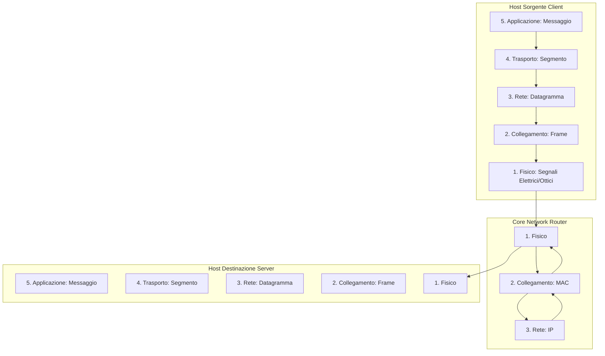
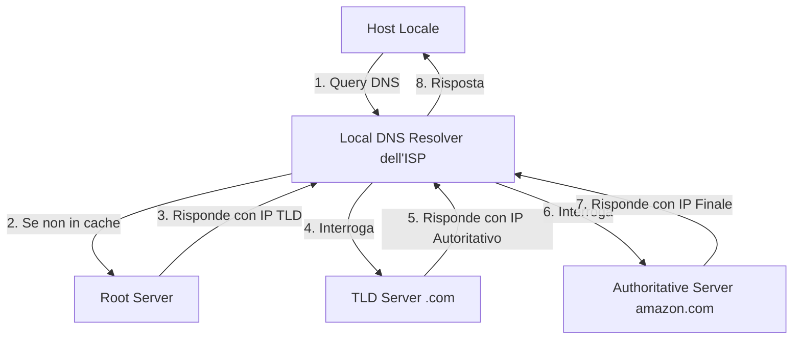

# Riassunto Approfondito: Reti di Calcolatori (Capitoli 1-4)
---

## 1. Introduzione alle Reti di Calcolatori

Una **rete di calcolatori** è un insieme di dispositivi di calcolo autonomi interconnessi. L'approccio moderno alle reti è descritto tramite la teoria dei grafi:
- **Nodi**: Dispositivi connessi. Si dividono in **Host (o end-systems)**, che eseguono le applicazioni utente, e **Dispositivi di instradamento** (Router e Switch).
- **Link di comunicazione**: Connessioni fisiche o wireless.
- **Cammino (Path)**: Sequenza di nodi e link da una sorgente a una destinazione.

### Metriche di Rete
- **Transmission Rate**: Quantità massima teorica di informazione trasmissibile da un singolo dispositivo (in bit/s).
- **Bandwidth (Larghezza di banda)**: Quantità massima di dati trasmissibili sull'intero cammino.
- **Throughput**: Quantità istantanea *effettiva* trasmessa in un dato momento.

### Topologie e Architetture Locali
Le reti possono essere di tipo **Point-to-point** o **Multipoint (broadcast)**.
Le topologie principali includono:
- **Bus**: Unico cavo condiviso. Molto economico ma a rischio collisioni e guasti (singolo point of failure).
- **Star (Stella)**: Hub o switch centrale. Molto scalabile e robusta per guasti ai nodi, ma dipendente dal centro.
- **Ring (Anello)**: Topologia a loop chiuso, performante ma difficile da scalare.
- **Mesh**: I nodi sono interconnessi tra loro. Estremamente tollerante ai guasti ma costosissima. In una configurazione *Full Mesh* il numero di link è $\frac{n(n-1)}{2}$.

### Gerarchia degli ISP (Internet Service Providers)
Internet è definita come "la rete delle reti" perché unisce reti locali disparate in una singola infrastruttura. Gli ISP seguono una gerarchia:
- **Access ISP**: (es. TIM, Fastweb) forniscono la connessione finale.
- **Regional ISP**: Aggregano il traffico su scala nazionale/regionale.
- **Tier-1/Global ISP**: Le dorsali oceaniche e mondiali ad altissima velocità.
Gli ISP si scambiano traffico gratuitamente o a pagamento presso infrastrutture terze chiamate **IXP (Internet Exchange Point)**.

### Lo Stack Protocollare
Il funzionamento delle reti è astratto in un modello a strati (stack protocollare), in cui ogni livello fornisce un servizio specifico al livello superiore imbustando i dati (principio di **Incapsulamento**). Durante questo processo, ogni strato aggiunge informazioni aggiuntive:
- **Header**: Dati di controllo aggiunti all'inizio del payload (es. indirizzi, porte, metadati di instradamento).
- **Trailer**: Dati di controllo aggiunti alla fine, usati principalmente a livello Link per il controllo degli errori (es. CRC).



> [!CAUTION]
> **Host vs Dispositivi Core**: Gli host elaborano tutti e 5 i livelli. Router elaborano fino al Livello 3 (Rete) per capire gli indirizzi IP e instradare i pacchetti. Gli Switch operano solo fino al Livello 2 (Link). Questo rende il cuore della rete (i router) leggero e veloce, spostando tutta la complessità applicativa agli estremi.

---

## 2. Architetture Applicative e Socket

Le applicazioni di rete si basano interamente sul software in esecuzione sugli host terminali. Esistono due architetture primarie:
1. **Client-Server**: I client comunicano con un server sempre acceso con indirizzo IP noto e fisso. Esempi: Web, E-mail, FTP.
2. **P2P (Peer-to-Peer)**: Non esistono server always-on. I dispositivi (peer) scambiano dati direttamente. Altamente scalabile in quanto ogni nuovo peer non solo richiede risorse, ma ne aggiunge alla rete (capacità di banda, storage).
   - Molte applicazioni usano un modello **Ibrido** (es. Skype: server centrale per l'autenticazione/indirizzamento, P2P per la chiamata audio/video).

### L'interfaccia Socket e Indirizzamento
Un processo su un host invia e riceve messaggi nella rete attraverso il suo **socket** (API di rete).
Per recapitare un messaggio a un processo specifico in giro per il mondo servono due elementi:
- **L'indirizzo IP (32 bit)**: Trova l'host di destinazione.
- **Il numero di porta (16 bit)**: Trova la socket del processo corretto sull'host.

> Le porte da `0` a `1023` sono "Well-known ports", registrate per protocolli standard.

### QoS: TCP vs UDP al Livello Applicazione
L'applicazione sceglie il trasporto in base a 4 parametri: *Affidabilità, Throughput, Timing e Sicurezza*.
- **TCP (Transmission Control Protocol)**: Connection-oriented (usa un handshake a 3 vie). Offre **consegna affidabile**, controllo di flusso e congestione. Usato dove i dati non possono corrompersi (HTTP, FTP, SMTP).
- **UDP (User Datagram Protocol)**: Connectionless. Nessuna garanzia di arrivo, nessun overhead. Usato dove la velocità (timing) è essenziale e le perdite sono tollerabili (VoIP, DNS, Gaming).

---

## 3. Il Web e il Protocollo HTTP

**HTTP (HyperText Transfer Protocol)** regola le interazioni Client-Server sul World Wide Web.

### Caratteristiche Fondamentali
- È intrinsecamente **Stateless** (senza stato): il server non ricorda nulla delle interazioni precedenti del client. Questo design garantisce performance straordinarie.
- Usa **TCP** sulla porta 80.
- Una pagina Web è composta da un file HTML base e più "oggetti" referenziati.

### Connessioni TCP in HTTP
1. **HTTP/1.0 (Non Persistenti)**: Apre una nuova TCP per *ogni singolo oggetto*. Lento e crea overhead per il server.
   - Il tempo di risposta per un singolo oggetto è: $2 \times RTT + t_{trasmissione}$ (il primo RTT serve per l'handshake TCP, il secondo per la richiesta HTTP).
2. **HTTP/1.1 (Persistenti + Pipelining)**: La connessione TCP resta aperta per più richieste consecutive. Con il *pipelining* il client lancia più GET insieme senza aspettare le risposte.
3. **HTTP/3**: Implementa le logiche su protocollo UDP (chiamato *QUIC*) per abbattere la latenza dell'handshake TCP, molto più rapido (+30%).

### Struttura dei Messaggi e Codici di Stato
Un messaggio di *Request* HTTP è in testo in chiaro ASCII:
```http
GET /somedir/page.html HTTP/1.1
Host: www.unina.it
Connection: close
User-agent: Mozilla/5.0
```
Le risposte includono codici di stato essenziali:
- **2xx (Successo)**: `200 OK`.
- **3xx (Redirect/Caching)**: `301 Moved Permanently`, `304 Not Modified`.
- **4xx (Errori Client)**: `400 Bad Request`, `404 Not Found`.
- **5xx (Errori Server)**: `500 Internal Server Error`, `505 Version Not Supported`.

### Gestione Stato (Cookie) e Prestazioni (Web Caching)
Per ovviare alla natura stateless di HTTP, i server impostano **Cookie** (header `Set-cookie: ID`). Il client salva l'ID in un file locale e lo riallega alle successive richieste. Utile per autenticazioni e tracking, pone forti dubbi sulla privacy.

**Web Caching (Proxy Server)**:
Istituzioni o ISP usano Proxy locali per memorizzare copie degli oggetti più richiesti.
- Se l'oggetto è in cache (**Hit**), il proxy lo invia istantaneamente senza usare banda verso l'esterno.
- Per evitare di inviare vecchi file, il proxy usa una "GET Condizionale" inserendo l'header `If-Modified-Since`. Se il file sul server originale non è mutato, questo risponde con un body vuoto e `304 Not Modified`.

---

## 4. Posta Elettronica, P2P e DNS

### Posta Elettronica: Una Danza a 3 Protocolli
L'architettura mail non è P2P; fa pesantemente affidamento su **Mail Server** intermedi.
1. **SMTP (Porta 25, TCP)**: È un protocollo di *push*. Serve esclusivamente per trasferire i messaggi dallo user agent (client) verso il server mittente, e **tra mail server mittente e destinatario**. 
2. **POP3 (Porta 110, TCP)**: Protocollo di *pull*, molto semplice. Ha 3 fasi: Autenticazione (username/pass), Transazione (scarica/marca i messaggi) e Update (li cancella dal server). Non permette cartelle.
3. **IMAP (Porta 143, TCP)**: Protocollo di *pull* avanzato. Lascia le copie originali sul server, supporta l'alberatura delle cartelle in remoto e l'uso di client multipli.

### Peer-to-Peer Avanzato: BitTorrent
Nelle architetture pure P2P il file sharing è diviso in pacchetti.
In **BitTorrent**:
- I file enormi sono suddivisi in **Chunk** (tipicamente 256 KB).
- Un nodo chiamato **Tracker** mantiene la lista dei peer attualmente connessi nel *torrent*.
- I client applicano due filosofie logiche:
  1. **Rarest-First**: Scaricano prima i chunk più rari nella rete, in modo da massimizzare la disponibilità globale.
  2. **Tit-for-Tat**: Puniscono i comportamenti egoistici (i *free-rider*). Un client apre il proprio upload verso i 4 peer (che aggiorna ogni 10 secondi) che gli stanno fornendo il rate di download più alto (*Unchoking*).

### Il Sistema DNS (Domain Name System)
Il DNS è il protocollo (di **livello Applicazione**, basato su **UDP porta 53**) che si occupa di tradurre i nomi di dominio (es. `amazon.com`) in Indirizzi IP (es. `205.251.242.103`).

> [!WARNING]
> Perché non esiste un server DNS unico per tutta Internet? 
> 1. Singolo punto di fallimento (Se cade, cade tutto Internet). 2. Latenze geografiche infinite. 3. Volume di query e manutenzione ingestibile.

**La Gerarchia DNS:**
La struttura è decentralizzata e ad albero rovesciato:
1. **Root Name Servers**: Il livello più alto, gestiti globalmente (13 root). Reindirizzano verso i server TLD appropriati.
2. **TLD Servers (Top-Level Domain)**: Server per suffissi quali `.com`, `.net`, `.it`. Reindirizzano ai server autoritativi.
3. **Authoritative Servers**: Server mantenuti direttamente dall'organizzazione ospitante (es. DNS dell'UniNA).


*(Questo schema mostra una query **Ricorsiva** dal Client al Resolver, seguita da 3 query **Iterative** dal Resolver verso la gerarchia globale)*.

**Resource Records e Ottimizzazioni:**
- I dati nel DNS sono salvati come Resource Records (RR). I principali: **A** (Nome -> IPv4), **AAAA** (Nome -> IPv6), **NS** (Nome Dominio -> Nome Server Autoritativo), **CNAME** (Alias -> Nome reale canonico), **MX** (Nome -> Server di posta).
- **Caching DNS**: Ogni volta che un Local Resolver riceve una mappatura la conserva in memoria (*Cache*) per un tempo definito dal **TTL (Time to Live)**. Questo evita che i Root Server esplodano per l'eccesso di traffico globale.
- **DNS e Load Balancing**: Siti con enormi flussi usano il DNS per ruotare in risposta ad ogni query la lista degli IP dei loro server replicati sparsi per il mondo. In questo modo distribuiscono uniformemente il traffico sui server (Round-Robin).

# Riassunto Approfondito: Reti di Calcolatori (Capitoli 5-10)

> Questo secondo blocco si concentra sulle logiche interne della comunicazione affidabile (Livello di Trasporto) e sull'instradamento globale (Livello di Rete). Include le formule e gli algoritmi matematici richiesti all'esame.

---

## 5. Programmazione di Rete con i Socket
Le socket rappresentano l'**API (Application Programming Interface)** fornita dal sistema operativo (Livello di Trasporto) alle Applicazioni.
In ambienti Unix/POSIX, le socket seguono il paradigma *"tutto è un file"* e sono gestite tramite un file descriptor intero (FD).

### Flusso Socket UDP (Connectionless)
Essendo privo di connessione, un server UDP non crea una nuova socket per ogni client. Ne mantiene una sola aperta su cui convergono tutti i datagrammi diretti a quella porta.
- **Primitive base**: `socket()` (creazione), `bind()` (obbligatoria sul server per assegnare IP e Porta locale), `sendto()` (invia dati includendo l'indirizzo destinazione), `recvfrom()` (riceve dati restituendo anche l'indirizzo del mittente).

### Flusso Socket TCP (Connection-oriented)
TCP richiede un *three-way handshake* prima di poter trasmettere payload. Per questo motivo, **il server TCP fa uso di due tipi di socket**:
1. **Welcoming Socket**: Esegue il `bind()` alla porta pubblica e ascolta passivamente tramite `listen()`. Il suo unico scopo è gestire le richieste di handshake in arrivo.
2. **Connection Socket**: Quando l'handshake è accettato, la funzione `accept()` genera al volo una **nuova socket dedicata** specificamente a quel particolare client. Da questo momento, i dati scorrono su questa connessione dedicata usando `send()` e `read()`.

---

## 6. Il Livello di Trasporto: UDP e Trasferimento Affidabile (RDT)
Mentre il Livello di Rete si assicura che il pacchetto arrivi dalla macchina A alla macchina B (host-to-host delivery), il Livello di Trasporto usa **Multiplexing e Demultiplexing** (tramite le Porte) per distribuire i pacchetti all'interno della macchina B al processo corretto (process-to-process delivery).

### L'approccio essenziale: UDP
**UDP (User Datagram Protocol)** si limita al multiplexing/demultiplexing e a un semplice **Checksum** per l'integrità, ereditando tutte le inaffidabilità del livello IP sottostante.
- **Vantaggi**: Nessun ritardo di connessione (ideale per DNS), header leggerissimo da soli **8 byte** (contro i 20B di TCP), nessun limite imposto su quanto velocemente l'applicazione può iniettare dati in rete (il Rate control è applicativo, ideale per lo streaming real-time).
- **Algoritmo di Checksum**: Si raggruppano i dati in blocchi da 16 bit e se ne fa la somma (aggiungendo il riporto eccedente ai 16 bit al totale). Il checksum è il *complemento a 1* del risultato. 

### RDT: Reliable Data Transfer (Trasferimento Affidabile)
Costruire un canale affidabile su Internet (che fa drop, duplicazione e riordinamento) richiede quattro elementi logici: *Sequence Numbers, Timer, ACK/NAK, e Buffer*.

#### Protocolli Pipelined: Go-Back-N (GBN) vs Selective Repeat (SR)

> [!NOTE]
> **Finestra vs Numeri di Sequenza**
> - La **Finestra ($N$)**: Rappresenta il numero massimo di pacchetti "in volo" (inviati ma non ancora confermati da ACK) che il mittente può mantenere simultaneamente sulla rete. Serve a regolare la quantità di traffico immessa nel canale.
> - I **Numeri di Sequenza (Spazio $2^k$)**: Sono le etichette numeriche scritte nell'header di ogni pacchetto per identificarli temporaneamente e riordinarli all'arrivo. Poiché i numeri girano ciclicamente (da $0$ a $2^k-1$), lo spazio totale dei numeri di sequenza deve sempre essere **maggiore** della finestra. Questo previene il problema dell'*Aliasing*, ovvero la possibilità che un vecchio pacchetto ritardato venga confuso con un nuovo pacchetto avente lo stesso numero (in GBN lo spazio deve essere $\geq N+1$, in SR $\geq 2N$).

Il protocollo basilare *Stop-and-Wait* attende l'ACK di ogni singolo pacchetto prima di procedere. È lentissimo. Si risolve inviando una finestra di $N$ pacchetti simultanei (Pipelining).
1. **Go-Back-N (GBN)**: 
   - Il ricevente ha buffer zero: accetta i pacchetti **solo in ordine sequenziale perfetto**. Se ne arriva uno fuori ordine, lo droppa.
   - Il ricevente usa **ACK cumulativi**: "ho ricevuto in ordine tutto fino al byte X".
   - Il mittente mantiene un solo timer (per il primo pacchetto non-ACKato). Se scade, il mittente **ritrasmette l'intera finestra** dal pacchetto perso in poi (inefficiente su reti affollate).
2. **Selective Repeat (SR)**:
   - Il ricevente ha un buffer e accetta pacchetti fuori ordine, confermandoli con **ACK singoli/individuali**.
   - Il mittente ha un timer per *ogni* pacchetto in volo. Se scade un timer, **ritrasmette solo quel singolo pacchetto**.
   - *Vincolo Matematico*: Per evitare che pacchetti vecchi si sovrappongano ai nuovi (Aliasing), lo spazio totale dei numeri di sequenza disponibili deve essere almeno il doppio della dimensione della finestra: $Spazio \geq 2 \times Finestra$.

---

## 7. Il Protocollo TCP in Dettaglio
**TCP** implementa i concetti teorici del Trasferimento Affidabile in un protocollo industriale full-duplex, point-to-point e basato su un flusso di byte (stream-oriented).

### Struttura del Segmento TCP e Sequence Numbers
- **MSS (Maximum Segment Size)**: È la grandezza del payload massimo inseribile in TCP, derivato dalla MTU della scheda di rete meno gli header IP e TCP (es. MTU 1500 - 40 = 1460 Byte di MSS).
- **Numerazione a Byte**: I *Sequence Number* (32 bit) in TCP **contano i singoli byte**, non i segmenti. Se si invia un file in blocchi da 1000 byte, i numeri di sequenza dei pacchetti saranno 0, 1000, 2000, 3000.
- **ACK Number (32 bit)**: Segnala al mittente il numero di sequenza del **prossimo byte che il ricevente si aspetta**. È un ACK di tipo *cumulativo*.
- **Piggybacking**: Dato che TCP è full-duplex, ogni segmento TCP che viaggia da B ad A può trasportare contemporaneamente dati (payload) verso A e l'ACK relativo all'ultimo pacchetto inviato da A.

### Gestione dei Timeout e RTT (Round Trip Time)
TCP stima l'RTT della rete campionandolo. Visto che la rete fluttua costantemente, usa una **Media Mobile Esponenziale Ponderata (EWMA)** per smussare i picchi:
$$EstimatedRTT = (1-\alpha) \cdot EstimatedRTT_{vecchio} + \alpha \cdot SampleRTT$$
Il Timeout è dinamico e impostato su $EstimatedRTT$ più un margine di sicurezza legato alla variabilità statistica ($4 \times DevRTT$).

**Fast Retransmit (Ritrasmissione Rapida)**:
Il Timeout calcolato è spesso superiore al secondo, troppo lungo se si perde un pacchetto in streaming. TCP sfrutta gli ACK per accorgersi in anticipo di un buco. Se il mittente riceve **3 ACK duplicati** di seguito (ovvero riceve per tre volte l'avviso che il ricevente sta aspettando lo stesso byte X), assume immediatamente la perdita del segmento e lo **ritrasmette istantaneamente**, saltando l'attesa del Timeout.

### Setup della Connessione
L'handshake è **A Tre Vie (Three-Way)** per aggirare il *Problema dei Due Eserciti*.
1. `SYN`: Client avvia (Seq=$X$, nessun dato).
2. `SYN-ACK`: Server risponde (Seq=$Y$, Ack=$X+1$).
3. `ACK`: Client conferma (Seq=$X+1$, Ack=$Y+1$, può includere dati).

*Nota Sicurezza*: Gli attacchi **SYN Flood (DDoS)** sfruttano il fatto che il server alloca buffer al passo 2, intasando la RAM. Si difende tramite **SYN Cookies** (non si alloca nulla finché non torna l'ACK finale).

La chiusura è un **Four-Way Teardown**, dove le due controparti usano indipendentemente il flag `FIN` per chiudere la propria direzione del tubo full-duplex.

---

## 8. Controllo di Flusso e Congestione (TCP Reno)
TCP risolve due problemi di inondazione del traffico che operano su scale diverse:

### Flow Control (Protezione del Ricevente)
Il problema è strettamente end-to-end. Il buffer dell'applicazione ricevente potrebbe riempirsi se il processo è impegnato.
**Meccanismo**: L'header TCP contiene un campo da 16 bit chiamato `Receive Window (rwnd)`. Ad ogni segmento di risposta, il ricevente scrive in `rwnd` quanto spazio libero gli è rimasto nel buffer. Il mittente si blocca se `rwnd` tocca zero (inviando *probe segments* da 1 byte per sbloccare la situazione quando il buffer si svuota).

### Congestion Control (Protezione della Rete)
Il problema coinvolge l'intera infrastruttura di internet: troppi host iniettano troppi dati, intasando le code dei router centrali, causando perdite prolungate e stalli.
**Meccanismo (Algoritmo di Jacobson - AIMD)**: Il mittente mantiene una variabile locale `Congestion Window (cwnd)`. La regola aurea di TCP è che i pacchetti in volo (*Unacked*) non possono superare il minimo tra rwnd e cwnd.
Il rate di invio si approssima con $\frac{cwnd}{RTT}$.
L'algoritmo regola `cwnd` seguendo un andamento a "dente di sega" (*Sawtooth*):

1. **Slow Start (Partenza Lenta ma esponenziale)**: Parte con $cwnd = 1 \text{ MSS}$. Per ogni ACK ricevuto `cwnd` sale di $1 \text{ MSS}$, causando il raddoppio della finestra ad ogni RTT. Questa fase cerca rapidamente il limite della banda, fermandosi quando tocca un valore soglia `ssthresh`.
2. **Congestion Avoidance (Incremento Lineare)**: Superata `ssthresh`, si sale cautamente aggiungendo $1 \text{ MSS}$ ogni RTT complessivo.
3. **Reazione alla Perdita (Loss Events)**:
   - Se c'è **Timeout** (congestione critica): `ssthresh` dimezza, ma `cwnd` viene **resettata a 1 MSS**. Si ricomincia dallo Slow Start.
   - Se ci sono **3 Dup-ACKs** (congestione lieve e Fast Retransmit): `ssthresh` dimezza, ma si entra nella fase di **Fast Recovery**. Anziché azzerare la `cwnd` a 1, la si imposta pari al nuovo `ssthresh + 3` e si riprende con crescita lineare. Questo evita crolli drastici di banda.

> **ECN (Explicit Congestion Notification)**: Approccio supportato dalla rete. Se i buffer di un router superano l'80%, il router imposta due bit di alert sull'header IP. Quando arrivano al ricevente, questi li rispecchia nel flag TCP (ECE), dicendo al mittente di rallentare *prima* che avvenga un effettivo packet loss e un conseguente Timeout.

---

## 9. Livello di Rete (Piano dei Dati e Router)
Il Livello di Rete assicura la mobilità dei pacchetti globalmente.
- Non garantisce nulla se non un servizio **Best-Effort**. Nessuna garanzia di ritardo minimo o perdita nulla.
- La distinzione principale all'interno dei router è tra:
  - **Data Plane (Forwarding)**: Basato su hardware ASIC. L'azione fulminea del router che guarda l'IP di destinazione, cerca sulla *Forwarding Table* locale, e sposta il pacchetto dal link di input a quello di output via *Switch Fabric*.
  - **Control Plane (Routing)**: Basato su software e CPU. Esegue algoritmi come Dijkstra o Bellman-Ford per "disegnare" la mappa globale e inviare aggiornamenti della Forwarding Table alle porte fisiche.

### Architettura e Switching
I router subiscono ritardi di accodamento. Se le code superano la RAM disponibile, scartano i pacchetti (solitamente con logica FIFO e Drop-Tail).
La logica di inoltro usa la **Longest Prefix Matching (LPM)**:
Quando un indirizzo IP destinazione matcha due diverse reti presenti in tabella (es. `192.168.1.0/24` e `192.168.0.0/16`), il router inoltrerà SEMPRE il pacchetto sulla rotta che ha la maschera (il prefisso) **più lungo e specifico** (nell'esempio il /24).

---

## 10. Indirizzamento: Subnetting, DHCP e NAT

### Subnetting e CIDR
L'IPv4 è a 32 bit, garantendo circa 4 miliardi di indirizzi unici, suddivisi concettualmente in `Parte Rete` e `Parte Host`.
La separazione è dettata dalla **Subnet Mask** (es. `255.255.255.0` o in CIDR notazione `/24`).
Il CIDR (*Classless Inter-Domain Routing*) permette di tagliare le reti su misura (non più vincolate a enormi e spreconi blocchi di classe A/B/C). 
- Permette anche l'**Aggregazione di rotta (Route Summarization)**: un ISP con 4 blocchi contigui `/24` annuncia al resto di Internet una singola rotta `/22`, sfoltendo immensamente le tabelle globali BGP e risparmiando TCAM preziosa sui core router.

### Configurazione Dinamica: DHCP
**DHCP** (UDP) alloca automaticamente gli IP ai nuovi host secondo 4 passaggi di rete (*DORA*):
1. **D**iscover: Il client manda un pacchetto IP broadcast `255.255.255.255` cercando un server.
2. **O**ffer: Il server DHCP risponde offrendo un IP.
3. **R**equest: Il client accetta ufficialmente.
4. **A**ck: Il server finalizza, concedendo un *Lease Time*, la Subnet Mask, l'indirizzo del Gateway e il DNS locale.

### Sicurezza e Scarsità IPv4: NAT
Il **Network Address Translation** risolve l'insufficienza cronica degli IPv4 rendendo le intere reti casalinghe dipendenti da **un singolo IP Pubblico** visibile su Internet, mentre internamente usano indirizzi riservati privati (es. il classico `192.168.1.x`).
- **Funzionamento**: Quando un pacchetto esce di casa, il NAT Router modifica l'header IP sostituendo l'IP privato sorgente e una porta effimera in una combinazione IP Pubblico : Nuova Porta, salvandola in una NAT Table. Quando il pacchetto risponde, il router fa l'inverso.
- **Infrange le regole a strati**: Il NAT è considerato un hack architetturale perché un apparato di Rete (Livello 3) ficca il naso negli header di Trasporto (Livello 4, porte TCP/UDP) per alterarle, violando il principio di incapsulamento OSI puro.

# Riassunto Approfondito: Reti di Calcolatori (Capitoli 11-17)

> Questo è il terzo e ultimo modulo del riassunto. Tratta le logiche software che guidano i pacchetti (Routing), l'accesso al mezzo fisico locale (Livello Collegamento), i fondamenti della sicurezza e una review tecnica degli esercizi d'esame e dei laboratori Wireshark.

---

## 11. Il Piano di Controllo: Gli Algoritmi di Routing
Il **Piano di Controllo (Control Plane)** è il "cervello" della rete. Il suo scopo è scambiarsi informazioni globali sulla topologia e generare le Forwarding Table che ogni router userà per lo smistamento fisico locale dei pacchetti.
La rete è calcolata matematicamente come un **Grafo pesato** in cui i Nodi sono i router e gli Archi (Link) hanno un Costo (ritardo, congestione, spesa).

### 11.1 Distance Vector (DV) - L'Algoritmo di Bellman-Ford
È un algoritmo distribuito e decentralizzato storicamente usato da RIP e BGP.
- **Visione Locale**: Ogni router parla **solo ed esclusivamente con i suoi vicini diretti**.
- **Processo**: A intervalli regolari, il router $X$ invia ai suoi vicini il proprio vettore delle distanze (ovvero quanto costa, secondo $X$, arrivare a tutti i possibili target su Internet).
- **Aggiornamento**: Quando un nodo $Y$ riceve il vettore dal vicino $X$, aggiorna la propria stima scegliendo il percorso più breve usando la formula di Bellman-Ford:
  $$D_Y(dest) = \min_X \{ costo(Y, X) + D_X(dest) \}$$
- **Il Problema (Count-to-Infinity)**: Le "buone notizie" (nuovi percorsi più corti) viaggiano velocemente; le "cattive notizie" (un link si rompe) causano cicli infiniti (*routing loop*) in cui due nodi si ingannano a vicenda aumentando all'infinito la stima dei costi.

### 11.2 Link-State (LS) - L'Algoritmo di Dijkstra
È l'algoritmo usato dai protocolli moderni come OSPF.
- **Visione Globale (Flooding)**: Ogni router parla **con tutta la rete**, inviando pacchetti di Link-State che contengono solo l'identità dei suoi vicini diretti.
- **Processo**: Alla fine del flooding, **tutti i nodi possiedono un database topologico identico** dell'intera rete.
- **Calcolo Locale**: Ogni router lancia in memoria l'Algoritmo di Dijkstra usando se stesso come Nodo Radice, calcolando l'albero dei percorsi minimi (Shortest Path Tree) ed estrudendo da esso la tabella di routing.

---

## 12. Il Livello di Collegamento (Link Layer e MAC)
Se IP si preoccupa dell'intero viaggio coast-to-coast, il Livello di Collegamento (Livello 2) si assicura che il pacchetto non sbandi mentre percorre **il singolo filo/link tra due nodi diretti**. Il datagramma IP viene imbustato in un **Frame**.

### Error Detection
Durante il transito sui cavi, variazioni di tensione elettromagnetica possono flippare i bit (corruzione).
Il mittente calcola un controllo matematico sui dati tramite il **CRC (Cyclic Redundancy Check)**:
Sfruttando l'algebra polinomiale, il messaggio viene diviso per un Polinomio Generatore $G$. Il resto della divisione (il CRC) è appeso alla fine del Frame. Se il ricevente non ottiene resto zero rifacendo l'operazione, il frame viene scartato (nessuna correzione, solo drop).

### MAC Address e ARP (Address Resolution Protocol)
Il Livello 2 usa l'**Indirizzo MAC** (es. `1A:23:F9:CD:06:9B`, lungo 48 bit e *fisso* nella scheda di rete).
**Come fa il Livello 3 a tradurre un IP nel corrispondente MAC del prossimo salto?** Usa l'ARP:
1. L'Host A chiede in Broadcast a tutta la rete locale (`FF:FF:FF:FF:FF:FF`): *"Chi ha l'IP 192.168.1.10?"*
2. Il dispositivo che ha quell'IP (o il gateway) risponde con un pacchetto unicast: *"Sono io, e il mio MAC è AA:BB:CC..."*.
3. L'Host A salva la coppia IP $\leftrightarrow$ MAC nella propria **ARP Cache** locale (scade in 20 min).

### Gestione delle Collisioni: CSMA/CD su Ethernet
Se due PC trasmettono simultaneamente su un cavo condiviso le loro onde collidono, distruggendo entrambi i frame. L'Ethernet classica (IEEE 802.3) usa la strategia **Carrier Sense Multiple Access / Collision Detection (CSMA/CD)**:
- **Listen Before Talk (CS)**: Il PC ascolta il cavo. Se è silenzioso, inizia a inviare bit.
- **Listen While Talking (CD)**: Se il PC sente un picco di voltaggio (collisione), ferma subito l'invio e trasmette un segnale di Jamming.
- **Binary Exponential Backoff**: Dopo la collisione, i due PC attendono un tempo *random* prima di riprovare. L'attesa è calcolata lanciando un dado in un range di $\{0 \dots 2^N - 1\}$, dove $N$ è il numero di collisioni consecutive. Al crescere dei conflitti, la finestra di attesa esplode esponenzialmente smaltendo il traffico.

### Gli Switch di Rete (Self-learning)
Gli Switch sono "trasparenti" alla rete (non hanno IP propri). Popolano automaticamente la loro *Switch Table* registrando la porta fisica da cui entra ogni MAC sorgente.
Se uno Switch riceve un pacchetto per un MAC che non ha mai visto in tabella, esegue il **Flooding** (inoltra la copia a tutte le sue porte inondando la rete).

---

## 13. Sicurezza delle Reti
Gli obiettivi della sicurezza sono **Confidenzialità** (cifratura), **Integrità** (hash/MAC), e **Autenticazione**.
Vulnerabilità principali: *Eavesdropping* (intercettazione passiva), *Man-in-the-Middle* (alterazione attiva come ARP Poisoning), e *Denial of Service* (inondamento di banda o esaurimento RAM tramite SYN Flood).

### Crittografia Base vs TLS
- **Simmetrica (es. AES-256)**: Singola chiave condivisa per cifrare/decifrare. Molto veloce computazionalmente, ma impossibile da scambiarsi apertamente su Internet se si è sconosciuti.
- **Asimmetrica (es. RSA)**: Usa due chiavi (Pubblica visibile a tutti, Privata nascosta). Risolve il problema dello scambio chiavi e permette la Firma Digitale, ma è lentissima.
- **La Soluzione Industriale (HTTPS/TLS)**: Il Client e Server usano la crittografia asimmetrica *solo* durante l'Handshake iniziale per scambiarsi (in segreto, dopo aver verificato i certificati di integrità) una chiave simmetrica master usa e getta. Da quel momento il traffico massiccio del sito scorrerà cifrato velocemente tramite AES.

---

## 14-17. Esercizi Risolti e Laboratori Wireshark (Pratica d'Esame)

### Formule e Calcoli Matematici d'Esame
1. **Tempi di trasferimento HTTP (Non-Persistenti)**
   - Il costo base in connessioni multiple non-persistenti per un Oggetto è: $2 \times RTT + t_{trasm}$ ($t_{trasm} = Lunghezza / Capacità \text{ del link}$).
   - *Nota Esame*: Se vi chiedono di valutare i ritardi di 5 immagini JPG sequenziali, il ritardo è $N \times (2 \cdot RTT + t_{trasm})$. Se il testo dice *connessioni parallele*, l'RTT si sconta una volta sola.
2. **Subnetting (CIDR)**
   - Data la rete `192.168.10.0/24`, scomporla in 4 sottoreti uguali.
   - Soluzione: $2^x = 4 \rightarrow$ servono $x=2$ bit rubati alla porzione Host. Il nuovo prefisso diventa $/26$ ($24+2$).
   - Salti (Delta): I salti sono calcolati dai bit rimanenti. L'host id è di 6 bit, $2^6 = 64$. Le reti saranno `.0/26`, `.64/26`, `.128/26`, `.192/26`.
3. **Longest Prefix Matching (LPM in Binario)**
   - Convertite in binario solo il byte dove differisce l'IP del pacchetto con le rotte in tabella. Confrontate quanti bit di testa combaciano tra la rotta (es. un $/21$) e l'IP in ingresso. La rotta che "matcha" il numero più lungo di bit (più specifico) è il Next-Hop vincitore.

### Approfondimenti Laboratori Wireshark
- **Analisi TCP (L05)**: Il fenomeno della segmentazione in TCP appare in Wireshark con messaggi `[TCP segment of a reassembled PDU]`. Accade quando l'applicazione passa al socket TCP un body HTML più grosso della MTU della scheda Ethernet. Wireshark li raggruppa virtualmente, ma fisicamente viaggiano come pacchetti frammentati separati.
- **Analisi DNS (nslookup)**: Si osserva l'uso nativo del protocollo UDP su porta `53`. Nelle query di tipo `NS` (Name Server Autoritativi), le risposte contengono non solo i nomi dei server ma spesso anche dei record `A` aggiuntivi chiamati *Glue Records*, i quali indicano preventivamente l'IP di tali server per far risparmiare all'host una successiva query di DNS resolving superflua.
- **Analisi ICMP e Traceroute**: Per scovare i Router lungo un percorso sconosciuto, `traceroute` lancia intenzionalmente dei pacchetti datagramma IP con un campo TTL corrotto artificialmente, settandolo a `1`, poi `2`, poi `3`. Al router in hop-1 il TTL scade (diventa `0`) e questo scarta il pacchetto inviando al client un errore di "Time Exceeded" ICMP, rivelando così il proprio indirizzo IP e smascherandosi. Il processo si ripete svelando la mappa topologica dell'instradamento hop-by-hop.

