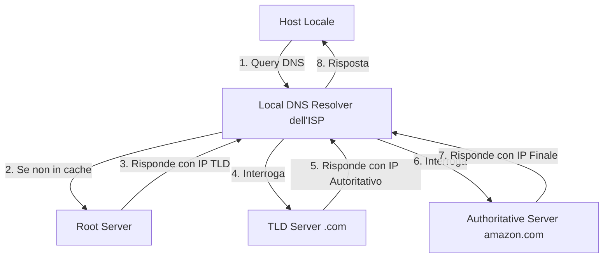

# Riassunto Approfondito: Reti di Calcolatori (Capitoli 1-4)

> Questa versione aggiornata del riassunto scende molto più nel dettaglio. Oltre ai concetti chiave, sono incluse spiegazioni tecniche approfondite, formule, esempi pratici e l'analisi completa del Livello Applicazione.

---

## 1. Introduzione alle Reti di Calcolatori

Una **rete di calcolatori** è un insieme di dispositivi di calcolo autonomi interconnessi. L'approccio moderno alle reti è descritto tramite la teoria dei grafi:
- **Nodi**: Dispositivi connessi. Si dividono in **Host (o end-systems)**, che eseguono le applicazioni utente, e **Dispositivi di instradamento** (Router e Switch).
- **Link di comunicazione**: Connessioni fisiche o wireless.
- **Cammino (Path)**: Sequenza di nodi e link da una sorgente a una destinazione.

### Metriche di Rete
- **Transmission Rate**: Quantità massima teorica di informazione trasmissibile da un singolo dispositivo (in bit/s).
- **Bandwidth (Larghezza di banda)**: Quantità massima di dati trasmissibili sull'intero cammino.
- **Throughput**: Quantità istantanea *effettiva* trasmessa in un dato momento.

### Topologie e Architetture Locali
Le reti possono essere di tipo **Point-to-point** o **Multipoint (broadcast)**.
Le topologie principali includono:
- **Bus**: Unico cavo condiviso. Molto economico ma a rischio collisioni e guasti (singolo point of failure).
- **Star (Stella)**: Hub o switch centrale. Molto scalabile e robusta per guasti ai nodi, ma dipendente dal centro.
- **Ring (Anello)**: Topologia a loop chiuso, performante ma difficile da scalare.
- **Mesh**: I nodi sono interconnessi tra loro. Estremamente tollerante ai guasti ma costosissima. In una configurazione *Full Mesh* il numero di link è $\frac{n(n-1)}{2}$.

### Gerarchia degli ISP (Internet Service Providers)
Internet è definita come "la rete delle reti" perché unisce reti locali disparate in una singola infrastruttura. Gli ISP seguono una gerarchia:
- **Access ISP**: (es. TIM, Fastweb) forniscono la connessione finale.
- **Regional ISP**: Aggregano il traffico su scala nazionale/regionale.
- **Tier-1/Global ISP**: Le dorsali oceaniche e mondiali ad altissima velocità.
Gli ISP si scambiano traffico gratuitamente o a pagamento presso infrastrutture terze chiamate **IXP (Internet Exchange Point)**.

### Lo Stack Protocollare
Il funzionamento delle reti è astratto in un modello a strati (stack protocollare), in cui ogni livello fornisce un servizio specifico al livello superiore imbustando i dati (principio di **Incapsulamento**).

```mermaid
graph TD
    subgraph Host Sorgente (Client)
    App[5. Applicazione: Messaggio] --> Trans[4. Trasporto: Segmento]
    Trans --> Rete[3. Rete: Datagramma]
    Rete --> Link[2. Collegamento: Frame]
    Link --> Fis[1. Fisico: Segnali Elettrici/Ottici]
    end
    
    subgraph Core Network (Router)
    R_Rete[3. Rete: IP]
    R_Link[2. Collegamento: MAC]
    R_Fis[1. Fisico]
    R_Fis --> R_Link --> R_Rete --> R_Link --> R_Fis
    end
    
    subgraph Host Destinazione (Server)
    D_App[5. Applicazione: Messaggio] 
    D_Trans[4. Trasporto: Segmento]
    D_Rete[3. Rete: Datagramma]
    D_Link[2. Collegamento: Frame]
    D_Fis[1. Fisico]
    end

    Fis --> R_Fis
    R_Fis --> D_Fis
```

> [!CAUTION]
> **Host vs Dispositivi Core**: Gli host elaborano tutti e 5 i livelli. Router elaborano fino al Livello 3 (Rete) per capire gli indirizzi IP e instradare i pacchetti. Gli Switch operano solo fino al Livello 2 (Link). Questo rende il cuore della rete (i router) leggero e veloce, spostando tutta la complessità applicativa agli estremi.

---

## 2. Architetture Applicative e Socket

Le applicazioni di rete si basano interamente sul software in esecuzione sugli host terminali. Esistono due architetture primarie:
1. **Client-Server**: I client comunicano con un server sempre acceso con indirizzo IP noto e fisso. Esempi: Web, E-mail, FTP.
2. **P2P (Peer-to-Peer)**: Non esistono server always-on. I dispositivi (peer) scambiano dati direttamente. Altamente scalabile in quanto ogni nuovo peer non solo richiede risorse, ma ne aggiunge alla rete (capacità di banda, storage).
   - Molte applicazioni usano un modello **Ibrido** (es. Skype: server centrale per l'autenticazione/indirizzamento, P2P per la chiamata audio/video).

### L'interfaccia Socket e Indirizzamento
Un processo su un host invia e riceve messaggi nella rete attraverso il suo **socket** (API di rete).
Per recapitare un messaggio a un processo specifico in giro per il mondo servono due elementi:
- **L'indirizzo IP (32 bit)**: Trova l'host di destinazione.
- **Il numero di porta (16 bit)**: Trova la socket del processo corretto sull'host.

> Le porte da `0` a `1023` sono "Well-known ports", registrate per protocolli standard.

### QoS: TCP vs UDP al Livello Applicazione
L'applicazione sceglie il trasporto in base a 4 parametri: *Affidabilità, Throughput, Timing e Sicurezza*.
- **TCP (Transmission Control Protocol)**: Connection-oriented (usa un handshake a 3 vie). Offre **consegna affidabile**, controllo di flusso e congestione. Usato dove i dati non possono corrompersi (HTTP, FTP, SMTP).
- **UDP (User Datagram Protocol)**: Connectionless. Nessuna garanzia di arrivo, nessun overhead. Usato dove la velocità (timing) è essenziale e le perdite sono tollerabili (VoIP, DNS, Gaming).

---

## 3. Il Web e il Protocollo HTTP

**HTTP (HyperText Transfer Protocol)** regola le interazioni Client-Server sul World Wide Web.

### Caratteristiche Fondamentali
- È intrinsecamente **Stateless** (senza stato): il server non ricorda nulla delle interazioni precedenti del client. Questo design garantisce performance straordinarie.
- Usa **TCP** sulla porta 80.
- Una pagina Web è composta da un file HTML base e più "oggetti" referenziati.

### Connessioni TCP in HTTP
1. **HTTP/1.0 (Non Persistenti)**: Apre una nuova TCP per *ogni singolo oggetto*. Lento e crea overhead per il server.
   - Il tempo di risposta per un singolo oggetto è: $2 \times RTT + t_{trasmissione}$ (il primo RTT serve per l'handshake TCP, il secondo per la richiesta HTTP).
2. **HTTP/1.1 (Persistenti + Pipelining)**: La connessione TCP resta aperta per più richieste consecutive. Con il *pipelining* il client lancia più GET insieme senza aspettare le risposte.
3. **HTTP/3**: Implementa le logiche su protocollo UDP (chiamato *QUIC*) per abbattere la latenza dell'handshake TCP, molto più rapido (+30%).

### Struttura dei Messaggi e Codici di Stato
Un messaggio di *Request* HTTP è in testo in chiaro ASCII:
```http
GET /somedir/page.html HTTP/1.1
Host: www.unina.it
Connection: close
User-agent: Mozilla/5.0
```
Le risposte includono codici di stato essenziali:
- **2xx (Successo)**: `200 OK`.
- **3xx (Redirect/Caching)**: `301 Moved Permanently`, `304 Not Modified`.
- **4xx (Errori Client)**: `400 Bad Request`, `404 Not Found`.
- **5xx (Errori Server)**: `500 Internal Server Error`, `505 Version Not Supported`.

### Gestione Stato (Cookie) e Prestazioni (Web Caching)
Per ovviare alla natura stateless di HTTP, i server impostano **Cookie** (header `Set-cookie: ID`). Il client salva l'ID in un file locale e lo riallega alle successive richieste. Utile per autenticazioni e tracking, pone forti dubbi sulla privacy.

**Web Caching (Proxy Server)**:
Istituzioni o ISP usano Proxy locali per memorizzare copie degli oggetti più richiesti.
- Se l'oggetto è in cache (**Hit**), il proxy lo invia istantaneamente senza usare banda verso l'esterno.
- Per evitare di inviare vecchi file, il proxy usa una "GET Condizionale" inserendo l'header `If-Modified-Since`. Se il file sul server originale non è mutato, questo risponde con un body vuoto e `304 Not Modified`.

---

## 4. Posta Elettronica, P2P e DNS

### Posta Elettronica: Una Danza a 3 Protocolli
L'architettura mail non è P2P; fa pesantemente affidamento su **Mail Server** intermedi.
1. **SMTP (Porta 25, TCP)**: È un protocollo di *push*. Serve esclusivamente per trasferire i messaggi dallo user agent (client) verso il server mittente, e **tra mail server mittente e destinatario**. 
2. **POP3 (Porta 110, TCP)**: Protocollo di *pull*, molto semplice. Ha 3 fasi: Autenticazione (username/pass), Transazione (scarica/marca i messaggi) e Update (li cancella dal server). Non permette cartelle.
3. **IMAP (Porta 143, TCP)**: Protocollo di *pull* avanzato. Lascia le copie originali sul server, supporta l'alberatura delle cartelle in remoto e l'uso di client multipli.

### Peer-to-Peer Avanzato: BitTorrent
Nelle architetture pure P2P il file sharing è diviso in pacchetti.
In **BitTorrent**:
- I file enormi sono suddivisi in **Chunk** (tipicamente 256 KB).
- Un nodo chiamato **Tracker** mantiene la lista dei peer attualmente connessi nel *torrent*.
- I client applicano due filosofie logiche:
  1. **Rarest-First**: Scaricano prima i chunk più rari nella rete, in modo da massimizzare la disponibilità globale.
  2. **Tit-for-Tat**: Puniscono i comportamenti egoistici (i *free-rider*). Un client apre il proprio upload verso i 4 peer (che aggiorna ogni 10 secondi) che gli stanno fornendo il rate di download più alto (*Unchoking*).

### Il Sistema DNS (Domain Name System)
Il DNS è il protocollo (di **livello Applicazione**, basato su **UDP porta 53**) che si occupa di tradurre i nomi di dominio (es. `amazon.com`) in Indirizzi IP (es. `205.251.242.103`).

> [!WARNING]
> Perché non esiste un server DNS unico per tutta Internet? 
> 1. Singolo punto di fallimento (Se cade, cade tutto Internet). 2. Latenze geografiche infinite. 3. Volume di query e manutenzione ingestibile.

**La Gerarchia DNS:**
La struttura è decentralizzata e ad albero rovesciato:
1. **Root Name Servers**: Il livello più alto, gestiti globalmente (13 root). Reindirizzano verso i server TLD appropriati.
2. **TLD Servers (Top-Level Domain)**: Server per suffissi quali `.com`, `.net`, `.it`. Reindirizzano ai server autoritativi.
3. **Authoritative Servers**: Server mantenuti direttamente dall'organizzazione ospitante (es. DNS dell'UniNA).


*(Questo schema mostra una query **Ricorsiva** dal Client al Resolver, seguita da 3 query **Iterative** dal Resolver verso la gerarchia globale)*.

**Resource Records e Ottimizzazioni:**
- I dati nel DNS sono salvati come Resource Records (RR). I principali: **A** (Nome -> IPv4), **AAAA** (Nome -> IPv6), **NS** (Nome Dominio -> Nome Server Autoritativo), **CNAME** (Alias -> Nome reale canonico), **MX** (Nome -> Server di posta).
- **Caching DNS**: Ogni volta che un Local Resolver riceve una mappatura la conserva in memoria (*Cache*) per un tempo definito dal **TTL (Time to Live)**. Questo evita che i Root Server esplodano per l'eccesso di traffico globale.
- **DNS e Load Balancing**: Siti con enormi flussi usano il DNS per ruotare in risposta ad ogni query la lista degli IP dei loro server replicati sparsi per il mondo. In questo modo distribuiscono uniformemente il traffico sui server (Round-Robin).
